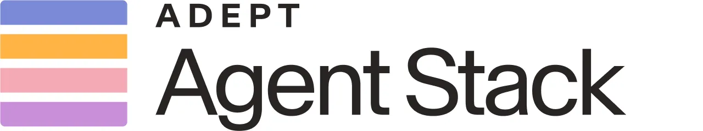

# Adept

## TL;DR

[[company.adept]] 是 browser / enterprise agent 这条线绕不开的历史样本。它 2022 年提出 ACT-1：一个能观察浏览器、点击、输入、滚动、在软件里执行任务的 Action Transformer；2023 年以 $350M Series B、至少 $1B 估值成为“AI learns how to use software”的明星公司；2024 年大部分创始/核心团队被 [[company.amazon]] 吸收，Amazon 非独占授权 Adept 技术、模型和数据，Adept 则保留独立公司身份，转向 agentic AI solutions / enterprise workflow automation。

我的判断：Adept 不是今天最强的直接竞品，更像 Viktor/企业 agent 的“前传”和反面教材。它很早看到了正确方向：natural language -> software actions -> enterprise workflow；但它同时暴露了这个方向最难的三件事：模型成本、可靠性/重复性、产品化速度。[[company.viktor]] 和新一代企业 agent 公司，其实是在重新回答 Adept 2022-2024 没有完全回答完的问题。

## 进入我们视野

昨天调研 [[company.viktor]] 时，Viktor 的付费搜索/需求侧信号里出现了 `adept` / `manus` / `adnova` 等词。Adept 因此进入“agent / AI worker / AI automation 心智争夺”的候选集合。

但 Adept 与 Viktor 的关系要谨慎判断：

- Adept 是 early computer-use / action model 代表。
- Viktor 是 Slack/Teams 里的 enterprise AI employee，强调团队入口、工具连接、云端执行和实际交付。
- Adept 当前独立公司仍在做 enterprise workflow automation，但它的核心团队/模型资产已有一部分进入 Amazon。

所以它更适合作为历史参照和能力边界参照，不一定是 2026 年最活跃的直接市场竞品。

## 关键时间线

- 2022-04-26：Adept 发布 introducing post，提出“训练 neural network 使用世界上每个 software tool 和 API”的愿景。见 [[source.adept-introducing-2022-04-26]]。
- 2022-09-14：发布 ACT-1，展示能通过 Chrome extension 观察浏览器并点击/输入/滚动的软件操作模型。见 [[source.adept-act1-2022-09-14]]。
- 2023-03-14：宣布 $350M Series B，由 [[investor.general-catalyst]] 领投、[[investor.spark-capital]] co-lead。见 [[source.adept-series-b-2023-03-14]]。
- 2024-06-28：Adept 宣布 co-founders 和部分团队加入 [[company.amazon]] AGI organization；Amazon 授权 Adept agent technology、multimodal models 和 datasets；[[person.zach-brock]] 接任 CEO。见 [[source.adept-update-amazon-2024-06-28]]。
- 2024-08-23：Adept 发布 AWL / Adept Workflow Language，进一步把产品讲成 enterprise automation agent stack。见 [[source.adept-agents-awl-2024-08-23]]。
- 2026-07-09：当前官网仍在，定位为 “Agentic AI for your tech stack”，主打企业工作流自动化。见 [[source.adept-homepage-2026-07-09]]。

## 产品定义

Adept 的核心产品思想是：AI 不只是聊天和生成内容，而是能把用户意图翻译成软件动作。

早期 ACT-1 版本：

- 通过 Chrome extension 观察浏览器。
- 对页面做自定义 rendering。
- 输出动作：click、type、scroll 等。
- 目标是“anything a human can do in front of a computer”。

当前官网/AWL 版本：

- Proprietary agent training data：针对 web UI 和真实软件使用的数据。
- Suite of multimodal models：定位、网页理解、规划。
- Custom actuation software：用 proprietary DSL / actuation layer 跨网站和软件执行动作。
- Feedback & data collection tools：持续改进模型和 workflow。

Adept Workflow Language（AWL）是关键资产：它是 JavaScript ES6 的语法子集，既可以写 prescriptive commands，也可以用 `act()` 把自然语言交给 agent reasoning loop。这个设计说明 Adept 后来意识到：纯自然语言太不稳定，企业 workflow 需要“可约束的语言 + 可推理的模型 + 执行层”。

## 融资与团队

Adept 早期团队非常强：[[person.david-luan]] 曾是 OpenAI VP of Engineering；[[person.ashish-vaswani]] 和 [[person.niki-parmar]] 是 Transformer 论文作者之一。Forbes 2023 年报道里把这套 founder pedigree 作为融资热度的重要原因，见 [[source.forbes-adept-series-b-2023-03-14]]。

融资：

- 2022 年早期 Series A：$65M，投资方包括 [[investor.greylock]]、Addition、Root Ventures 等。见 [[source.adept-introducing-2022-04-26]]。
- 2023 年 Series B：$350M，[[investor.general-catalyst]] lead，[[investor.spark-capital]] co-lead，另有 Addition、Greylock、Atlassian Ventures、Microsoft、NVIDIA、Workday Ventures 等。见 [[source.adept-series-b-2023-03-14]]。
- Reuters 2024 年称 Adept 已融资超过 $410M，估值超过 $1B。见 [[source.reuters-amazon-adept-2024-06-28]]。

团队变化：

- Forbes 2023 年称 Ashish Vaswani 和 Niki Parmar 已离开 Adept 去创办新公司。
- 2024 年 Amazon 事件中，David Luan 以及 Augustus Odena、Maxwell Nye、Erich Elsen、Kelsey Szot 等 co-founders/核心团队成员加入 Amazon。见 [[source.techcrunch-amazon-adept-2024-06-28]] 和 [[source.geekwire-amazon-adept-2024-06-28]]。
- Adept 继续独立运营；[[person.zach-brock]] 接任 CEO，[[person.tim-weingarten]] 继续任 Head of Product。官方说法见 [[source.adept-update-amazon-2024-06-28]]。

## Amazon 事件怎么理解

不要把它简单写成“Amazon 收购 Adept”。公开证据更准确的说法是：Amazon hired away Adept co-founders / key team members and licensed Adept technology under a non-exclusive license。Adept 官方、Reuters、CNBC、TechCrunch、GeekWire 都支持这个口径。

这件事对我们判断 Adept 很重要：

- 正面看：Adept 的技术和团队足够强，被 Amazon AGI 认为能加速 digital agents / software workflow automation。
- 反面看：Adept 作为独立公司烧钱训练 foundation models + 做 enterprise product 双线推进，压力太大；最终选择把 general intelligence/model 路线交给 Amazon，自己聚焦 agentic AI solutions。
- 对竞品分析来说：Adept 当前不是一个完整状态的“原版 Adept”，它是经历过核心团队迁移后的产品化残部/重组体。

## 流量与市场信号

Similarweb 快照见 [[source.similarweb.adept-overview-2026-07-09]]。

Jan-Jun 2026，Similarweb 显示 adept.ai 总访问量约 304,788，月访问量 15,372，平均访问 27 秒，1.75 页/访问，跳出率 66.20%。渠道上 Organic Search 占 56.99%，Direct 30.25%，Referral 6.75%，Organic Social 2.01%，Generative AI 4.00%。搜索里品牌占 96%、非品牌只有 4%。

这说明 Adept 仍有不小的历史品牌/研究流量，但不像强产品增长：访问短、跳出高、搜索高度品牌化。它更像一个“仍被研究和引用的老牌 agent 公司”，不是一个正在高速获客的 enterprise SaaS。

Similarweb 的 Similar Sites 模块给了 19 个相似站点，见 [[source.similarweb.adept-overview-2026-07-09]]。我用 Google 做了一轮 quick ID 后，结论更清楚：这份列表适合当“发现入口/相邻产品池”，不能直接当竞品表。

- `agentic.ai` 不是竞品，而是 agentic AI 工具目录/评测站，适合作为后续发现新公司的入口。
- `camel-ai.org` 是 agent framework / computer-use 生态信号，适合技术路线观察。
- `salesgroup.ai`、`newoaks.ai` 属于 customer-facing AI employee / customer-service agent 相邻产品，值得轻量看。
- `hynote.ai`、`obsidiancopilot.com`、`chatpaper.ai`、`eu.plaud.ai`、`decktopus.com`、`irusiru.jp` 更偏 note / research / deck / productivity。
- `rvc-models.com`、`humanornot.ai`、`chemistryai.io`、`tolans.com`、`acquainte.xyz`、`ibnsireen.com` 对企业 action-agent 这条线基本是噪声。

## 社区反馈

HN 2022 年 ACT-1 讨论已经问到了今天企业 agent 仍绕不开的问题，见 [[source.hn-adept-act1-2022-09-14]]：

- 能否稳定重复同一个 workflow？
- 修改 Salesforce / 数据库出错怎么 recovery？
- 自然语言是否太 lossy？
- captcha、滥用、账号信任怎么处理？
- 需要多少 demonstration / feedback / benchmark？

这些问题是 Adept 的长期价值：它不是只给我们一个公司案例，而是给了一个“computer-use agent 的问题清单”。

## 和 Viktor 的关系

Adept 和 [[company.viktor]] 的差异可以这样看：

- Adept 的起点是 model/action layer：让 AI 学会使用软件。
- Viktor 的起点是 workplace product/GTM layer：把 AI employee 放进 Slack/Teams，让团队分配任务并看到结果。
- Adept 更像“agent engine / automation stack”。
- Viktor 更像“企业里可雇佣的 agent coworker”。

这解释了为什么 Viktor 可以从 Adept 学到很多技术/产品问题，但它不一定需要和 Adept 正面对标。Viktor 真正要证明的是：在团队协作入口里，agent 能否拿到上下文、权限、工具连接，并持续交付可复用工作结果。Adept 则提醒我们：底层 action model 再强，如果产品化/GTM/可靠性没有闭环，仍然可能高开低走。

## 我们该学什么

1. **computer-use 是对的，但不能只卖模型能力。** ACT-1 很早证明了方向，但企业客户买的是 workflow 结果和可靠性。
2. **自然语言需要被约束。** AWL 的出现说明纯 prompt 不够，企业 workflow 需要 DSL、模板、审批和可复现执行路径。
3. **可靠性是品类天花板。** HN 早期反馈已经指出重复性、回滚、误操作、权限和滥用问题。
4. **foundation model + enterprise SaaS 双线很难。** Adept 的 Amazon 事件说明烧模型和打产品同时做，对 startup 极其吃力。
5. **Viktor 这类后发者要回答 Adept 的未竟问题。** Slack/Teams 入口只是第一步，最终还是要证明跨系统执行的稳定 ROI。

## 证据库

- [[source.adept-homepage-2026-07-09]] - 当前官网，S1。
- [[source.adept-introducing-2022-04-26]] - Adept 初始 thesis，S1。
- [[source.adept-act1-2022-09-14]] - ACT-1，S1。
- [[source.adept-agents-awl-2024-08-23]] - AWL / enterprise agents，S1。
- [[source.adept-series-b-2023-03-14]] - $350M Series B 官方公告，S1。
- [[source.forbes-adept-series-b-2023-03-14]] - Kenrick Cai 对融资/估值/团队的报道，S2。
- [[source.adept-update-amazon-2024-06-28]] - 官方 Amazon/team update，S1。
- [[source.reuters-amazon-adept-2024-06-28]] - Reuters Amazon deal，S2。
- [[source.techcrunch-amazon-adept-2024-06-28]] - TechCrunch Amazon/team critique，S2。
- [[source.geekwire-amazon-adept-2024-06-28]] - GeekWire Amazon memo/team details，S2。
- [[source.similarweb.adept-overview-2026-07-09]] - Similarweb overview，S2。
- [[source.hn-adept-act1-2022-09-14]] - HN ACT-1 community feedback，S3。
- [[source.hn-adept-amazon-2024-07-03]] - HN Amazon wording caution，S3。
