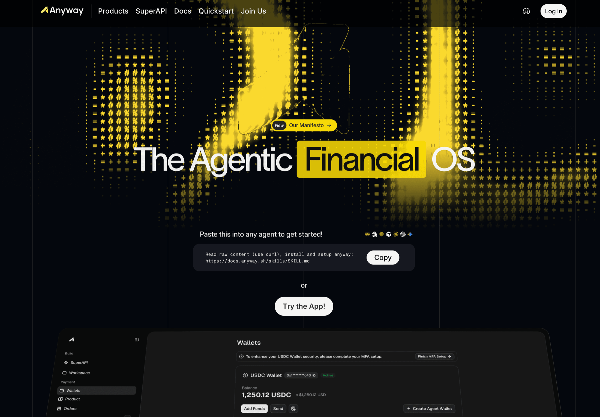
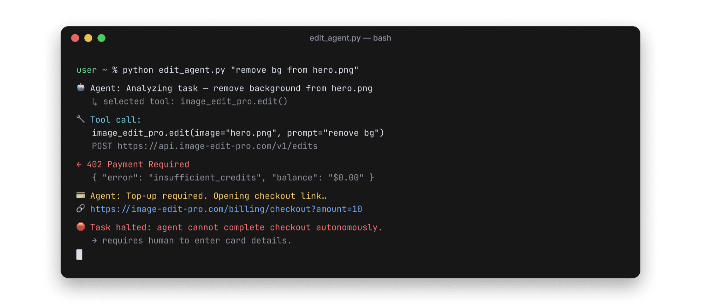
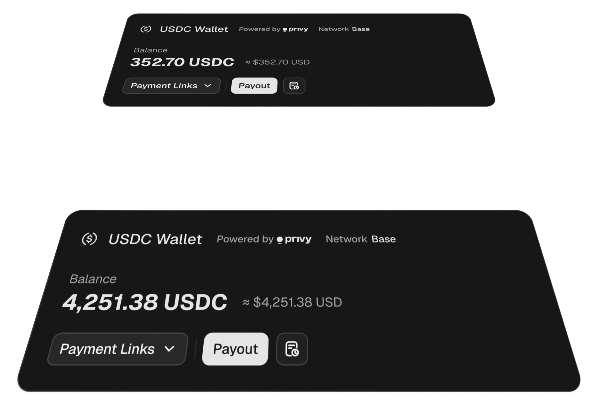
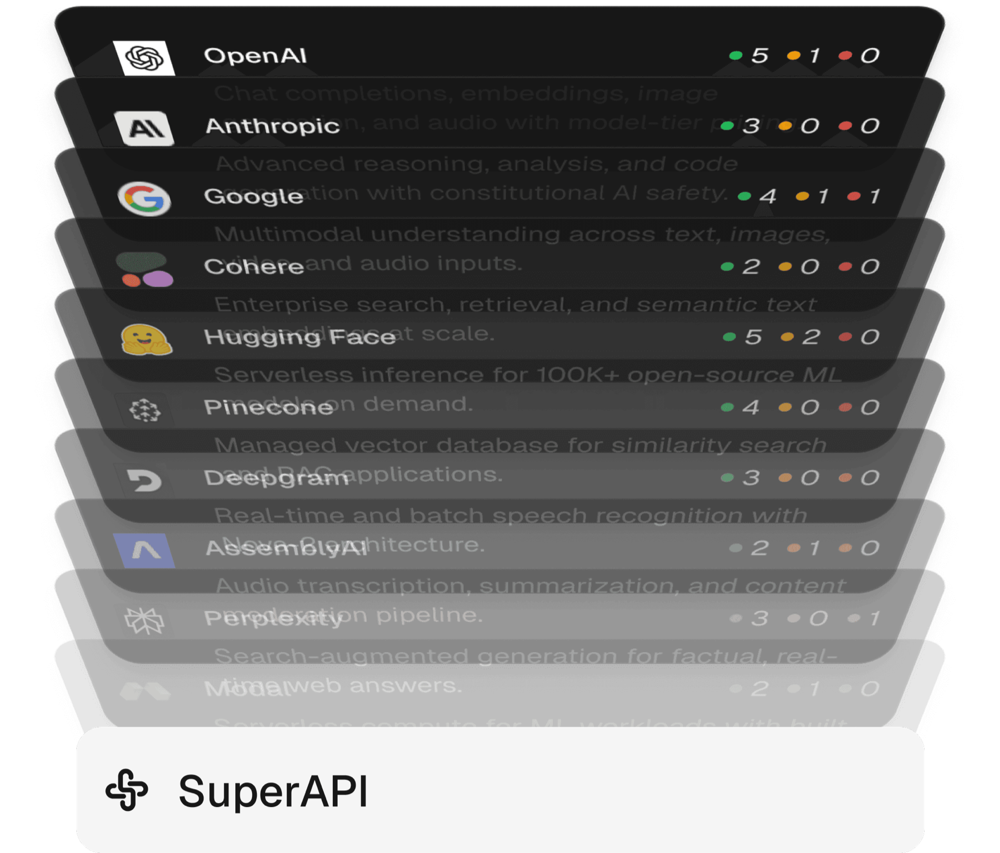

# Anyway

> **一句话**：Anyway 是面向 AI Agent 的金融操作层，把 Agent 钱包、跨支付轨道收款、按次付费 API 市场和执行成本追踪放进同一套 CLI / SDK / 控制台。

## TL;DR

Anyway 最值得关注的不是“AI 也需要钱包”这句口号，而是它在不到半年里完成了一次非常激进的产品上移：2026 年 2 月 Beta 仍以“帮助 Agent 变现”为核心，随后补入 tracing、成本归因和聊天式 Workspace，5 月开始把第三方 API 聚合成 SuperAPI，6-7 月又把 Agent Wallet、x402 支付和 Stripe 充值推到前台。当前产品已经覆盖 **卖方收款 + 买方支出 + API 供给 + 交易/执行追踪**，这比单一 Agent wallet 或 payment link 更接近“Agent 经济控制面”。

它不是纯概念。公开 CLI 从 4 月 9 日到 7 月 1 日连续发布 30 个版本；无账号实测能读取 37 个服务、193 个 endpoint 的实时目录，并收到包含金额、Base 网络、USDC 合约与收款地址的标准 x402 `402 Payment Required` challenge。CLI 也能识别本机 Codex/OpenClaw 环境，并为缺少 Agent Wallet Key 给出明确错误。没有注册、充值或真实付款，因此生产结算、退款、风控、计费准确性仍未验证。

目前最大的问题是“完整故事跑在证据前面”。官网宣称跨协议、跨货币路由和 secure sandbox，但公开文档实际最清楚的是 **USDC on Base + Privy MPC + x402**，收款侧则是 Stripe 或 USDC；Trust Center 主要是原则性政策，没有看到公开认证或具体控制审计。官方称 6 月已有 20K Agent wallets，但没有 active wallet、交易额、留存或客户分布，第三方网站流量工具甚至无法给出可靠月访问量。融资也没有可靠公开记录。

## 它到底解决什么

Agent 要完成一个有经济行为的任务，通常跨四个断点：

1. **发现能力**：找到搜索、模型、浏览器、数据或其他服务。
2. **获得支付权限**：知道自己能花多少、是否可直接转账、由谁授权。
3. **调用并结算**：处理 API key、402 challenge、签名、稳定币或卡支付。
4. **留下业务证据**：把一次付款关联回具体 Agent、用户、工作流、成本和结果。

Anyway 同时覆盖四处。SuperAPI 聚合 API；Agent Wallet 提供受限签名权；CLI 自动完成 402 challenge 与重试；Tracing 和 customer/order attribution 把成本、收入和 Agent 行为连接起来。它的核心差异不只是“Agent 能付款”，而是试图回答：**这笔钱为什么花、由哪个 Agent 花、对应哪次任务、最终是否产生收入或结果。**

## 产品分层与成熟度

| 层 | 已公开能力 | 本轮判断 |
| --- | --- | --- |
| Agent Wallet | USDC on Base、Privy MPC、P-256 Agent key、默认单笔 `$5`、默认阻止 direct send | 文档和 CLI 命令面完整；真实创建与付款未测 |
| SuperAPI | 37 个服务、193 个 endpoint；x402 按次付费；AI/search/crypto/browser 等目录 | 目录与 402 challenge 已实测；目录中所有 service 的 `verified` 字段当前均为 false |
| Merchant Payments | Stripe 或 USDC 产品、payment link、订单、webhook | 文档与 CLI 已有；真实收款未测 |
| Tracing / Cost | OpenTelemetry tracing、模型成本、用户/订单归因、Workspace | SDK 和公开仓库可见；与支付闭环的生产采用未证实 |
| Protocol Router | 官网称统一 x402、ACP、MPP，并覆盖 fiat/crypto | 当前公开实现证据仍以 x402、Stripe、USDC/Base 为主，其他协议深度待验证 |
| Security / Governance | 单笔限额、阻止直接转账、审计记录、Trust Center | 有基础控制；日/任务/供应商类别限额、human gate、退款恢复等未清楚公开 |

Agent Wallet 的设计值得单独看：Agent 本地持有 P-256 signing key，不直接持有钱包私钥；Privy MPC 在服务端签名层执行 policy。它降低了把 raw private key 交给 Agent 的风险。不过公开默认 policy 目前主要是“单笔上限 + 禁止 direct sends”，距离一个企业级 Agent 财务治理面仍有距离。

## SuperAPI：能力市场还是支付路由

2026-07-14 的公开目录返回：

- 37 个服务、193 个 endpoint；
- AI 84 个 endpoint、crypto 55 个、search 20 个、finance 15 个；
- 28 个 endpoint 未标价格，其余公开价格约 `$0.001` 到 `$3`；
- 目录中的 service `verified=false`，不能把“已列入目录”自动写成经过 Anyway 商业或技术认证。

供给包括 ElevenLabs、MiniMax、FAL.ai、CoinMarketCap、Cloudsway、twit.sh、搜索/浏览器/安全工具等。Anyway 的价值是让 Agent 不必为每家服务保存独立 key，而用钱包和 x402 按次调用。风险也在这里：它必须持续承担供应商可用性、价格透明度、调用错误、退款与责任划分，而不仅是做一个目录。

## 本轮无账号实测

本轮只做公开、低风险验证，没有注册或消费：

1. `npx -y @anyway-sh/cli@0.11.1 --help` 成功，命令覆盖 login、products、orders、dashboard、wallets、agent wallets、SuperAPI、developer keys 和 traces。
2. `anyway setup --check --format json` 正确识别本机 Codex 与 OpenClaw skill 目录。
3. `wallets agents whoami` 在缺少凭证时返回明确错误，区分 Agent Wallet Key 与 merchant login。
4. 公开 directory API 返回 37 个服务、193 个 endpoint。
5. 对 `twit-sh` endpoint 的未付费请求返回 HTTP 402，challenge 明确给出 0.01 USDC、Base (`eip155:8453`)、USDC 合约、收款地址和 x402 v2 参数。

这些结果证明 CLI、目录和付款挑战链路可用；没有证明付款后的上游结果、链上结算、退款、账单归因和高并发稳定性。证据：[[source.anyway.product-smoke-test-2026-07-14]]。

## 产品演化：五个月扩了四层

- **2025-09/10**：GitHub org 建立；创始人开始预告 Anyway。
- **2026-02-14**：Beta 上线，定位是帮助 Agent “get paid” 与 monetize outcomes。
- **2026 年 2-3 月**：叙事迅速加入 tracing、成本、延迟与 Agent observability；通过 Imperial、OpenClaw clinical 等黑客松让参赛项目接 SDK。
- **2026-04-09**：发布聊天式 Anyway Workspace，把 tracing、图表、flags、模型成本和 payment links 放进一个财务工作台。
- **2026-05**：SuperAPI 成为主线，连续宣布 MiniMax、Cloudsway、CoinMarketCap、Z.ai、Monad x402 等供给或生态接入。
- **2026-06-08**：官方称已创建 20K Agent wallets；6 月 26 日支持通过 Stripe 给 Anyway Credits 充值。
- **2026-07-13**：重新组合成 “SuperAPI + Agent Wallet”，强调 Agent 自己完成工作并为每次调用付款。

这条演化说明团队并非只做钱包，而是在找一个更大的 control point。但也意味着 tracing SaaS、merchant payments、API marketplace、crypto wallet 和 protocol router 五种产品同时存在，产品聚焦与组织负担是需要持续观察的核心问题。

## 团队与资本

公开可确认的创始人是 [[person.jims-young]]（中文名/法律材料中出现 Mengqi Yang）。其公开履历对细节存在两套口径：公司发布的 PR 称他曾在 Airwallex 从 0 到 1 搭建 company card 业务，随后从事风险投资；RootData 则列出 Youbi Capital、源码资本与阿里巴巴。两者不必然矛盾，但本轮未从 LinkedIn 经历页获得完整时间线，因此只确认“支付 + 投资”组合，不把具体任职年限写死。

LinkedIn 公司页标注 2-10 人；employees 搜索显示 total 21，但只有 6 个可见结果且混有学生/投资人身份，不能当作当前 headcount。高置信角色包括 Jims、Growth/Ops 的 Ivy Zeng、Building Anyway 的 Jichun (Joe) Cai；npm maintainer 还显示 David、Seven、Jeremy 三个工程维护者邮箱。团队正在招聘美国 GTM/BD、Solutions Architect、设计、后端与运营，反映公司正从跨地区产品团队向旧金山市场扩张。

没有找到可靠的融资公告、投资机构 portfolio 或交易数据库记录。结论只能是 **融资未公开/未核实**，不能推断为 bootstrapped，也不能根据创始人 VC 背景脑补投资方。

## GTM：先占开发者现场，再放大品牌

Anyway 的早期分发很清晰：

1. **黑客松做产品试验场**：Imperial/OpenClaw、Clinical Hackathon、Stanford/Hack Nation 中同时做 sponsor、judge、workshop 和 credits provider，让参赛 Agent 接入 tracing 或 payment track。
2. **合作公告扩目录心智**：用 MiniMax、CoinMarketCap、Z.ai、ElevenLabs 等品牌证明 SuperAPI 供给，而不是先做 SEO。
3. **Founder-led + 高视觉密度传播**：Jims 的 X 有约 9.5K followers，公司账号约 1.9K；官网与视频投入明显，品牌在 4 月集中重做。
4. **从活动转向美国 BD**：团队公开表示向 SF full-time transition，并招聘 founding GTM/BD 与 solutions architect。

网站侧还看不到成熟的 demand engine。Similarweb 没有足够数据估算月访问；Semrush 只有 Authority Score 2、10 个自然关键词、51 个引荐域和 75 条反链，关键词主题还混入无关服装搜索。博客已有 8 篇围绕 agent payments、协议、monetization 与 observability 的内容，但当前 SEO 仍是布局而非增长结果。

## 社区与采用证据

HN、Reddit 没有找到有效的 Anyway 产品讨论；Product Hunt 命中的是同名旧产品，不是该公司。这不是“没有用户”，只是公开社区反馈不足。

找到一条独立用户视频，展示通过 Anyway SuperAPI 调 Z.ai 构建健康监测应用；样本只有一条，适合作为“有人跑过调用”的弱证据，不足以证明生产采用。官方 20K wallets 也缺少 active、去重、credits 发放和真实交易定义。当前最可靠的使用证据仍是：公开 CLI/SDK 持续发布、黑客松项目接入、目录与 402 可实测。

中文世界主要通过创始人本人、小红书招聘和黑客松合作进入视野，尚未形成独立开发者口碑。公众号搜索命中的核心文章来自与团队关系紧密的“支无不言”，应视为分发渠道而非独立媒体验证。

## 竞品边界

| 类型 | 对象 | 与 Anyway 的关系 |
| --- | --- | --- |
| 最直接 | [[company.sapiom]] | 同样聚合能力、执行支付并做治理；Sapiom 更向 execution runtime 上移，Anyway 更强调 wallet、merchant 收款和 traces |
| 直接 | [[company.skyfire]] | 更强调 KYA、pay token、buyer/seller 身份与交易控制 |
| 直接 | [[company.nevermined]] | 更强调 access、metering、pricing 与 Agent service monetization |
| 协议/轨道 | Coinbase x402、Google AP2、OpenAI/Stripe ACP、Mastercard Agent Pay | 可能成为 Anyway 路由的底层标准，也可能由大平台直接吞掉聚合层 |
| 功能邻近 | Langfuse、Helicone、Traceloop | 竞争 tracing/cost 层，不等于完整 Agent financial OS |
| 供给/邻近 | RapidAPI、模型网关、各 API provider | 竞争统一调用入口，但通常不同时提供受限 Agent wallet 与交易归因 |

Anyway 与 Sapiom 的重叠尤其值得盯：二者都在把“一个 key 调所有能力”与付款结合。Anyway 当前更像 **financial identity + wallet + marketplace + ledger**；Sapiom 则试图成为 **capability access + workflow runtime + payment + governance**。未来谁先获得真实调用量和企业控制面，远比谁的首页层级更多重要。

## 关键判断与风险

1. **Anyway 抓到的核心问题成立：Agent 的经济行为不能只留下付款凭证，还要留下任务与责任链。** Tracing 和 payment 的结合比单做 wallet 更有长期价值。
2. **产品扩张速度既是能力也是风险。** 五个月内从 monetization 到 observability、Workspace、SuperAPI、wallet 和协议路由，说明执行快，也说明 PMF 尚可能在移动。
3. **当前最真实的产品楔子是 x402 SuperAPI + 受限 Agent Wallet。** 跨所有协议/货币的 Financial OS 仍是方向性叙事，不应与当前实现等同。
4. **20K wallets 是监控信号，不是规模结论。** 需要 active wallets、真实付费调用、GMV、留存、provider concentration 与 credits 补贴占比。
5. **治理面仍薄。** 单笔限额和禁止 direct sends 是好起点，但企业还会要求日/任务预算、新供应商审批、身份、退款、争议、异常回滚和人类 gate。
6. **GTM 目前明显是 event/network-led。** 黑客松能快速产生集成样例和开发者关系，但能否转成持续付费客户尚无公开数据。
7. **资本与组织信息透明度偏低。** 融资未公开、团队人数口径冲突，未来若进入托管资金与企业支付，信任建设会比一般开发者工具更重要。

## 待验证

- 20K wallets 的 active 定义、去重、交易量、credits 补贴比例与留存。
- 193 个 endpoint 中经过生产验证、SLA、退款和错误归责的比例；`verified=false` 的具体含义。
- ACP、MPP、fiat routing 和 secure sandbox 当前哪些已可用，哪些仍是 roadmap。
- Agent policy 是否会增加日/任务/供应商/类别限额、审批与异常恢复。
- Stripe/USDC 收款与 Agent traces 是否已经形成真实 revenue attribution 闭环。
- 公司融资、董事/投资人及当前全职团队规模。
- 黑客松开发者是否继续使用，还是一次性 credits 驱动的试用。

## 证据索引

产品：[[source.anyway.homepage-2026-07-14]]、[[source.anyway.docs-index-2026-07-14]]、[[source.anyway.docs-agent-wallet-2026-07-14]]、[[source.anyway.docs-superapi-2026-07-14]]、[[source.anyway.docs-payments-tracing-2026-07-14]]、[[source.anyway.product-smoke-test-2026-07-14]]、[[source.npm.anyway-cli-2026-07-14]]、[[source.github.anyway-platform-2026-07-14]]。

演化与团队：[[source.x.anyway-beta-launch-2026-02-14]]、[[source.x.anyway-workspace-launch-2026-04-09]]、[[source.x.anyway-superapi-wallets-2026-07-14]]、[[source.linkedin.anyway-team-2026-07-14]]、[[source.jims-young.profile-crosscheck-2026-07-14]]。

规模与边界：[[source.similarweb.anyway-2026-h1]]、[[source.semrush.anyway-2026-07-13]]、[[source.community.anyway-search-2026-07-14]]、[[source.x.anyway-independent-demo-2026-05-29]]、[[source.anyway.trust-terms-2026-07-14]]。

研究判断：[[note.anyway-product-takeaway-2026-07-14]]、[[note.anyway-research-run-2026-07-14]]、[[concept.agent-native-payments]]。
