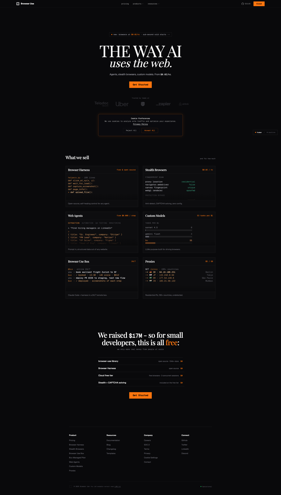

# Browser Use 调研

## TL;DR

Browser Use 是 browser-agent 赛道里最强的开源入口之一：核心 repo `browser-use/browser-use` 已经超过 104k stars，MIT license，官网直接把自己定位成 “The #1 open-source browser automation platform”。它的商业路径不是从云浏览器开始，而是从开源 agent browser framework 起势，然后顺势做 Cloud、stealth browsers、web agents、custom models、profiles、proxy、Browser Harness、Bux 等产品。

一句话：Browser Use 是“开源框架 -> 社区/launch 爆发 -> Cloud 产品化”的典型样本。和 Browserbase/Hyperbrowser 不同，它的最大资产是开源心智和开发者扩散，而不是一开始就卖 infra。

## 产品分层

### 1. 开源 browser-use library

GitHub 描述是 “Make websites accessible for AI agents”。早期 Show HN 中他们强调：通过提取 xPaths、interactive elements、screenshots 等，把网页变成 LLM 友好的结构，让 LLM 用 function calling 控制浏览器。

这不是“全知全能 agent”，而是给 agent web automation 提供底层交互层。

### 2. Browser Use Cloud

YC Launch 和 Cloud 文档显示，Cloud 解决的是 hosted browser + agent task + profiles + proxy/persistent session/parallel instances。核心对象包括：
- Session：一次云端浏览器运行环境；
- Browser：可通过 CDP 控制的 hosted browser；
- Agent：围绕 task 控制 browser 的工具/提示/模型组合；
- Model：Browser Use 官方模型或外部模型；
- Browser Profile：持久化 cookies/localStorage/saved passwords；
- Task：用户 prompt + 文件/图片，系统返回结果。

Cloud docs 里还强调 API v3、structured output、follow-up tasks、live messages、workspaces/files、deterministic rerun、human-in-the-loop、MCP、webhooks、n8n 等。

### 3. Stealth browsers / proxies / profiles

官网主打 $0.02/hr stealth browsers、$5/GB residential proxies、195+ countries、CAPTCHA solving、anti-detect。Cloud 文档中 browser session pricing 仍出现 $0.05/hr，和官网口径不同，说明价格/产品包在迭代；报告里不要把单一价格当永久事实。

### 4. Browser Harness / Bux / Custom Models

官网把 Browser Harness 标为 free & open source，强调 self-healing control；Bux 是 “Claude Code + harness in a 24/7 remote box”；Custom Models 则主打为 browser driving 优化的模型成本效率。

这说明 Browser Use 正在从一个 Python library 扩到 agent runtime/tooling/product suite。

## 增长与融资

Browser Use 的启动路径很清晰：
- 2024-11-05 Show HN：Gregor 和 Magnus 用 5 天做出 Browser Use，180 points / 72 comments；
- 2025-01-28 YC Launch：OpenAI Operator 后，社区要求 hosted version，于是发布 Browser Use Cloud；
- 2025-02-25 Launch HN：Browser Use Cloud，259 points / 100 comments；
- 2025-03-22 官网博客宣布 $17M seed；
- TechCrunch 2025-03-23 报道：Felicis 领投，Paul Graham、A Capital、Nexus Venture Partners 等参与。报道还提到 Manus 对 Browser Use 的使用显著放大了认知。

这个路径值得学习：它不是先做大型商业产品再找用户，而是先用开源框架占住问题心智，再在 OpenAI Operator 带火 browser agent 后快速推出 Cloud 承接需求。

## 团队

YC 公司页显示 Browser Use founded in 2024 by Magnus Müller and Gregor Zunic，7 employees，based in San Francisco，YC W25。TechCrunch 报道补充两人来自 ETH Zurich Student Project House，做过 web scraping / data science 相关工作。

已确认触点：
- Gregor Žunič：X @gregpr07，LinkedIn /in/gregorzunic；
- Magnus Müller：X @mamagnus00，LinkedIn /in/magnus-mueller；
- 公司 X @browser_use，LinkedIn company /company/browser-use。

## 开发者生态

GitHub org 很强：
- `browser-use/browser-use`：104k+ stars，11.5k forks，MIT，Python；
- `browser-use/browser-harness`：15.9k stars；
- `awesome-prompts`、`desktop`、`terminal`、`vibetest-use`、`bux`、SDK、n8n nodes、examples 等一系列周边。

这里的关键不是单仓 stars，而是它已经形成了围绕 browser agent 的开源生态与实验场。

## 流量与 GTM

Similarweb Jan-Jun 2026 显示 browser-use.com 6 个月总访问 2.519M，月均访问 190,824，月独立访客 108,827，访问时长 1:55，页/访 1.95，跳出率 56.97%。

渠道结构：自然搜索 50.11%、Direct 34.66%、Referral 6.83%、Organic Social 5.65%、Gen AI 2.32%。自然搜索里品牌 90%，非品牌 10%，说明搜索增长主要来自“Browser Use”品牌/开源心智，不是宽泛 SEO 内容站。

地理：美国 21.65%、印度 13.03%、中国 6.49%、加拿大 4.64%、德国 3.62%。中国出现在 top 3，和中文社区大量教程/讨论方向一致。

Referral：YC 27.97%、GitHub 23.02%、AI 工具目录 aixploria 7.08%、saaspo 4.38%。社交：YouTube 48.44%、X 42.64%。这是一套非常典型的开源开发者扩散路径：GitHub + YC/HN + YouTube/X + AI 工具目录 + branded search。

## 社区反馈与风险

Reddit 负反馈主要集中在：安装难、慢、循环、简单任务失败、生产可靠性不足、真实登录态/反 bot 复杂。另一个实测帖里也反复提到：本地真实浏览器/已有登录态、bot detection、long-running multi-step、parallel sessions 是关键分水岭。

这说明 Browser Use 虽然开源心智极强，但用户预期也很容易过高。它需要把“demo/开源库”升级成生产级 cloud runtime，难点不只是网页理解，还有身份、反爬、状态、并发、重试、成本、可观测性。

## 和 Browserbase / Hyperbrowser 的区别

- Browserbase：更像企业/开发者平台，Stagehand 心智强，访问质量高，停留时间和页/访更好。
- Hyperbrowser：更像 web infra + stealth/proxy/captcha + agent runtime/sandbox，官网技术栈更“底层产品化”。
- Browser Use：最强的是开源心智和社区扩散，商业化靠 Cloud/stealth browsers/agents 承接。

一句话：Browser Use 更像“开源项目产品化”，Browserbase/Hyperbrowser 更像“infra 平台产品化”。

## 对我们的 takeaway

1. 开源是 browser-agent 赛道非常强的获客方式，但必须快速接 Cloud，否则用户会卡在安装、模型、浏览器环境、登录态和反 bot。
2. Operator/Manus 这样的外部事件会放大品类需求，Browser Use 抓住窗口迅速推出 Cloud，这个 timing 很关键。
3. “让网页变成 LLM 可操作结构”比“让模型看截图”更便宜、更可重复，这是 Browser Use 的核心叙事。
4. 但真实生产问题并没有被 stars 解决：登录态、动态 UI、反爬、长任务、重复执行、状态恢复仍然是产品机会。
5. 对我们做 agent infra：开源心智、文档/LLM-readable docs、MCP/SDK、deterministic rerun、profile sync 都是值得学习的 GTM + 产品组合。

## 待补

- Product Hunt launches 4 个具体发布时间/排名。
- Cloud 实际试用体验：API v3、profile sync、deterministic rerun、human-in-the-loop。
- Browser Use 和 Browserbase/Hyperbrowser/Browserless/Anchor Browser/Steel.dev 的功能矩阵。
- GitHub issue/Discord 里的生产问题分类。

## 证据分级

S1：官网、docs、GitHub、YC、公司/个人 X & LinkedIn。
S2：TechCrunch、HN、Similarweb。
S3：Reddit、Product Hunt、中文社区搜索结果。
