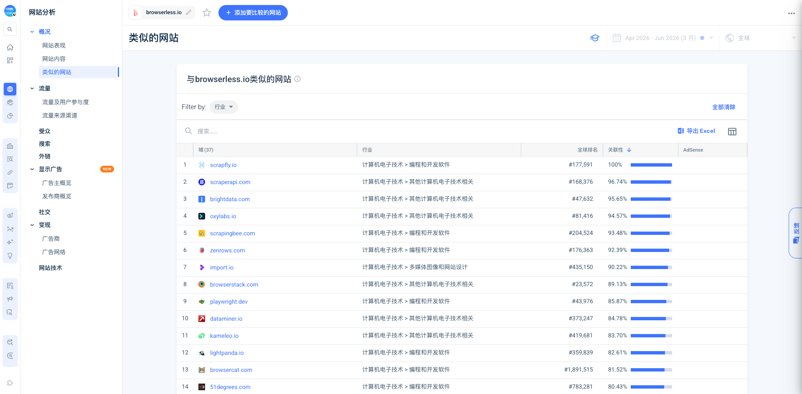

# Browserless

## TL;DR

Browserless 是一类更早的 browser infra 公司：它不是从 AI agent 风口里长出来的，而是从 2017/2018 年前后的 headless Chrome / Puppeteer 生产化问题里长出来的。今天它把自己重新表述为 “browser infrastructure for scraping, automation, testing and AI agents”，但底层护城河仍然是老问题：浏览器很重、容易泄漏、容易崩、难并发、难隔离、难绕过 bot detection、难在企业环境里维护。

和 Browserbase、Hyperbrowser、Browser Use 相比，Browserless 的位置更像“上一代但仍在进化的基础设施”：它有更长生产历史、自托管/企业私有化、Puppeteer/Playwright 兼容、BrowserQL/stealth/CAPTCHA/proxy 组合，也有内容 SEO 和开源/源码可用积累；但它的品牌增长和开源心智不如 Browser Use 激进，X 社媒也不强。

最值得学的是它的 GTM：不是靠一场 launch 爆掉，而是多年围绕同一个痛点写内容、回答 GitHub/StackOverflow/HN 的具体问题，把“开发者不想养 Chrome”这件事反复讲清楚。它早期在 HN 被质疑“这不就是几行 Docker/Helm 吗”，Joel 的回答一直是 managed database 类比：能自建不代表应该自建，真正成本在稳定性、支持、集成和长期维护。

## 产品定位

Browserless 的核心产品可以拆成四层：

1. **Browsers as a Service**：把本地 Puppeteer/Playwright 的 `launch()` 改成 remote `connect()`，让脚本跑在 Browserless 管理的浏览器池里。
2. **REST APIs**：截图、PDF、scraping、search、crawl、export 等单请求任务，不需要自己写完整 browser library 代码。
3. **BrowserQL / stealth automation**：专门面向 bot detection/CAPTCHA/fingerprint/proxy 的自动化层，强调 Cloudflare/Datadome bypass、humanized interactions、session reuse。
4. **AI agent browser automation**：把长期的 browser/session/profile/command batching 能力包装给 agent 使用，支持 MCP、authenticated profiles、跨 turn session。

这说明 Browserless 并不是纯“agent 产品”。它更像浏览器执行层：AI agent 只是其中一个新上层应用。

## 发展脉络

Browserless 的起点是 Joel Griffith 做 scraping/PDF/SPA 渲染时发现 headless browser 很难稳定运行。早期 Failory 采访里它被称作 “chrome-as-a-service”，典型需求是 PDF generation、screenshots、data gathering。2018 年 HN 帖子 “Observations running 2M headless sessions” 已经在讨论 tabs vs browser processes、memory leak、Chrome crash、container isolation、bot blockers、PDF generation 等今天仍然存在的问题。

2024 年官方 V2 重建文章很关键：Joel 说 Browserless 是八人 bootstrapped startup，已有 thousands users，上年超过 $1M ARR；核心产品是在 AWS/DigitalOcean 上跑 thousands of managed cloud browsers，并支持 Puppeteer/Playwright scripts 和 self deploy container。V2 重写的原因不是追 AI，而是 V1 从 2015 以来技术债太重：memory leaks、Chrome 绑定太深、难扩展 Firefox/WebKit、developer experience 差。

到 2026 年第三方 SaaS Club 摘要称 Browserless 接近 $4M ARR、团队不到 10 人。这不是官方财务披露，但与“bootstrapped small team + content engine + long-term infra”叙事一致。

## 增长与 GTM

Browserless 的增长更接近“问题搜索驱动”的开发者基础设施，而不是 Product Hunt/X 爆发型产品。

早期 Joel 明确说 Product Hunt/HN 这种大站点不一定有效，真正带来早期客户的是 niche communities、GitHub issues、StackOverflow、web dev subreddits，以及持续写 headless browser 的实战内容。这个经验和我们前面看 Superset 的 PH 爆发路径不同：Browserless 的受众非常窄，大众曝光不一定转化，具体问题入口才有价值。

Similarweb 也支持这个判断：2026 Jan-Jun，`browserless.io` 总访问约 1.153M，月访问约 101,595；Direct 32.26%，Organic Search 29.18%，Referrals 9.79%，Organic Social 6.04%，Gen AI 16.64%。它不是纯 SEO，也不是纯社媒，而是长期品牌/搜索/外链/AI 问答共同驱动。非品牌搜索占 44%，说明还有不少来自具体技术问题，比如 `cloudflare bypass`、`playwright vs selenium`、`memory leak fix`。

## 流量与竞品位置

Browserless 的 Similarweb similar sites 与 Browser Use/Hyperbrowser 不一样。它更靠近 scraping/proxy/browser automation 老赛道：Scrapfly、ScraperAPI、Bright Data、Oxylabs、ScrapingBee、ZenRows、Import.io、BrowserStack、Playwright、Kameleo、Lightpanda、Browsercat、Skyvern。

这说明我们不能把 Browserless 简单归类成 Browserbase/Hyperbrowser 的直接竞品。更准确的三层关系：

- **直接邻近**：托管浏览器、Puppeteer/Playwright 云执行、browser session、截图/PDF/scraping API。这里对 Browserbase/Hyperbrowser 有重叠。
- **传统竞品**：Scrapfly、ScraperAPI、Bright Data、Oxylabs、ScrapingBee、ZenRows，重点在 scraping、proxy、anti-bot。
- **AI agent 新叙事**：Browser Use、Skyvern、agent browser automation，重点在 agent 能否可靠上网、登录、跨步骤执行。

## 团队与商业状态

Browserless 是 bootstrapped small team。LinkedIn company page 显示 2-10 人、约 4,000 followers；官方博客 2024 年称八人团队。Joel Griffith 是 founder/CEO，GitHub profile 显示 CEO @browserless。暂未找到可靠的 VC 融资证据；Crunchbase 搜索结果有公司页，但没有从可访问正文中验证融资轮次。当前应按 bootstrapped/自举公司处理。

这点很重要：Browserless 与 Browserbase/Hyperbrowser 的资本叙事不同。Browserbase 是融资驱动、AI browser infra 明确面向新一代 agent；Browserless 更像盈利型基础设施公司，在新一轮 AI agent 需求里重定位。

## 社区反馈与风险

Browserless 的社区讨论主要集中在 HN/GitHub/开发者内容，而不是 Reddit/X。HN 上两个长期主题很稳定：

1. **为什么不自己搭？** 开发者会本能低估 managed browser infra 的维护成本。Browserless 的回答是 managed database 类比：自建可行，但生产稳定性、监控、queue/concurrency、版本管理、支持都要长期付费。
2. **开源/许可边界**：Browserless 的 repo license 不是简单 MIT；早期就有 GPL/商业用途/云服务许可争议。这是商业化优势，也是用户心智风险。

产品风险集中在：

- Anti-bot 是持续军备竞赛，BrowserQL 的承诺越强，失败时用户预期越高。
- AI agent 叙事容易吸引更高不确定性的任务，但真实网页变化、登录、长会话、风控仍然难。
- 它的品牌声量不如 Browser Use，可能在 AI-native 开发者心智里被新玩家盖过。
- Similarweb 里 Brazil 流量占 26.18%，需要进一步确认是否由特定渠道/教程/异常 referral 带动。

## 对我们的启发

Browserless 最值得学的不是某个功能，而是“把一个脏活累活基础设施化”的耐心：Chrome/Playwright/Puppeteer 这些东西大家都会用，但少有人愿意为它们承担长期生产责任。Browserless 把这个责任产品化，并通过内容把用户的问题语言收集成入口。

对 agent infra 来说，这里有三点启发：

1. **上层 agent 再聪明，也需要可靠执行层**。登录态、session、proxy、CAPTCHA、文件下载、截图、网络日志、重试，这些不是 demo 里的细节，而是产品化的主体。
2. **兼容已有开发者工作流很重要**。Browserless 强调 existing Puppeteer/Playwright code works unchanged，这比要求用户迁移到一套全新 agent abstraction 更容易落地。
3. **内容要贴着具体故障写**。memory leak、Chrome crash、Cloudflare bypass、PDF rendering、container isolation 这类关键词很窄，但能带来高意图用户。

## 证据库

- [[source.browserless.website-2026-07-13]]
- [[source.browserless.docs-2026-07-13]]
- [[source.browserless.pricing-2026-07-13]]
- [[source.browserless.ai-agent-page-2026-07-13]]
- [[source.browserless.browserql-2026-07-13]]
- [[source.browserless.comparison-2026-07-13]]
- [[source.github.browserless-repo-2026-07-13]]
- [[source.github.joel-griffith-2026-07-13]]
- [[source.x.browserless-profile-2026-07-13]]
- [[source.linkedin.browserless-company-2026-07-13]]
- [[source.browserless.rebuilding-v2-2024-02-20]]
- [[source.failory.browserless-2019-02-21]]
- [[source.saasclub.browserless-2026-03-05]]
- [[source.lastweekinaws.browserless-2024-03-05]]
- [[source.hn.browserless-2m-sessions-2018-06-04]]
- [[source.hn.browserless-open-source-2019-11-25]]
- [[source.weixin.browserless-search-2026-07-13]]
- [[source.xiaohongshu.browserless-search-2026-07-13]]
- [[source.similarweb.browserless-2026-01-2026-06]]
- [[traffic.similarweb.browserless-2026-01-2026-06]]
