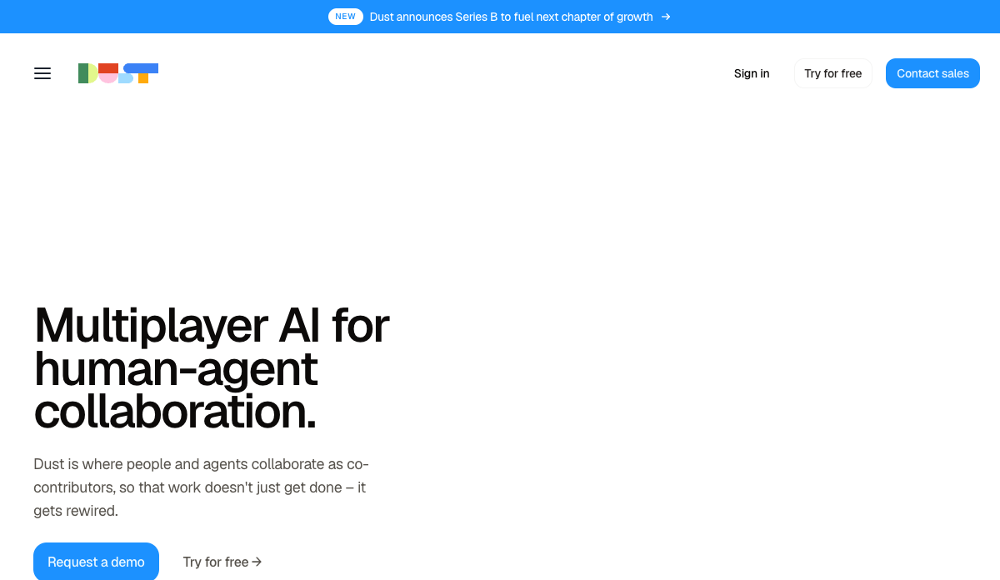
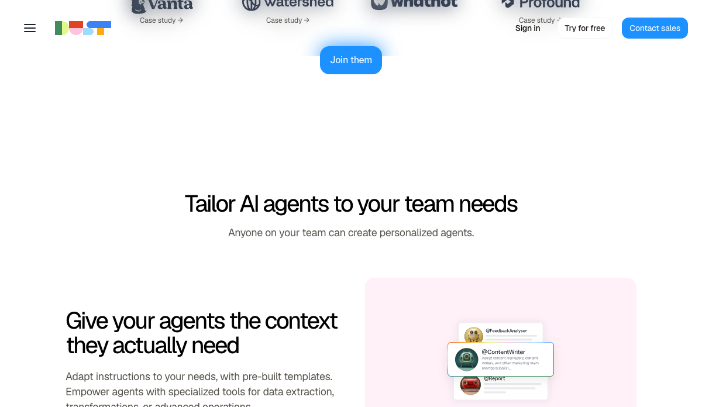
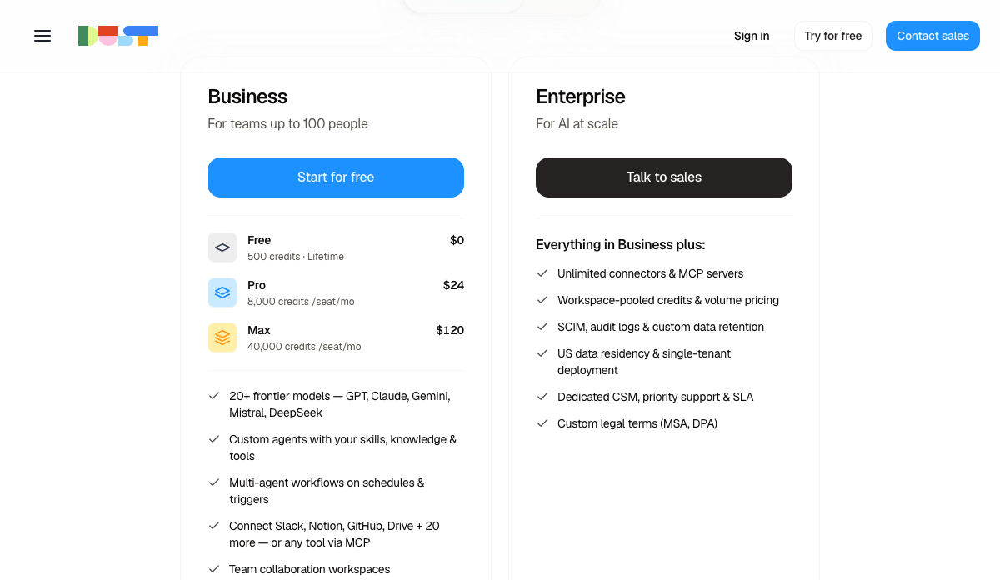
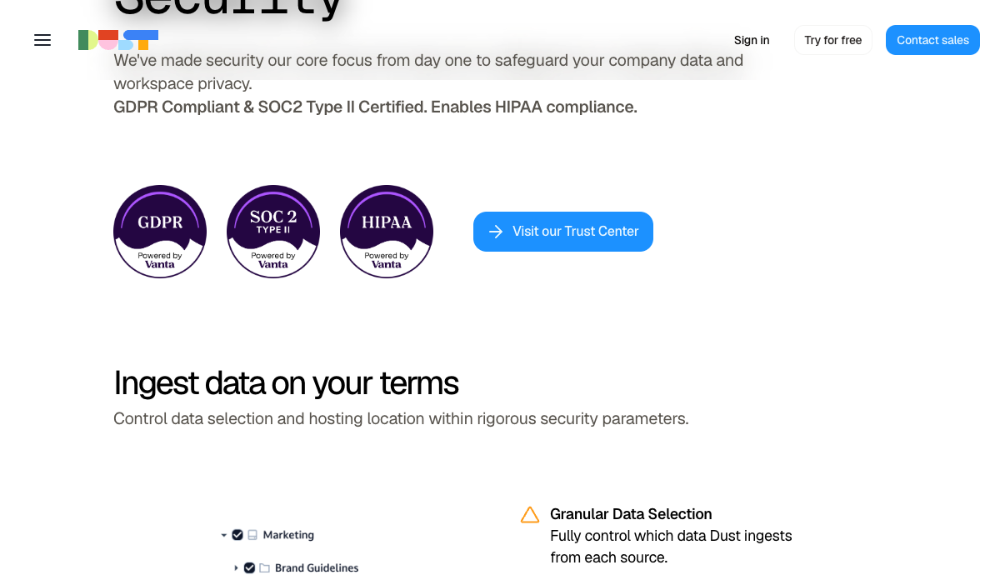

# Dust

## TL;DR

[[company.dust]] 是 Viktor 竞品池里很值得看的对象，但它和 [[company.viktor]] 的切入点不同：Viktor 把自己包装成 Slack/Teams 里的 “AI employee / hire”，强调把任务交给一个会交付结果的同事；Dust 则把自己定义成多人协作的 enterprise AI workspace，让员工和多个专业 agents 在同一个受治理的工作空间里共享公司知识、工具、上下文和任务。

我的初步判断：Dust 更像企业 agent 的 **context + collaboration + orchestration layer**，不是单纯的聊天助手，也不是只做 deterministic workflow automation。它的强项在于把企业 agent 从 single-player chat 拉到 team-level multiplayer workspace：多 agent、共享上下文、权限治理、连接企业数据源和工具、Slack/Teams 入口、MCP/工具扩展。对 Viktor 来说，Dust 是非常好的横向参照：同样卖“agent 真正进入工作”，但 Dust 更强调团队协作和组织知识，Viktor 更强调 AI employee 执行与交付。

## 进入我们视野

调研 [[company.viktor]] 时，我们把竞品集合从 Similarweb 的 audience overlap 纠偏为：能否在企业工具里接任务、跨系统执行、闭环交付。这个口径下，Dust 是更合理的候选之一。它不是从 Viktor Similarweb 直接给出的竞品，而是从“enterprise agent / team agent workspace”类别判断出来的相邻强样本。

## 产品定位

Dust 的核心叙事是 “multiplayer AI for human-agent collaboration”。它反对单人单 agent 的 private chat 形态，认为企业 AI 需要共享工作空间，让 agents 和员工看到同一批项目、对话、文件、通知、任务，并在治理和权限下协作。

从 docs 和公开报道看，Dust 的产品能力包括：

- 构建和部署 specialized agents。
- 多个 agents 可以在同一讨论里协同工作。
- agents 可以接入 company knowledge / data sources。
- 支持 Slack 和 Microsoft Teams 入口；Slack channel 里 mention `@Dust` 后，agent 可以获得 channel conversation context。
- 支持 Connections 同步企业数据源，如 Notion、Google Drive、Slack 等。
- 支持 Tools / MCP：Salesforce、NetSuite、GitHub、HubSpot、Canva、Intercom、Snowflake、Zendesk 等方向都有 docs 线索。
- 支持 triggers：按 schedule 或 webhook 触发 agent，agent 可以基于工具、数据源和公司知识处理请求，并通过工具写回连接平台。
- 支持 table queries、extract data 等结构化工作能力。

这说明 Dust 不只是 RAG bot。它已经在往“agent operating layer”走：数据源、工具、MCP、触发器、Slack/Teams、权限治理、agent analytics。

官网和 product page 进一步把 Dust 的目标用户定义成 **AI Operators**：那些不会等公司统一采购 AI 工具，而是会自己 build、deploy、run agents for their team 的人。这是 Dust 与 Viktor 很不一样的地方：Viktor 更像把 AI 员工交给业务用户；Dust 则把一批内部 AI operator 变成组织里的 agent builder / operator。

Pricing page 也验证了这个产品包装：Business 自助版本面向 100 人以内团队，Free / Pro / Max 三档分别是 $0、$24/seat/mo、$120/seat/mo，配合 credits；Enterprise 则加入 workspace-pooled credits、unlimited connectors/MCP servers、SCIM、audit logs、custom retention、single-tenant、CSM/SLA 和 custom legal terms。它不是纯 usage-based，也不是纯 seat-based，而是 **seat + credits + enterprise governance** 的混合模型。

## 融资与规模信号

TNW 2026-05-18 报道称 Dust 完成 $40M Series B，由 Abstract 和 [[investor.sequoia-capital]] co-lead，Snowflake 和 Datadog 参与；总融资超过 $60M。报道还称 Dust 2024-06 的 $16M Series A 也由 Sequoia 领投。

公开规模信号：

- 3,000+ organizations。
- 2026-04 月活用户 41,000。
- 300,000+ agents deployed。
- 70% weekly active usage。
- 2025 年 zero customer churn。

这些数字来自 Dust 自己给媒体的口径，可信度属于 S2/公司披露经媒体转述，后续如果做完整调研，需要找官方原文、投资方文章和客户案例交叉验证。

Dust 的 pricing page 与官网也给了更明确的商业化信号：它已经有 self-serve Business plan，同时把 Enterprise 包装成 governance、deployment、security、support 和 legal terms 的组合。这说明 Dust 不是只靠大客户销售，也试图让 AI operator 自助进入，再向企业化治理升级。

## 团队

[[person.gabriel-hubert]] 是 co-founder / CEO；[[person.stanislas-polu]] 是 co-founder / CTO。Sequoia podcast 和 TNW 均称两人 2023 年创立 Dust，此前有 Stripe / OpenAI 背景。TNW 还提到两人在 Stanford 相识，曾把 TOTEMS 卖给 Stripe；Stanislas Polu 后来在 OpenAI 做 research engineer，Gabriel Hubert 曾任 Alan CPO。

这类团队很强：不是纯应用层创业者，而是 product + infra + enterprise 工作流经验组合。Dust 的“多模型、企业数据、权限治理、human-agent collaboration”路线，也和团队背景吻合。

## 流量与市场信号

Similarweb 2026-06 公共页显示：dust.tt 全球排名 #61,967，法国国家排名 #3,889，法国 Programming and Developer Software category rank #75；过去三个月 global rank 从 #67,593 上升到 #61,967。流量参与度较强：bounce rate 29.25%，pages/visit 5.62，avg visit duration 00:05:34。近三个月 total visits 显示约 753.9K。

国家结构里法国占 65.53%，美国 10.24%，英国 3.02%，巴西 1.87%，印度 1.74%。这说明 Dust 仍有明显法国/欧洲 base，但已经有美国扩张信号。TNW 也称其是 Paris / San Francisco based platform，并提到在 San Francisco 扩展美国运营。

渠道上，Similarweb 公共页显示 Direct 83.14%，Organic Search 第二，Referrals 第三；搜索流量几乎全 organic，top keywords 是 `dust`、`dust ai`、`dust ia`、`dustt`、`dust.tt`。这和 Viktor 不一样：Viktor 有明显 paid search / paid social / PR launch 放大，Dust 更像强品牌/工作区直达和已有用户使用驱动。

Similarweb similar sites 给出的前几名是 agent.so、mindstudio.ai、brimlabs.ai、bestaiagents.ai、nation.ai、agent.ai、lightning.ai、decart.ai、copymind.me、typingmind.com。这个列表同样不能直接当竞品表，但说明 Dust 的流量邻域更靠 AI agent builder / model app / developer-productivity / AI frontend，而不是传统 SaaS workflow 工具。

## 和 Viktor 的关系

Dust 和 Viktor 都在回答一个问题：企业里 agent 怎么从 demo 变成日常工作系统。

差异：

- Viktor：像一个可以被雇佣的 AI coworker，入口在 Slack/Teams，强调把任务交给 Viktor，产出 deck、dashboard、app、research、code、automation。
- Dust：像一个多人 agent workspace，入口可以是 Dust web app、Slack、Teams、email、Zapier 等，强调员工和多个 agents 共享上下文、知识、工具和治理。

更具体地说：

- Viktor 的叙事偏“AI employee / outcome delivery”。
- Dust 的叙事偏“multiplayer AI workspace / agent orchestration”。
- Viktor 更像业务用户把任务交出去。
- Dust 更像组织内的 AI operator / builder 配置、管理、复用一组专业 agents。

所以 Dust 不是 Viktor 的完全同类竞品，但它很适合拆来回答：企业 agent 要规模化，是否必须有 workspace、agent 管理、权限、数据源、工具、治理和使用量经济模型？这可能是 Viktor 往后必须补的能力。

## 初步 takeaway

1. **企业 agent 不能停在 private chat。** Dust 的核心判断是 single-player AI 不会沉淀组织记忆，multiplayer workspace 才能让 agent 工作复利化。
2. **agent 需要被组织管理。** 300,000+ deployed agents 这个数字如果成立，真正问题不是“能不能建 agent”，而是发现、治理、复用、权限和质量控制。
3. **Slack/Teams 是入口，不一定是产品全部。** Viktor 主要把入口前置到协作工具；Dust 则把协作工具当入口之一，背后有更完整的 workspace / builder / governance。
4. **Dust 的增长更像产品/工作区使用驱动。** Similarweb direct 极高、停留长、pages/visit 高，和 Viktor 的 paid/PR/creator 混合打法不同。
5. **下一步要验证执行能力。** 官网和 pricing page 已经确认 multi-agent workflows、scheduled/event-driven triggers、MCP、Frames、Pods、Search/query/extract、automation platforms、developer API 等能力；但到底多大比例是真正跨系统执行、能否高可靠完成业务 workflow，还需要看客户案例、产品体验和社区反馈。

## 待验证

- 需要看客户案例：Vanta、Qonto、Watershed、Pennylane 等。
- 需要看社区反馈：HN 对 Dust 讨论很少，Reddit 搜索未命中；可能主要传播在 LinkedIn、X 和客户案例里。
- 需要验证 `@dust4ai` X 账号：profile adapter 能返回 URL，但 list-add-member 返回 User not found。

## 证据库

- [[source.dust-homepage-2026-07-09]] - Dust 官网，S1。
- [[source.dust-product-page-2026-07-09]] - Dust product page，S1。
- [[source.dust-security-page-2026-07-09]] - Dust security page，S1。
- [[source.dust-pricing-page-2026-07-09]] - Dust pricing page，S1。
- [[source.dust-docs-tools-2026-07-09]] - Dust docs: tools / MCP / Slack / Teams / triggers 等，S1。
- [[source.dust-series-b-tnw-2026-05-18]] - TNW Series B 报道，S2。
- [[source.sequoia-dust-company-page]] - Sequoia portfolio page，S2。
- [[source.sequoia-dust-podcast]] - Sequoia podcast / founders interview，S2。
- [[source.similarweb.dust-2026-06]] - Similarweb public traffic snapshot，S2。
