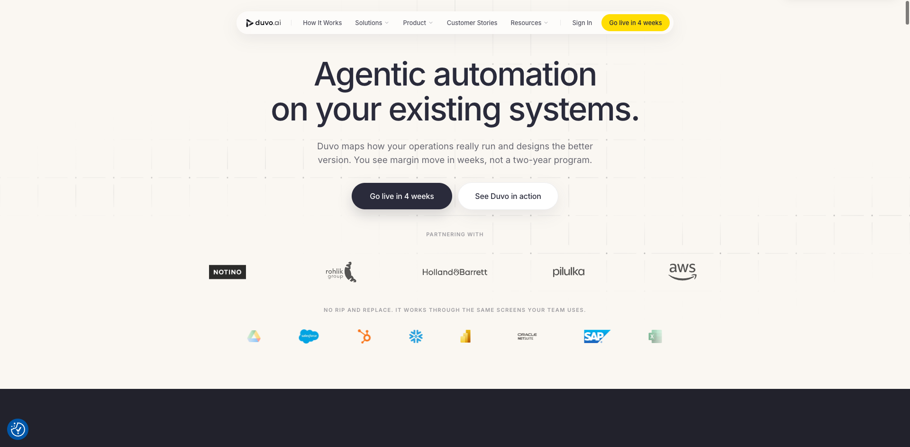
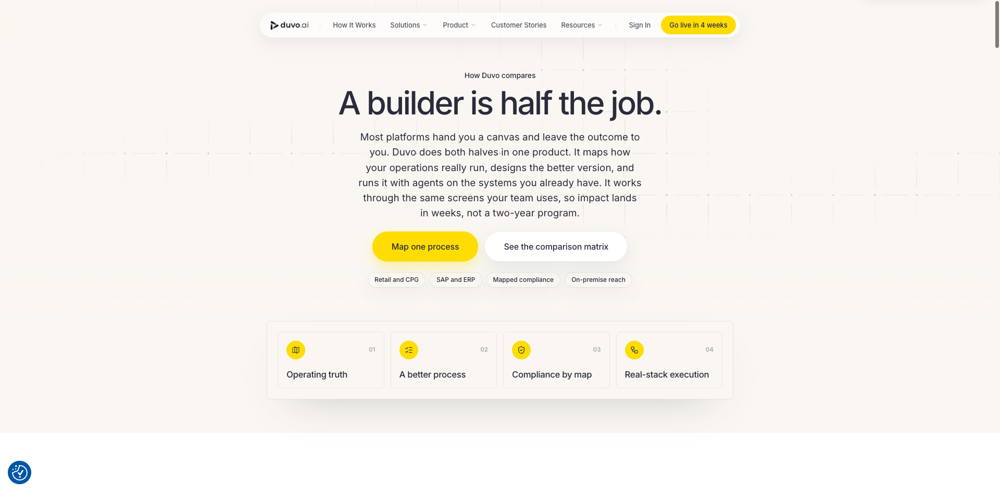
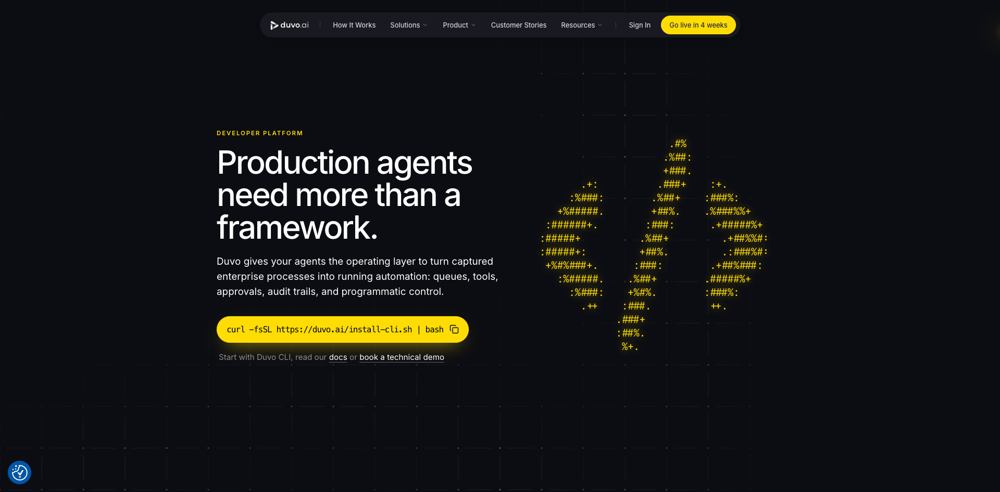

# Duvo

## TL;DR

[[company.duvo]] 是我们从 Viktor / Dust / Interloom 之后很值得看的第四类样本：**vertical AI workforce / agentic operations platform**。它不是横向“AI employee”，也不是企业 agent workspace，而是直接进入 retail / FMCG / CPG 运营，把真实流程 map 出来、优化流程，再让 agents 在既有系统里跑完 approved work。

我的初步判断：Duvo 对 agent infra 的启发很强。它说明企业 agent 的落地不只是“会用工具”或“会打开浏览器”，而是要有 process truth、domain skills、queues、approvals、evidence packs、audit history、ERP/SAP/portal/desktop reach、human gates 和按业务结果计费。它更像垂直行业里的 operations workforce，而不是通用 agent workspace。

## 进入我们视野

我们先看了 [[company.viktor]]、[[company.dust]]、[[company.interloom]]：

- [[company.viktor]]：Slack/Teams 里的 AI employee，偏前台执行入口。
- [[company.dust]]：multiplayer AI workspace / AI Operator platform，偏团队 agent 构建与治理。
- [[company.interloom]]：Context Graph / corporate memory，偏组织记忆和工作路由层。

Duvo 补的是另一层：**vertical operations automation**。它把 agent 放进 retail/CPG 真实运营流程里，强调 SAP、supplier portals、spreadsheets、email、phone calls、approvals 和 audit-ready execution。

## 产品定位

官网对 Duvo 的定义很直接：agentic operations platform for retail, FMCG, and CPG teams。它的流程是：

1. Map the real process：用 Duvo Clarity 映射真实 L4 workflow，做 costed savings case。
2. Optimize / close gaps：找出系统和流程缝隙，不把当前流程当成神圣不可改。
3. Run the work：Duvo Automation 让 agents 跨 browser、APIs、desktop 跑流程。
4. Prove outcomes：Duvo Pulse 给 live dashboards 和 case-level drilldown。

Compare page 的一句话很关键：**A builder is half the job.** Duvo 不是给你一个 workflow/agent builder 让你自己搭，而是同时做 process mapping、process improvement、mapped-process compliance 和 real-stack execution。

## 具体 use cases

官网和 compare page 提到的 retail / CPG 工作包括：

- supplier onboarding and compliance。
- purchase order creation and exception handling。
- invoice matching / invoice reconciliation / deductions recovery。
- inventory availability / replenishment / inventory planning。
- price list and promo updates。
- master data and SKU onboarding。
- logistics tracking / OTIF recovery / freight audit。
- input cost monitoring、grocery should-cost、supplier discovery、regulatory compliance、competitor intelligence。

客户结果口径：Pilulka 两周内提升 stock availability 15%；Rohlik Group 通过 invoice reconciliation 保护 €2.1M revenue 和 €1.4M margin；promo margin 从 17% 提升到 27%。这些是官网/官方披露口径，后续如做深调需要找 case study 原文交叉验证。

## 技术与 agent infra 线索

Duvo 的 developer/docs 线很强。它公开了 developer platform、OpenAPI、MCP、webhooks、CLI、agent discovery manifest、agent-card、llms.txt、compare.md、pricing.md 等 agent-readable 文件。

Developer page 的定位是：Production agents need more than a framework。Duvo 给 agents 一个 operating layer：

- durable queues。
- agents / tools / approvals。
- files / schedules / webhooks。
- multi-agent routing。
- MCP。
- audit-ready runs。
- human-in-the-loop gates。
- browser / file / desktop sandboxes。
- connections and customer policy gates。

它甚至直接写给 Claude Code / Codex 使用：把 Duvo CLI 和 hosted MCP server 加进 agent client，让 agent start runs、create cases、inspect approvals、read messages/tool calls/audit events。

这对我们很重要：Duvo 不是只卖业务 SaaS，它也把自己包装成 production runtime / operating layer for agents，面向 agent builders 和 enterprise platform teams。

## 定价

Duvo pricing.md 明确：不是按 token，不按 seat，而是 **per process run**。

- 一个 process run 是一个完成的工作单元：one invoice processed, one price change, one SKU recovered。
- 10,000 invoices = 10,000 runs。
- no per-seat fees；unlimited users can approve and monitor。
- token cost 由 Duvo 自己工程化控制，不转嫁成客户账单。
- exact per-process number 不公开，按客户流程和 expected volume scoped。

这和 [[company.dust]] 的 seat + credits，也和 [[company.viktor]] 的 credits 包装不同。Duvo 更接近“按业务工作量/结果单元计费”。这对 vertical AI workforce 很合理：客户买的不是模型调用，而是 invoice、price change、SKU recovery、supplier exception 这类工作被完成。

## 融资与团队

Duvo 2025-12-02 宣布 $15M seed，[[investor.index-ventures]] lead，[[investor.credo-ventures]]、[[investor.northzone]]、[[investor.puzzle-ventures]] 参与；angel 包括 Roy Reznik、David Singleton、Ajay Kavan、Kieran Flanagan 等。官方博客、TechFundingNews 和 Northzone portfolio 均支持这条融资线。

团队：

- [[person.tomas-cupr]]：co-founder / CEO，Rohlik Group founder / CEO。官方博客和 Substack 都强调他从 Rohlik 的真实零售运营痛点出发做 Duvo。
- [[person.marek-paris]]：co-founder / CPTO。
- [[person.martin-pecha]]：co-founder / COO。

官方博客称团队 15 人，已有 multi-billion-dollar retail and FMCG groups 客户，paying customers run six-figure annual contracts。Northzone 显示 Founded 2025，Partnered 2025，Location Czech Republic；Duvo 官网 footer 显示 taskcrew Inc., Dover, DE, US。这里说明其运营/公司结构可能跨美国和欧洲，需后续核实。

## 和 Viktor / Dust / Interloom 的关系

Duvo 和 [[company.viktor]]、[[company.dust]]、[[company.interloom]] 不在同一层：

- Viktor：横向 AI employee，入口在 Slack/Teams，卖“把任务交给 AI coworker”。
- Dust：团队 agent workspace，卖 AI Operator 平台和多人协作/治理。
- Interloom：Context Graph / corporate memory，卖企业过去如何完成类似 case 的组织记忆。
- Duvo：垂直 AI workforce，卖 retail/FMCG/CPG 运营流程里的已完成工作。

Duvo 的关键价值是把 agent 从泛化“能做很多事”压进具体垂直运营：SAP、supplier portal、spreadsheets、email、phone、human approval、audit trail。这类公司可能最能证明 vertical agent 的 ROI，因为它能直接连接 revenue/margin/working capital。

## 初步 takeaway

1. **Vertical beats horizontal when workflow is messy.** Duvo 不是先做横向 agent 再找 use case，而是从 retail/FMCG/CPG 的 messy operations 出发。
2. **Process truth before automation.** 它的核心不是 builder，而是先 map 真实流程，再修流程，再自动化。
3. **Agent infra 需要业务运行层。** queues、approvals、files、audit、MCP、webhooks、sandboxes、human gates 都是 production agent 的必要运行层。
4. **定价应贴业务工作单元。** process-run pricing 比 token/seat 更适合垂直运营场景。
5. **Docs 是 GTM。** Duvo 的 markdown、agent-card、MCP、CLI、compare.md 很像是专门为 agents / AI search / technical evaluators 准备的机器可读 GTM。

## 待验证

- 实际客户案例原文：Pilulka、Rohlik、promo margin 等是否有单独 case study。
- Similarweb 流量：普通搜索没有直接拿到有效 Similarweb public page，需要后续手动查。
- X/Twitter 官方账号：`duvo_ai` 未命中；LinkedIn 公司页可查到 6190+ followers。
- Index Ventures 页面 browser read 返回空正文；官方博客和 TechFundingNews 已覆盖融资事实，但如果深挖投资人 thesis，需换抓取路径。
- 是否已公开 SOC2/Trust Center 细节。

## 证据库

- [[source.website.duvo-home-2026-07-09]] - 官网，S1。
- [[source.website.duvo-compare-2026-07-09]] - compare page，S1。
- [[source.website.duvo-pricing-md-2026-07-09]] - pricing.md，S1。
- [[source.website.duvo-developers-md-2026-07-09]] - developers.md，S1。
- [[source.website.duvo-mcp-md-2026-07-09]] - mcp.md，S1。
- [[source.website.duvo-agent-card-2026-07-09]] - agent-card.json，S1。
- [[source.blog.duvo-seed-2025-12-02]] - official seed announcement，S1。
- [[source.substack.tomas-cupr-duvo-2025-12-02]] - founder post，S2/S1 founder-authored。
- [[source.techfundingnews.duvo-seed-2025-12-02]] - TechFundingNews seed coverage，S2。
- [[source.northzone.duvo-portfolio]] - Northzone portfolio page，S2。
- [[source.linkedin.duvo-company-2026-07-09]] - LinkedIn company page snapshot，S2 metadata。
