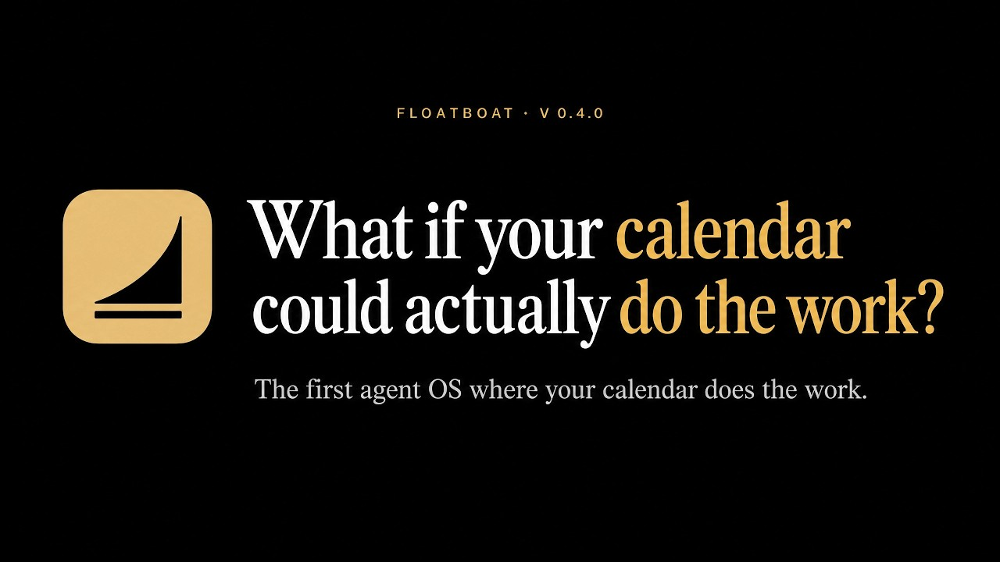
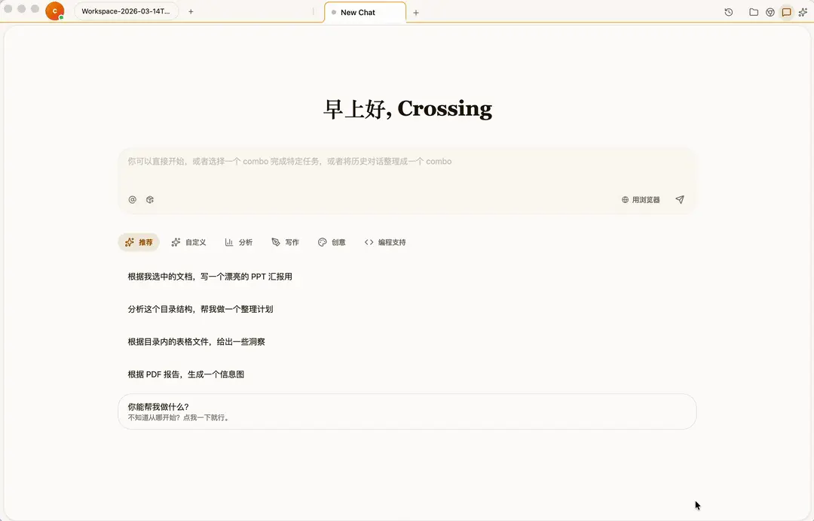
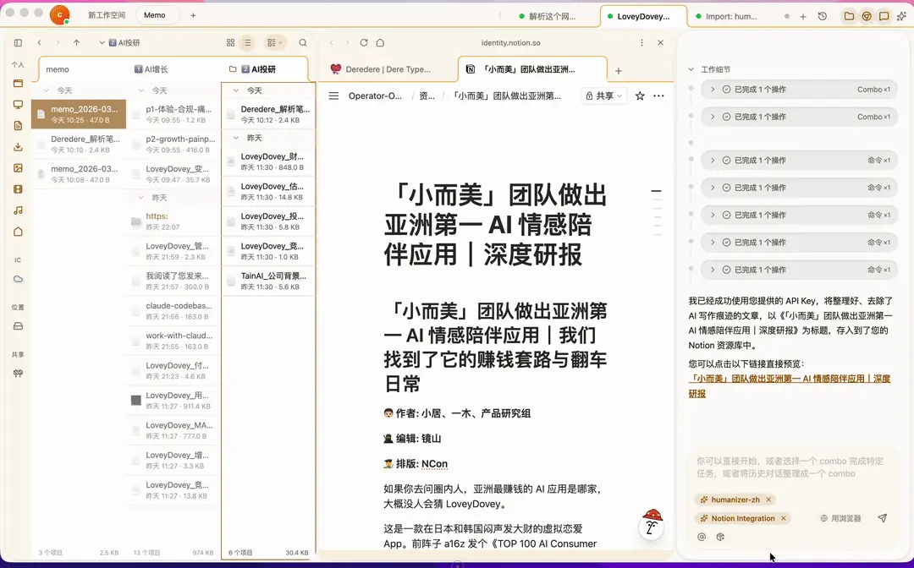
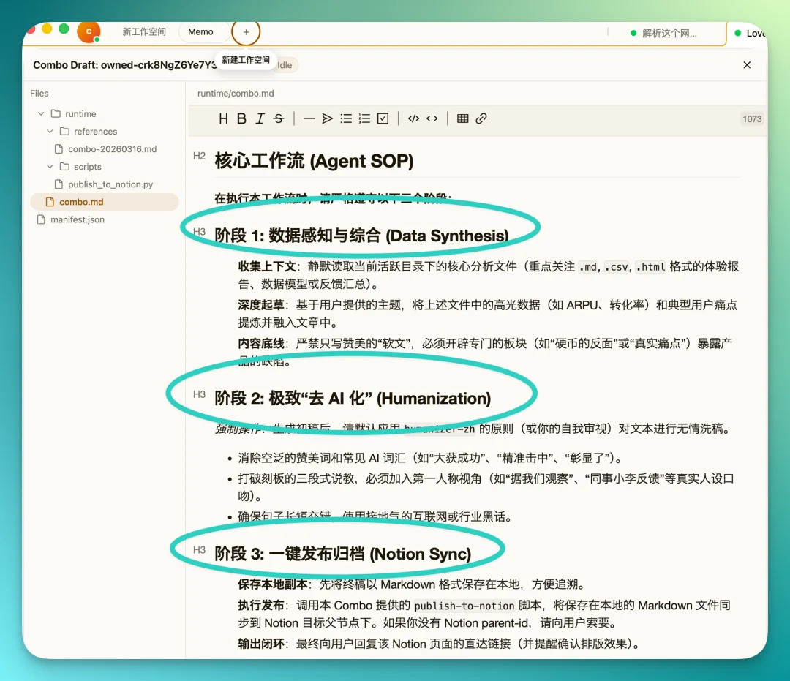
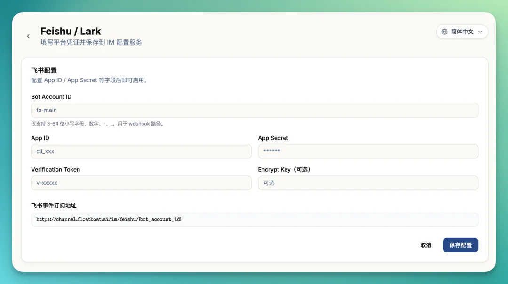
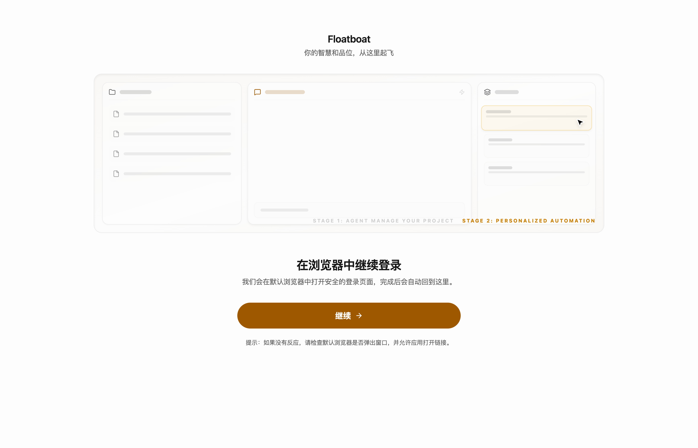
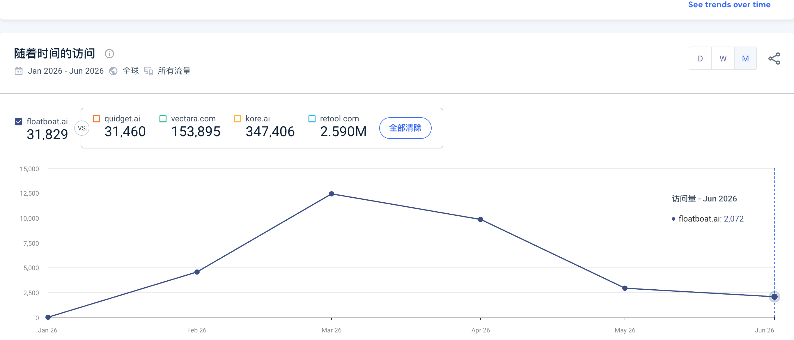

# Floatboat

> **TL;DR**：Floatboat 是一款面向个人与小团队的桌面端 Agent 工作环境。它最初用“文件管理器 + 浏览器 + Agent + 可复用 Combo Skills”降低上下文搬运成本，2026 年 5 月以后又把日历事件提升为 Agent 的运行时：会前准备、到点执行、会后跟进。真正值得关注的不是“又一个 AI 办公入口”，而是它试图同时控制 **工作现场、个人工作方法与执行时机**。但现阶段产品方向仍在快速迁移，公开规模口径、定价、安全认证和真实留存都缺少独立验证。

## 先纠正主体：Floatboat 不是 Floatbot

本库此前研究的 [[company.floatbot]] 是 2017 年成立、由 Jimmy Padia 创办的印度/美国企业语音与对话 AI 公司，当前重点是保险、催收和客服工作流。**本报告的 Floatboat.ai 是另一家公司**：2025 年创立，由 [[person.shaoqing-tan]] 与 [[person.judy-gao]] 经营，面向个人、创作者、顾问和小团队提供桌面 Agent 工作环境。

两家公司只差一个字母，但创始人、产品、法律主体、融资、地域和目标用户均不同。此前把 Floatbot 放进“通用 Agent workspace”队列属于实体消歧错误，不应通过改名覆盖旧主体，而应保留两家公司并逐条修正错误关系。[[note.floatboat-research-run-2026-07-16]]

## 产品演进：从工作现场到执行时机

### 第一阶段：把上下文搬运变成原生界面

2026 年 3 月融资与首轮集中传播时，Floatboat 的产品中心是三栏或多栏桌面工作区：本地文件、内置浏览器和 Agent 共享同一个上下文，Combo Skills 把多轮操作沉淀成可复用 SOP。用户不再反复上传文件、复制网页、解释目录；Agent 在授权后直接读写工作现场。第三方实测还展示了拖拽文件、网页与图片、生成本地 Markdown、操作 Notion/系统应用、把完整对话转成 Combo 等流程。[[source.36kr.floatboat-interview-2026-04-10]] [[source.crossing.floatboat-review-2026-03-18]]

这条路线与普通聊天产品的差别不在模型，而在上下文构建：文件管理器和浏览器本身就是 Agent 的观察与操作界面。Floatboat 因而更接近 [[concept.agent-native-context-workspace]]，而不是在旧 SaaS 旁边增加一个聊天框。

### 第二阶段：把工作方法沉淀为 Combo

Combo Skills 是 Floatboat 比“本地 Agent 壳”多走的一步。它不只保存 prompt，而是把文件、工具、脚本、执行顺序和目标输出打包成可编辑流程；官方称可从 GitHub、ClawHub、Dify、Coze、n8n、ComfyUI 等导入历史资产。第三方实测用产品调研与内容生产展示了“收集上下文 -> 分块研究 -> 综合 -> 调整风格 -> 发布到 Notion”的完整链路。该证据说明产品在尝试把人的 tacit workflow 变成可复用资产，但没有证明每种导入或复杂工作流都已稳定。[[source.crossing.floatboat-review-2026-03-18]]

### 第三阶段：日历成为 Agent runtime

2026 年 5 月 25 日，官方视频开始用“Calendar does the work”重新讲产品；5 月 27 日的全球发布稿把 FloatSchedule 定义为首个核心产品。当前官网进一步把日历事件描述成带时间、上下文、权限和历史的执行单元：会前收集资料与生成 briefing，到点触发任务，会后起草 follow-up，并让用户在高影响动作前审批。[[source.youtube.floatboat-calendar-os-2026-05-25]] [[source.globenewswire.floatboat-launch-2026-05-27]] [[source.floatboat.homepage-2026-07-16]]

这不是简单加一个日历集成，而是产品中心从“用户打开工作区并指挥 Agent”迁移到“事件自动唤醒 Agent”。如果成立，它对应 [[concept.calendar-as-agent-runtime]]；如果执行可靠性、权限和事件分类不足，它也可能退化为带 AI 的自动提醒。

### 第四层：FloatIM 与 Agent 协作网络

FloatIM 让人和多个本地 Agent 进入同一个群聊。官方将 IACT 用作可交互文本协议，将 Selfware 描述为可携带数据、逻辑与执行方法的文件协议，并称两者以 MIT 许可开放。其目标是让 Agent 成为群聊中的一等成员，而不是外接 bot。[[source.floatboat.floatim-2026-07-16]]

第三方实测还展示了飞书配置入口，说明“手机发指令，电脑端 Agent 执行”的远程入口至少进入过产品界面；这仍不等于长期稳定的企业 IM 集成。[[source.crossing.floatboat-review-2026-03-18]]

## 实际体验：产品确实发了，但公开入口仍有门槛

本轮下载并检查了 macOS Apple Silicon 客户端：下载链接实际返回 `Floatboat 0.4.15`，约 261 MB；应用是 ARM64 Electron 客户端，由 `Beijing Weak Water Three Thousand Technology Co., Ltd` 使用 Developer ID 签名并带 notarization ticket。首次运行可以进入真实引导页，显示项目管理、个性化自动化和浏览器登录流程。[[source.floatboat.desktop-smoke-0.4.15]]

本轮没有使用私人账号继续登录，因此只验证了安装、签名和首屏，没有验证日历连接、3,500+ 集成、Combo 执行、FloatIM 协作或 credits 消耗。这个 smoke test 只能证明“存在可运行客户端”，不能证明核心 workflow 已稳定。

## 团队与资本

### 创始人

- [[person.shaoqing-tan]]：创始人兼 CEO，第三次创业。豆瓣作者主页与 36 氪访谈共同支持其曾任 360 安全卫士产品经理、泰迪未来科技联合创始人兼产品副总裁；他在上一家公司参与 Android 系统级 AI 服务。媒体提到离开时产品覆盖约 6 亿用户，该数字仍属于人物/公司自述，未独立审计。[[source.douban.shaoqing-tan-profile-2026-07-16]] [[source.36kr.floatboat-interview-2026-04-10]]
- [[person.judy-gao]]：GTM 联合创始人。LinkedIn 自述为 Ex-GeekPark / Founder Park，负责 AI 产品增长与开发者社区；5 月全球发布稿使用 Judy Gao 并引用其对后续项目执行、客户管理和团队协调 Agent 的规划。[[source.linkedin.judy-gao-2026-07-16]] [[source.globenewswire.floatboat-launch-2026-05-27]]

LinkedIn 公司页显示 2-10 人规模档位，员工搜索只返回两位创始人。这不是精确 headcount，也不能据此断言没有其他员工或外包；更稳妥的结论是：公开可识别团队很小，产品、内容和国际传播节奏却很激进。[[source.linkedin.floatboat-company-2026-07-16]] [[source.linkedin.floatboat-employees-2026-07-16]]

### 融资

2026 年 3 月 18 日，36 氪报道 Floatboat 完成 **200 万美元种子轮**，由 [[investor.hongshan-seed-fund]] 与 [[investor.welight-capital]] 共同投资，资金用于研发和团队建设。公开材料没有披露估值、单家金额或董事席位，因此本库只建立两条 participant 关系，不把 200 万美元拆给单家。[[investment.hongshan-floatboat-seed-2026]] [[investment.welight-floatboat-seed-2026]] [[source.36kr.floatboat-seed-2026-03-18]]

## 增长与 GTM：不是单一 launch，而是密集铺面

### 1. 融资、实测与 PR 形成首轮起量

主域趋势从 1 月近零、2 月约 4,556 次访问，上升到 3 月约 12,425 次、4 月约 9,849 次；这与 3 月 18 日融资公告和中文实测集中发布基本重合。5 月、6 月分别回落到约 2,926 与 2,072，说明首轮传播产生了明显峰值，但尚不能据此证明自然留存。[[traffic.similarweb.floatboat-2026-h1]] [[source.floatboat.similarweb-2026-h1]]

### 2. 5 月重新包装为全球 calendar-first 产品

官方在 5 月 25 日发出 64 秒英文视频，5 月 27 日通过 GlobeNewswire 宣布全球发布，明确把 San Francisco、Sequoia-backed、3,500+ integrations 和 proactive agent OS 作为英文市场叙事。视频采集时只有约 145 次观看，X 账号采集时约 37 个关注者、21 条内容，说明英文传播资产已经建立，但公开社交规模仍很早期。[[source.youtube.floatboat-calendar-os-2026-05-25]] [[source.globenewswire.floatboat-launch-2026-05-27]] [[source.twitter.floatboat-profile-2026-07-16]]

### 3. 内容与 SEO 已经工业化

2026 年 7 月 16 日 sitemap 有 637 个 URL，其中约 515 个 Combo Store 页面、96 个 blog 页面和 13 个 alternatives 页面。大量页面围绕 AI agent、OPC、自动化、竞品替代和具体技能展开。这说明 Floatboat 不只是靠创始人 PR，而是在快速构建搜索与技能 marketplace 的内容面。[[source.floatboat.sitemap-2026-07-16]]

但当前 organic search 只占估算流量约 11.93%，非品牌词中仍混有 `flowboat`、`floatboar` 等品牌拼写，因此“页面很多”尚未转化为成熟 SEO moat。

### 4. 付费流量与激励式分发很重

Similarweb 估算中 Display Ads 占 37.92%，Direct 34.88%，Organic Search 11.93%，Paid Search 7.42%。展示广告发布方包含 postcodebase、豆包、SparkNotes 和 ip8 等，结构与典型开发者 Agent 产品不同，也可能受小样本和广告归因噪声影响。官网同时运营 FloatCup：预测比赛、邀请好友分奖金、每条审核通过的 Floatboat 内容奖励 20 美元。[[source.floatboat.homepage-2026-07-16]] [[source.floatboat.similarweb-2026-h1]]

因此当前 GTM 更像 **融资/媒体 PR + 英文新闻稿 + programmatic content + creator/referral 激励 + display ads** 的组合，而不是单靠 Product Hunt、HN 或开发者社区自然扩散。

## 社区反馈：中文曝光明显强于独立用户口碑

- Reddit 精确域名搜索返回 18 个候选，但只有 3 个包含 `floatboat.ai`，且都来自同一账号、低分、低评论的推广帖。少量评论质疑“used by people who left these places”式 social proof，另有人直接问为何不用 Gemini/Claude Pro。不能把这些帖子当作独立采用。[[source.floatboat.reddit-scan-2026-07-16]]
- HN 对域名与产品名均无有效命中，Product Hunt 未发现正式产品页；LinuxDo 与 V2EX 精确检索无结果。
- 小红书有官方、媒体与创始人网络传播，也有少量用户演示。但 Founder Park 内容与 GTM 联合创始人的过往关系接近，AI Dance 等高互动内容主要讲创始人故事；目前仍缺少持续使用、付费、失败和留存样本。[[source.floatboat.xiaohongshu-scan-2026-07-16]]

更准确的判断是：**Floatboat 已经获得中文 AI 产品圈的注意力，但独立产品口碑尚未形成。**

## 商业与治理边界

### 定价仍在调整

当前 pricing 页面主要展示 3,000 credits / 12.99 美元的一次性 booster，没有完整列出套餐；User Protection Program 则写明 39.98 或 199.98 美元订阅档位。该计划允许用户对不满意结果申请退回 credits，但要经过审核，额度不超过所购订阅价值。它是向 outcome-aligned pricing 的实验，不是“只按成功结果收费”。[[source.floatboat.pricing-2026-07-16]] [[source.floatboat.user-protection-2026-07-16]]

### Local-first 不等于数据不出端

Privacy Policy 的 controller 是香港 AOE Tech Labs Limited。文件名索引、搜索等“尽可能”本地处理，但查询与相关上下文仍会发送给模型提供商；政策甚至明确提示第三方提供商可能按自身政策保留或使用数据。长期 Memory 保留到用户删除，云同步、Sentry/PostHog、Stripe 等也在数据链路中。[[source.floatboat.privacy-2026-07-16]]

### Agent 权限和社区 Combo 是核心风险

Terms 明确 Agent 可编辑文件、写代码、执行 shell、浏览网页和操作第三方应用，部分配置可减少实时确认。社区 Combo 可能访问本地文件，Floatboat 只称可能做自动扫描，不持续审计其运行时行为，并把大量风险与责任留给用户。[[source.floatboat.terms-2026-07-16]]

官网“Security Certified / Passed rigorous security audits”没有在本轮找到证书、审计机构或 Trust Center 支撑，不能写成已验证 SOC 2、ISO 27001 或企业就绪。

## 竞争位置

Floatboat 的直接竞争不应由 Similarweb 的 `quidget.ai / vectara / kore.ai / retool` 自动列表决定，那些只是算法邻接。更有意义的对照是：

| 方向 | 代表样本 | Floatboat 的差别 |
|---|---|---|
| Agent 原生上下文工作空间 | [[company.teamday]]、[[company.moxt]]、[[company.multica]]、[[company.raft]] | 更强调本地桌面、文件/浏览器同屏和个人工作方法沉淀 |
| AI employee / 任务执行 | [[company.lindy]]、[[company.motion]]、[[company.sintra]]、[[company.marblism]] | 不先卖固定岗位，先卖一个可学习个人工作的通用环境 |
| Chat / Cowork 式入口 | Claude Cowork、Manus、ChatGPT | 试图减少主动 prompt，把日历、文件和历史变成持续 runtime |
| 自动化与项目管理 | Zapier、n8n、Notion、Asana | 不把信息组织或触发器当终点，而要交付 finished artifact |

真正需要验证的是：Floatboat 能否在“通用工作环境”的广度与“可靠完成一类任务”的深度之间找到平衡。日历切入可能缩小入口、改善主动性，也可能说明原先 all-in-one workspace 太宽、用户不易理解。

## 关键判断

1. **最有价值的资产不是 UI，而是工作上下文与可复用方法。** 文件、网页、任务、编辑习惯和 Combo 共同形成个人 operating memory；这比单次生成更接近长期锁定。
2. **从 workspace 到 calendar runtime 是一次真实产品迁移。** 它把“Agent 知道什么”延伸为“Agent 什么时候行动”，但也暴露早期定位还没有稳定。
3. **资本和媒体网络帮助 Floatboat 快速进入中文 AI 圈。** 红杉种子背书、Founder Park/AI 媒体实测和集中采访构成首轮流量峰值；这仍不是产品市场匹配证据。
4. **当前增长很大一部分是可购买或可生产的分发。** 637 个内容页面、FloatCup 激励和高 Display Ads 占比都说明团队在主动制造流量。下一步应看 branded search、direct return、产品内活跃与付费，而不只看访问峰值。
5. **安全与责任模型尚未跟上“主动执行”的野心。** 当 Agent 能运行 shell、改文件、调用第三方工具并自动触发时，权限、审计、撤销和社区技能供应链必须成为产品主体，而不是 Terms 里的免责说明。

## 待验证

- 官网“100K+ users、4.8/5.0”来自什么统计口径和平台；当前流量与社交规模无法独立支持该数字。
- 3,500+ integrations 中有多少是直接维护、MCP 目录、第三方聚合或模板映射；本轮未逐项测试。
- 日历驱动工作流的实际成功率、审批延迟、失败回滚和长期留存。
- 39.98 / 199.98 美元套餐的完整 credits、模型与功能差异；当前 pricing 页面信息不完整。
- 官网“Passed rigorous security audits”的具体审计、范围和有效期。
- 香港 AOE Tech Labs Limited、北京签名主体与实际研发/雇佣主体之间的法律关系。
- 英文全球发布后是否出现独立客户、渠道伙伴、付费与自然搜索增长。

## 主要证据

**官方与产品**：[[source.floatboat.homepage-2026-07-16]]、[[source.floatboat.agent-workspace-2026-07-16]]、[[source.floatboat.floatim-2026-07-16]]、[[source.youtube.floatboat-calendar-os-2026-05-25]]、[[source.globenewswire.floatboat-launch-2026-05-27]]、[[source.floatboat.privacy-2026-07-16]]、[[source.floatboat.terms-2026-07-16]]。

**第三方强证据**：[[source.36kr.floatboat-seed-2026-03-18]]、[[source.36kr.floatboat-interview-2026-04-10]]、[[source.crossing.floatboat-review-2026-03-18]]、[[source.douban.shaoqing-tan-profile-2026-07-16]]。

**规模与社区信号**：[[source.floatboat.similarweb-2026-h1]]、[[source.linkedin.floatboat-company-2026-07-16]]、[[source.floatboat.reddit-scan-2026-07-16]]、[[source.floatboat.xiaohongshu-scan-2026-07-16]]、[[source.twitter.floatboat-profile-2026-07-16]]。
