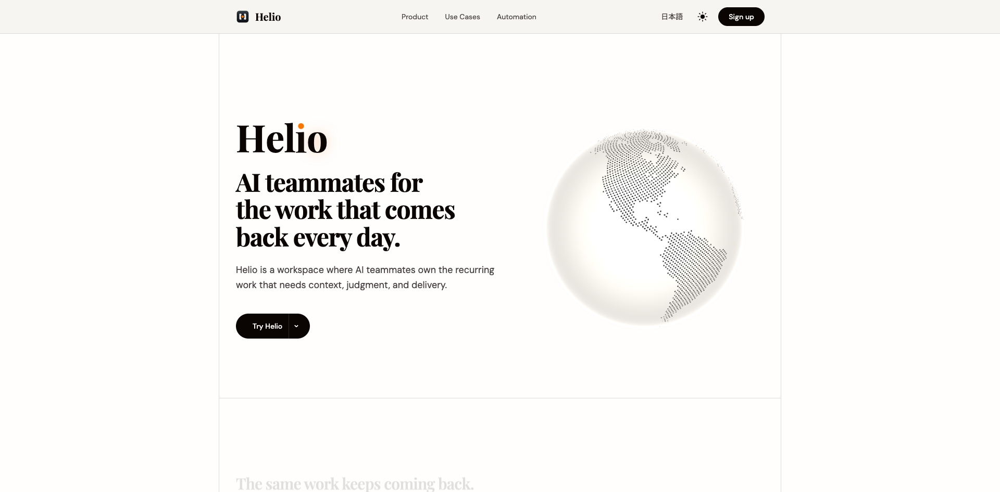
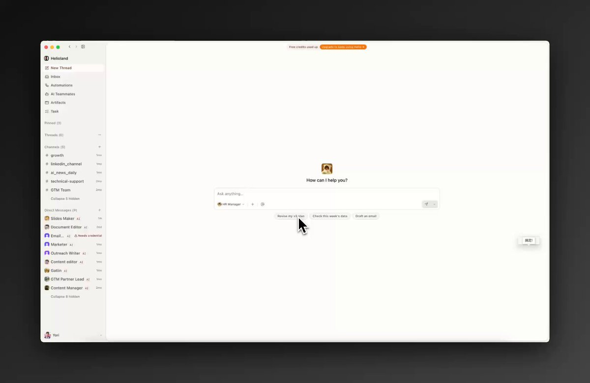
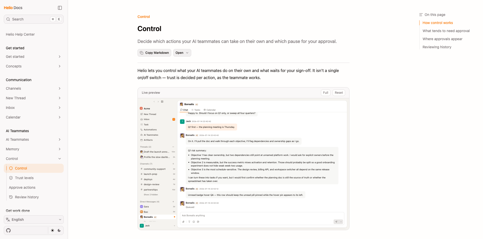
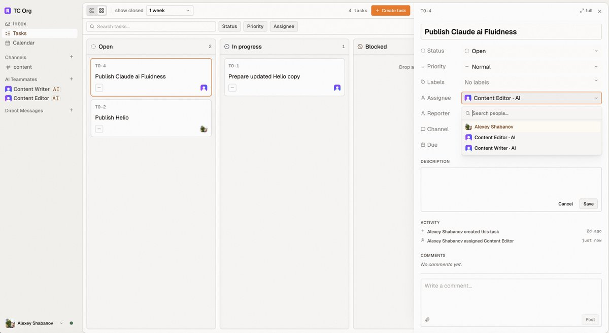
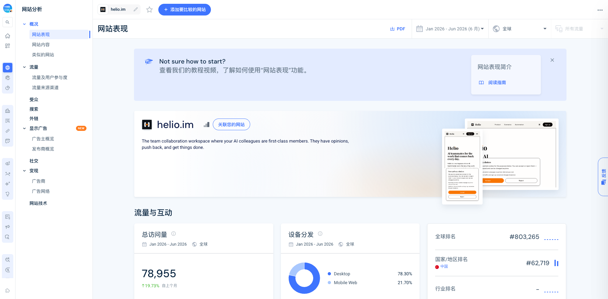
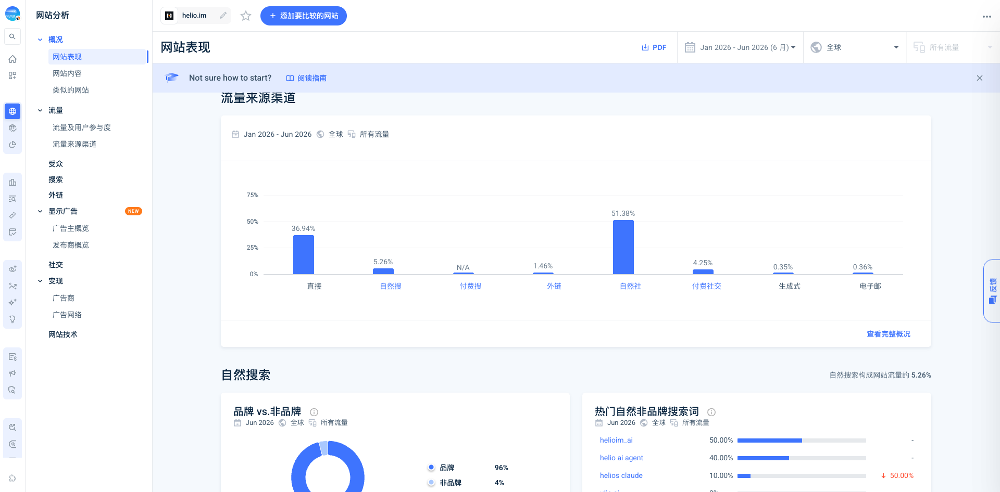

# Helio

> 调研时间：2026-07-14。Helio 仍处于快速迭代期；产品、流量和法律文本都可能继续变化。

## TL;DR

**Helio 是 Sheet0 团队转型后推出的 AI Workforce 产品：它不把 Agent 当一个等待 prompt 的工具，而是把它放进组织结构里，赋予独立身份、频道成员关系、任务、长期记忆、日历、技能、凭据、审批和行为记录，让它长期承接重复工作。** [[concept.ai-employee-operating-system]]

它不是一个只有概念页的项目。Web 登录、macOS / Windows 0.5.2 安装包、任务与 Inbox、BYOK、技能市场、按动作审批、Activity trace，以及官方开源的 `ship` 和 `anycli` 都能被公开验证；TestingCatalog 也实际跑过由 HR Manager、Writer、Editor 协作的任务。[[source.helio.testingcatalog]] [[source.helio.download-0-5-2]]

但它仍然很早：没有公开定价、付费客户、收入、留存或企业部署规模；官网大量 use-case 页面和 automation 模板跑在已验证采用之前。Similarweb 估算 2026 年上半年累计访问约 7.9 万、6 月约 2.7 万，流量主要来自社媒和直接访问，品牌搜索占绝对多数。它目前更像一个**被社交传播带起来、产品能力快速补齐中的早期工作区**，还不是已经完成 PMF 的企业平台。[[traffic.similarweb.helio-2026-h1]]

最值得警惕的不是模型能力，而是信任合同。产品强调权限、独立身份和审批，但公开条款授予公司非常宽泛、永久且不可撤销的内容使用许可，隐私政策又明确包含 model training；公开站未找到 SOC 2、DPA、完整 subprocessor 或数据驻留说明。对于要接入公司邮箱、代码和内部频道的产品，这是当前最重要的企业采用阻力。[[source.helio.legal-terms]] [[source.helio.legal-privacy]]

## 产品到底是什么

Helio 的表面长得像 IM，底层心智却不是“再做一个 Slack”。创始人 [[person.wenfeng-wang]] 的定义是：为 AI Workforce 重建一个容器，让人和 AI 使用同一套数据与语义模型，只是分别拥有适合自己的界面。AI 不再只响应一次对话，而是持续感知频道、邮件、日历、任务与其他 Agent 的触发。[[source.helio.tencent-founder-interview]]

当前产品可以拆成四层：

| 层 | Helio 提供什么 | 当前证据 |
|---|---|---|
| 组织身份 | Profile、角色、职责、独立频道 / DM 成员关系 | 官网与 Docs 均标为 live |
| 工作状态 | Tasks、优先级、状态、Channel 关联、Artifact、Calendar、Automation | Docs 有详细 UI 与状态模型，0.5 更新新增 Artifact gallery 与实时步骤 |
| 能力与运行时 | Skills / Plugins、Claude Code、Codex、MCP、Docker、Anthropic / OpenAI / DeepSeek BYOK | Docs 与开源 `anycli` 可核实 |
| 信任与治理 | 按动作审批、Inbox、Activity trace、凭据 vault、历史回放 | Control Docs 可核实；企业合规材料仍缺 |

官方首页把 Profile、Memory、Skills、Tasks、Calendar、Integrations、Automation 标为 live；Inbox / Email 标为 preview。另一方面，Docs 已有完整 Inbox 页面和 approval feed。因此更稳妥的判断是：**Inbox 框架已经存在，但邮件收发与外部动作的完整闭环仍在逐步开放，不能把 use-case 页里的所有流程当成生产成熟能力。** [[source.helio.homepage]] [[source.helio.product]]

### 交付路径

Helio 试图把第一次体验从“配置 Agent”改成“先拿到一个结果”：新用户选择写作、研究、邮件、briefing 或日程等具体任务，系统自动创建默认 teammate 和 DM，交付文件、报告或计划；看到结果后再雇用 Software engineer、Content writer、Data analyst 等专职角色。[[source.helio.docs-onboarding]]

这个设计解决的是 Agent 产品常见的空白页问题：用户不必先理解 model、runtime、skill 和 credential。但后续真正持续使用，仍取决于用户能否把某项重复工作定义成稳定责任，而不是不断创建新角色。

### 控制不是一个总开关

Helio 的控制模型按动作风险决定是否暂停：

- 阅读、搜索、推理、起草通常自主执行；
- 编辑文件、内部消息和创建任务属于中间地带；
- 外部邮件、运行代码、调用外部 API 属于敏感动作；
- 删除、发布、部署等不可逆动作应请求批准；
- 每次回复可以展开执行步骤，审批同时出现在频道和 Inbox。

这比“Agent 是否 autonomous”更接近企业实际问题：同一个 Agent 可以对低风险动作自治，对高风险动作设 human gate。[[source.helio.docs-control]]

## 产品是否真的能跑

公开证据形成了一个基本闭环：

1. `app.helio.im` 有可用的 GitHub、Google、Microsoft 和邮箱登录入口。
2. 2026-07-14 的 macOS / Windows 下载入口分别指向 0.5.2 安装包。
3. Docs 覆盖 onboarding、AI teammates、tasks、memory、control、BYOK、skills、inbox、automation 等真实操作面。
4. `heliohq/ship` 展示了阶段门、独立 reviewer 和证据驱动的 Agent 开发 harness；`heliohq/anycli` 展示了由宿主注入凭据的工具层。[[source.helio.github-ship]] [[source.helio.github-anycli]]
5. TestingCatalog 在 public beta 中创建 HR Manager、Content Writer 和 Content Editor，验证了角色、频道、任务状态和多 Agent 协作；Editor 还会指出未核实的创始人说法。[[source.helio.testingcatalog]]

这些证据足以排除“只有 landing page”，但仍不能证明稳定性、复杂组织权限、长周期记忆质量、真实部署安全或客户留存。本轮没有使用 CP 身份注册工作区，也没有把桌面安装包实际接入公司系统。

## 从 Sheet0 到 Helio

Helio 不是新成立的孤立团队，而是 Lifecycle AI, LLC / Sheet0 团队的转型产品。

[[person.wenfeng-wang]] 此前做过分布式系统、数据平台和基础软件创业；2023 年开始 Agent 连续创业，依次探索 AI Coding、NPi / Tool Use、Sheet0 的实时数据 Agent，再把“上下文”提升为 Helio 的核心问题。[[source.helio.zpotentials-sheet0-founder]]

创始人给出的演化时间线是：

- **2026-01-15**：决定探索新产品；
- **1 月下旬**：做出前身 Zgent，后来成为 Helio infra 层；
- **2 月下旬**：切入端到端 Coding 场景，开始解决人如何参与；
- **2026-04-24**：在即刻发布内测帖；
- **2026-04-25**：公开 v0.2.5 任务、附件、未读和聊天细节更新；
- **2026-05-26**：第三方开始以 public beta 口径体验；
- **2026-06-17**：Docs 上线；
- **2026-07-13**：Helio 0.5 发布 Web、Artifact、实时步骤、跨端同步和更多集成；
- **2026-07-14**：官方下载入口已更新到 0.5.2。[[source.helio.jike-founder]] [[source.helio.x-official-account]] [[source.helio.x-v0-5]]

值得注意的是，早期访谈强调“没有 New Chat、重建新容器”，当前 0.5 却已经有 `New Thread`，并强调 Slack、Lark、Teams、Discord 适配器和“AI teammates now live where you already work”。这不是简单自相矛盾，更像是产品在验证后承认了分发现实：**Agent-native 数据模型可以保留，但不能要求每个团队先整体迁移协作入口。**

## 团队与融资

创始人访谈口径为 9 人，分布在北京望京和旧金山；LinkedIn 公司页只公开关联到少量员工，因此不能用 LinkedIn 可见人数否定团队口径。[[source.helio.linkedin-company]]

公开融资是 **2025 年 Sheet0 阶段累计 500 万美元**，涉及 [[investor.baidu-ventures]] 与 [[investor.future-capital-mingshi]]。这笔资金属于同一团队与法律实体的历史融资，应写成“Helio 继承了 Sheet0 阶段的 500 万美元融资”，而不是“Helio 在 2026 年新融 500 万美元”。未找到可验证估值。[[investment.baidu-ventures-helio-sheet0-seed]] [[investment.future-capital-helio-sheet0-seed]]

这次转型说明团队的资产不是某一个 UI，而是连续积累的三类能力：结构化数据与上下文、Agent 工具调用、长期运行与验证。风险也同样明显：多次方向转移证明学习速度，但商业市场与定价尚未被公开验证。

## 增长与 GTM

Helio 的起量路径与我们此前看到的 HN → Product Hunt 不同：

1. **即刻内测首发**：创始人原本只想招十几二十人，帖子在中文创业者与 AI 圈层扩散；Typeform 一夜多次扩容。扩容和“数百名用户”都来自创始人口径，不能等价为活跃用户。
2. **深度访谈解释新品类**：十字路口在 4 月 29 日发布长访谈，用“工具让你少打字，人让你少操心”把复杂产品压成传播语言。
3. **持续 release demo**：5-7 月官方 X 以模板、频道、事件、Activity trace、Docs、0.5 等连续更新维持注意力。
4. **独立体验放大**：TestingCatalog 用自己的编辑工作流展示产品，而不是只转述功能。
5. **从自建工作区扩向现有入口**：0.5 强调 Web 和 Slack / GitHub / Notion / Google Workspace / LinkedIn，降低迁移成本。

Similarweb 的流量结构与这条路径一致：

- 2026 年 1-6 月累计访问估算约 **78,955**；6 月约 **27,292**，环比 **+19.73%**；
- 自然社媒 **51.38%**，直接访问 **36.94%**，自然搜索仅 **5.26%**；
- 搜索中品牌词约 **96%**，说明 SEO 尚未形成独立获客引擎；
- 中国 **42.96%**、美国 **23.40%**、印度 **13.54%**；
- 出站链接约 **99.12%** 前往 `app.helio.im`，说明营销站到产品入口的路径明确。

这是一个**创始人社交网络 + 社媒传播驱动**的早期 GTM，不是搜索或开发者社区驱动。Similarweb 对小站只适合判断方向，不能把这些估算当 GA 数据。[[source.helio.similarweb-2026-h1]]

## 社区反馈

本轮检索了 X、Reddit、Hacker News、Product Hunt、微信、小红书、V2EX、Linux.do 和即刻。

- **即刻**是已验证的关键 launch 场，而非补充渠道；创始人主页保留了内测扩容和高频更新记录。
- **X** 上官方账号已有约 3,853 followers，但多数更新互动不高，回复中有大量泛化赞美；不能据此推断用户满意度。[[source.helio.x-official-account]]
- **TestingCatalog** 是目前最有信息量的独立体验，重点在角色分工与编辑质检，而非只看生成结果。
- **小红书** 已出现 Helio 二次解读，但本轮样本大多复述创始人访谈；一条专门内容采集时仅 7 likes、6 collects。[[source.helio.xiaohongshu-secondary]]
- **微信**能搜到活动与趋势性提及，尚未发现高质量长期用户复盘。
- **Reddit / HN / Product Hunt / V2EX / Linux.do** 未命中聚焦讨论或正式 launch；同名噪声很多。这只能说明公开可见样本不足，不能写成“没有用户”。

## 竞品边界

“AI employee”不是一个同质类别，至少分四层：

| 类型 | 代表 | 与 Helio 的关系 |
|---|---|---|
| 进入现有协作工具 | [[company.viktor]]、Lucius | 分发阻力小；Helio 也通过 adapters 向这边靠近 |
| Agent-native 工作区 | Helio、Raft、Bloome | 直接争夺“人和 Agent 在哪里共同工作”的系统层 |
| Coding Agent 管理层 | Multica | 更垂直，围绕 issue、repo、runtime 和软件交付 |
| 企业 Agent 平台 | [[company.dust]] | 更成熟的治理与集成，但不强调拟人化的同事界面 |

Helio 最有价值的竞争主张不是“有很多 Agent”，而是：**同一个长期身份在频道、任务、记忆、日历、技能、凭据、审批和 Artifact 之间保持连续责任。** 如果这个连续性成立，它比一次性 workflow 更接近劳动力；如果不能形成持续使用，它就会退化为一个角色模板丰富的多 Agent UI。

## 关键判断与风险

### 1. 模型不是主要护城河，工作状态才是

Helio 主动支持 Claude Code、Codex、DeepSeek 和 BYOK，等于承认模型与 runtime 可以替换。真正的产品资产应是组织上下文、责任状态、审批历史、技能与凭据边界。[[concept.ai-employee-operating-system]]

### 2. “新工作区”与“进入现有工作区”必须同时成立

自建工作区能给 Agent 最完整的语义与控制，但会增加团队迁移成本；Slack / Lark / Teams adapters 有分发优势，却可能丢失部分原生状态。0.5 的路线说明 Helio 正试图用自己的数据模型承接两种入口。

### 3. 治理叙事领先，法律与合规公开面落后

Control 和 Activity trace 的产品设计是加分项，但公开 Terms 与 Privacy 的内容授权、模型训练口径过宽，且未找到 SOC 2、DPA、完整 subprocessor、数据驻留与删除承诺。这不是文案瑕疵，而是企业销售前必须补齐的信任基础。

### 4. 传播已验证，PMF 尚未验证

即刻引爆证明新品类叙事能吸引早期用户，6 月流量继续增长；但邀请码申请、followers、访问量和模板数量都不能替代付费、留存与重复工作完成率。

### 5. 产品页面跑得比真实采用更快

Automation store 和 use-case 页面覆盖 SEO、KOL、招聘、CMS、分析、邮件、支持、开发等大量场景。它们适合展示可编排性，却也容易模糊最初 wedge。当前最值得验证的不是“还能多做什么”，而是哪三类 recurring work 已经形成高频、长期、低监督的真实使用。

## 待验证

- 当前免费额度、付费计划、seat / teammate / token 定价；
- 活跃 workspace、周留存、重复 automation 数和付费客户；
- 是否已有企业 DPA、SOC 2 路线、完整 subprocessor 和数据不训练选项；
- Slack / Lark / Teams adapter 与原生工作区之间能同步哪些状态；
- 长期记忆的写入、纠错、删除和隔离机制；
- 外部工具凭据的 runtime 边界、审计导出与 incident response；
- Inbox / Email 当前究竟是 preview、beta 还是可稳定使用；
- 500 万美元之后是否有未公开的新融资或估值变化。

## 证据库

### S1：官方与原始材料

- [Helio 官网](https://www.helio.im/) · [[source.helio.homepage]]
- [产品页](https://www.helio.im/product/) · [[source.helio.product]]
- [Control Docs](https://www.helio.im/docs/control/) · [[source.helio.docs-control]]
- [BYOK Docs](https://www.helio.im/docs/byok/) · [[source.helio.docs-byok]]
- [首次使用 Docs](https://www.helio.im/docs/get-started/your-first-15-minutes/) · [[source.helio.docs-onboarding]]
- [Helio 0.5 发布](https://x.com/helioim_ai/status/2076657929797931322) · [[source.helio.x-v0-5]]
- [官方 X](https://x.com/helioim_ai) · [[source.helio.x-official-account]]
- [王文锋即刻主页](https://m.okjike.com/users/AB9BD6AD-595A-49C5-A3F9-D3B73BB96567) · [[source.helio.jike-founder]]
- [heliohq/ship](https://github.com/heliohq/ship) · [[source.helio.github-ship]]
- [heliohq/anycli](https://github.com/heliohq/anycli) · [[source.helio.github-anycli]]
- [Terms](https://www.helio.im/legal/terms/) · [[source.helio.legal-terms]]
- [Privacy](https://www.helio.im/legal/privacy/) · [[source.helio.legal-privacy]]

### S2：强第三方与经创始人确认材料

- [十字路口对话王文锋](https://view.inews.qq.com/a/20260429A07IHC00) · [[source.helio.tencent-founder-interview]]
- [Z Potentials 对话王文锋](https://zpotentials.substack.com/p/z-potentials-exclusive-interview-718) · [[source.helio.zpotentials-sheet0-founder]]
- [TestingCatalog 实测](https://x.com/testingcatalog/status/2059296826658873467) · [[source.helio.testingcatalog]]
- [[source.helio.funding-pedaily]]
- [[source.helio.similarweb-2026-h1]]

### S3：弱社区信号

- [[source.helio.xiaohongshu-secondary]]

## 关联资产

- 创始人：[[person.wenfeng-wang]]
- 投资方：[[investor.baidu-ventures]]、[[investor.future-capital-mingshi]]
- 流量：[[traffic.similarweb.helio-2026-h1]]
- 概念：[[concept.ai-employee-operating-system]]
- 判断：[[note.helio-product-takeaway-2026-07-14]]
- 过程：[[note.helio-research-run-2026-07-14]]
- 方法：[[method.product-research-workflow-v0]]
