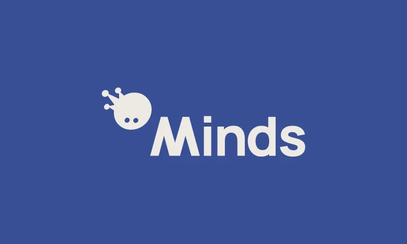
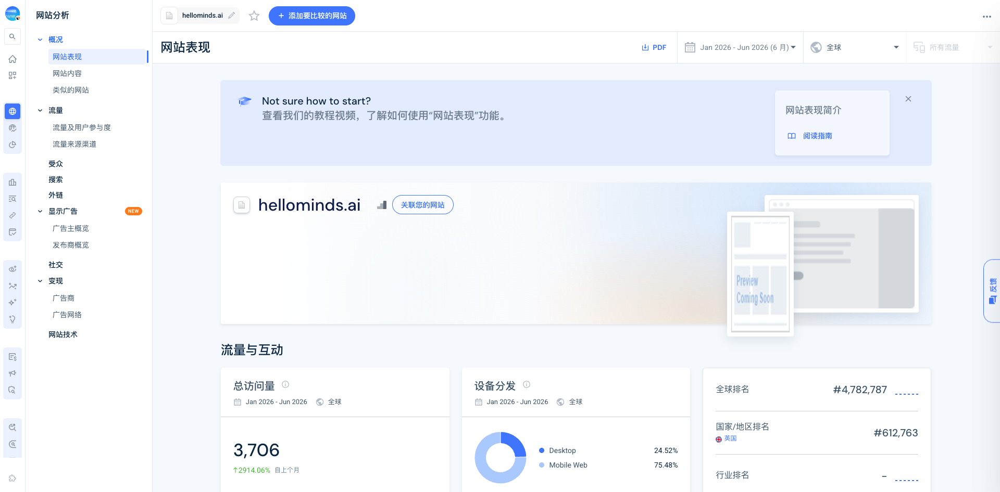

# Minds by Animoca Brands / HelloMinds

## TL;DR

[[company.hellominds]] 不是一个典型的 YC 式早期 SaaS 公司，而是 [[company.animoca-brands]] 和 [[company.ethoswarm]] 推出的“persistent personal AI agent”平台项目：用户不用装 app、不写代码、不接触钱包，通过 Telegram 或 email 启动一个带身份、长期记忆、工具和模板的 Mind。它的关键不是单个 agent demo，而是把“个人 AI agent + agent 模板市场 + builder 生态基金 + Animoca 分发网络”捆在一起。

我的判断：它值得看，不是因为当前产品已经证明 PMF，而是因为它提供了另一种 agent GTM 样本：不是从企业 Slack/Teams 切入，也不是从 browser automation 切入，而是用低门槛个人入口和 Web3 生态资金/分发来造一个 agentic web 平台。风险也明显：定位很大，真实留存和高频场景还需要验证；“US$10M”是 builder programme，不是 HelloMinds 自身融资；社区自然反馈目前不强，更多是 Animoca/Yat Siu/Ethoswarm 的资源驱动。

## 进入我们视野

CP 指定 hellominds.ai 作为下一个样本。它补上了我们前面几类公司的空白：

- [[company.viktor]] 更像企业 Slack/Teams 里的 AI employee。
- [[company.interloom]] 偏 browser/context graph 的执行与组织。
- [[company.lace-ai]] 偏垂直 revenue workflow。
- HelloMinds 则是 consumer/prosumer personal agent + builder ecosystem，更像“平台化 agent 入口”。

## 关键事实

- 2026-02-05，[[company.animoca-brands]] 和 CryptoSlam 的 [[company.ethoswarm]] 宣布战略合作，推出 Animoca Minds。见 [[source.animoca-minds-launch-2026-02-05]]。
- 官方 docs 说 Animoca Minds 是 Animoca Brands 和 Ethoswarm 的服务，让任何人部署和运营 persistent AI agents，即 Minds。见 [[source.hellominds-docs-overview-2026-07-09]]。
- 官网主张：60 秒内设置个人 AI agent；处理 booking、email、research、daily tasks；通过 Telegram/email 使用；no app, no code, no wallet。见 [[source.hellominds-homepage-2026-07-09]]。
- 2026-05-05，Animoca 宣布最高 US$10M 的 Minds Investment Programme，面向把 Minds 作为核心产品层的早期团队。见 [[source.animoca-minds-investment-programme-2026-05-05]] 和 [[source.hellominds-builder-hub-2026-07-09]]。
- 官方 X 账号 @hellominds_ 2026-07-09 抓取时 1,882 followers、1,120 tweets、verified。见 [[source.x.hellominds-profile-2026-07-09]]。

## 产品怎么定义自己

它把 Mind 定义成一个“always-on digital employee / persistent companion”，核心能力有四层：

1. Persistent identity and memory：Mind 有身份、目标、人格和长期上下文，不是每次重置的 chatbot。
2. Specialized skills：每个 Mind 有自己的技能、工具和知识，适配个人或业务场景。
3. Shareable with anyone：可以和朋友、家人、伴侣、同事共享，用于计划、协作、推进任务。
4. Autonomous execution：后台处理任务、workflow 和 follow-up，即使用户离线也继续运行。

这套定义值得注意，因为它把 agent 从“聊天窗口”挪到“持续存在的工作实体”。但目前能从公开材料确认的是产品叙事和模板，不等于已验证真实自主执行质量。

## 场景与模板

官网展示两类入口：

- Everyday life：日程、旅行、副业、销售、健康等。
- Builders：在 Minds 上构建 agentic web 产品，并申请生态支持。

One-click Minds 覆盖很广：General Assistant、Sales Mind、Bizz Mind、Research Mind、Product Builder Mind、GTM Mind、Chief of Staff Mind、Email Manager、Scrum Master、Fitness Coach、Personal Chef、Recruiter、Superior Trader、Game Designer 等。

这里有一个明显的产品取舍：它没有先只押一个窄场景，而是用模板库表达“你可以在这里启动各种 agent”。这更像平台/市场叙事，优势是想象空间大，劣势是用户可能不知道从哪个高频刚需开始。

## 分发与生态

Minds 的 GTM 不只是产品页，而是三件事叠加：

- 低摩擦入口：email + Telegram，避免新 app、代码、钱包。
- 模板和工具市场：One-click Minds / Minds Bazaar，让用户和 builder 都有可见入口。
- Animoca 生态杠杆：US$10M programme、Cognition Credits、DevRel、600+ portfolio network。

这和我们之前看的一些创业公司很不同：它不是纯靠 HN/PH 试水，也不是先靠某个企业 workflow 打透，而是用战略方资源和生态投资 programme 先拉 builder 供给。要继续验证的是：这个生态能否带来真实用户需求，而不是只有供给侧热闹。

## 规模数据

2026-07-09 已通过 Similarweb 抓到 hellominds.ai 的概览数据，见 [[source.similarweb.hellominds-overview-2026-07-09]]。

Similarweb 显示 Jan-Jun 2026 全球所有流量总访问量为 3,706，页面同时显示月访问量 1,563、月独立访客 851、平均访问时长 1 分 02 秒、2.56 页/访问、跳出率 48.82%。设备结构偏移动端：Mobile Web 75.48%，Desktop 24.52%。地域上英国 69.25%、美国 23.18%、印度 7.57%。

这说明它目前还是非常小的早期流量体量，不能用 Similarweb 做成熟渠道归因。详细 traffic source、social、referral、paid search、similar sites、audience interest 都显示数据不足或无结果。可以记录的弱信号是：出站目的地里 oauth.telegram.org 占 93.98%，platform.composio.dev 占 6.02%，这和它以 Telegram 为主要交互入口的产品叙事一致，但不能直接证明技术架构。

## 团队与相关节点

- [[company.animoca-brands]]：推出方/战略生态方，公告中强调其 600+ Web3 portfolio。
- [[company.ethoswarm]]：Minds 的协议/基础设施提供方，官方 X bio 也写 “Starting with @hellominds_”。
- [[company.cryptoslam]]：公告称 Ethoswarm 来自 CryptoSlam；[[person.randy-wasinger]] 是 CryptoSlam founder/CEO。
- [[person.yat-siu]]：Animoca co-founder/executive chairman，是这条线最重要的公众信号节点。
- [[person.mohamed-ezeldin]]：Head of Animoca Labs，公告中代表产品/实验室方向发声。

## 我的判断

### 值得学习的点

- “个人 agent”可以不从一个重 app 开始，而是从 Telegram/email 这种已有通信入口开始，降低首次使用门槛。
- agent 模板要具体。Research Mind、GTM Mind、Chief of Staff Mind 这些命名，比抽象讲“agentic AI”更容易让用户知道能做什么。
- 如果做平台，不只卖产品能力，还要卖 builder 的机会：资金、credits、DevRel、分发和网络。
- Web3 复杂性被主动隐藏：官网强调 no wallet，公告里才讲 blockchain 提供 identity/economics/provenance。这是一个“对用户隐藏基础设施、对生态讲清叙事”的双层表达。

### 风险与待验证

- 公开材料目前主要是官方叙事，缺少独立用户反馈、社区讨论、Product Hunt/HN/Reddit 自然扩散证据。
- 模板覆盖太宽，可能说明平台野心，也可能说明 wedge 不够尖。
- “persistent / autonomous / 24/7”是高承诺，需要验证工具权限、任务执行、失败恢复、通知质量、记忆质量。
- US$10M programme 容易被误读成公司融资；这里应明确标注为 Animoca 对 builders/projects 的生态投资 programme。
- Web3/agentic web 叙事强，但主站强调 no wallet/no barriers，说明它需要在大众可用性和链上 agent 经济之间做平衡。

## 证据库

- [[source.hellominds-homepage-2026-07-09]] - 官网主页，S1。
- [[source.hellominds-docs-overview-2026-07-09]] - docs overview，S1。
- [[source.animoca-minds-launch-2026-02-05]] - 2026-02-05 官方 launch 公告，S1。
- [[source.animoca-minds-investment-programme-2026-05-05]] - 2026-05-05 US$10M programme 公告，S1。
- [[source.hellominds-builder-hub-2026-07-09]] - Builder Hub，S1。
- [[source.x.hellominds-profile-2026-07-09]] - @hellominds_ profile，S2。
- [[source.x.ethoswarm-profile-2026-07-09]] - @Ethoswarm profile，S2。
- [[source.x.animocabrands-profile-2026-07-09]] - @animocabrands profile，S2。
- [[source.x.ysiu-profile-2026-07-09]] - @ysiu profile，S2。
