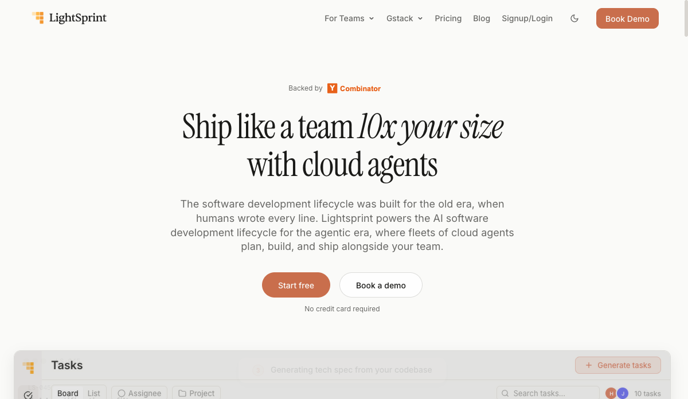
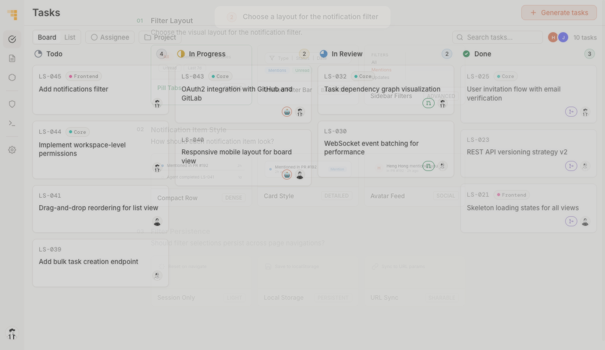
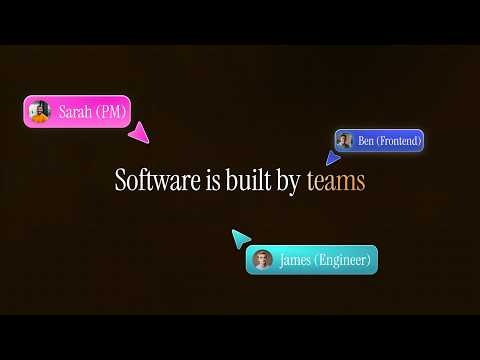

# Lightsprint

Lightsprint 是 YC P26 公司，定位为 AI-native product platform / collaborative product development platform。它的核心不是单个 coding assistant，而是把 PM、设计师、工程师和 cloud agents 放到同一个软件交付工作流里：先视觉化计划，再并行让 cloud agents 执行，最后用 live PR preview 审查并合并。

## 产品理解

Lightsprint 的问题定义是：coding agents 已经让代码生成变快，但团队协作、需求对齐、审查上下文和发布流程仍然停留在旧 SDLC。它把自己放在 “team layer for AI-powered development” 的位置，类似 Linear/Jira 在 agent 时代的重构。

核心模块：

- Visual Plan Mode：把自然语言需求拆成结构化计划、任务依赖和视觉选项，让团队先对齐再执行。
- Parallel Cloud Agents：在云端并行跑多个 agents，分别做前端、dashboard、测试等任务。
- PR Preview Environments：每个 PR 都有 live preview URL，非工程师可以像真实用户一样点击审查，不需要读 diff。

它和我们前面看的几家公司关系很清楚：

- Superset：偏多 coding agent 的操作台。
- Arga：偏 agent / agent-written code 的验证层。
- Lightsprint：偏团队协作和 SDLC 工作流层。
- Ploy：偏网站/增长工作流闭环。

## 团队

YC profile 显示 founder：

- Ben Ong：曾在 SEA Group、Temasek 做 AI 产品/投资相关工作。
- Benedict Chan：曾任 Chainlink VP Engineering、BitGo CTO。
- Heng Hong Lee：曾参与 Facebook Messenger，后任 Fazz engineering leader。

已确认 X：

- Benedict Chan: https://x.com/bencxr
- Heng Hong Lee: https://x.com/HengHongLee

Ben Ong 的 X 暂未找到可信账号，先不登记。

## 发布与分发

YC Launch 页面发布时间约为 2026-05-21，标题是 “The Collaborative Product Development Platform”。官方 X 在 2026-05-22 左右发出 launch tweet，话术是 “missing team layer for AI-powered development”。

早期 X 扩散里有明显统一叙事：coding is no longer the bottleneck; coordination/planning is. 多个转发都把 Lightsprint 描述为 “Linear/Jira for the AI era” 或 “planning and orchestration layer for AI-native teams”。这说明它的 GTM 表达很集中，但也要注意是否存在同质化推广文本。

## 当前判断

Lightsprint 值得跟，因为它押注的是 agent coding 之后的组织问题：当每个人都能触发 agents 修改真实 codebase，谁负责计划、对齐、审查和发布？这是 agentic SDLC 里自然会冒出来的一层。

风险是边界很拥挤：Linear/Jira、GitHub、Cursor、Claude Code、Codex、Superset 都可能往团队协作/agent orchestration 扩。Lightsprint 需要证明自己不是一层临时 PM UI，而是能沉淀组织记忆、代码库上下文和跨角色协作闭环。

## 证据入口

- YC profile: https://www.ycombinator.com/companies/lightsprint
- YC Launch: https://www.ycombinator.com/launches/QSs-lightsprint-the-collaborative-product-development-platform
- Website: https://lightsprint.ai/
- X: https://x.com/lightsprintai
- TechCrunch P26 standouts: https://techcrunch.com/2026/06/18/the-11-standout-startups-from-ycs-demo-day-according-to-vcs/
- Product demo iframe: https://app.lightsprint.ai/demo-auto.html?theme=light

## LinkedIn 补充

LinkedIn 公司页显示 Lightsprint (YC P26) 为软件开发公司，员工范围 2-10，关注者 759，员工页当前返回 3 人：Ben Ong、Benedict Chan、Heng Hong Lee。这个口径和 YC profile 的 team size 3 一致。

LinkedIn source 已入库：`source.linkedin.lightsprint-company`。
