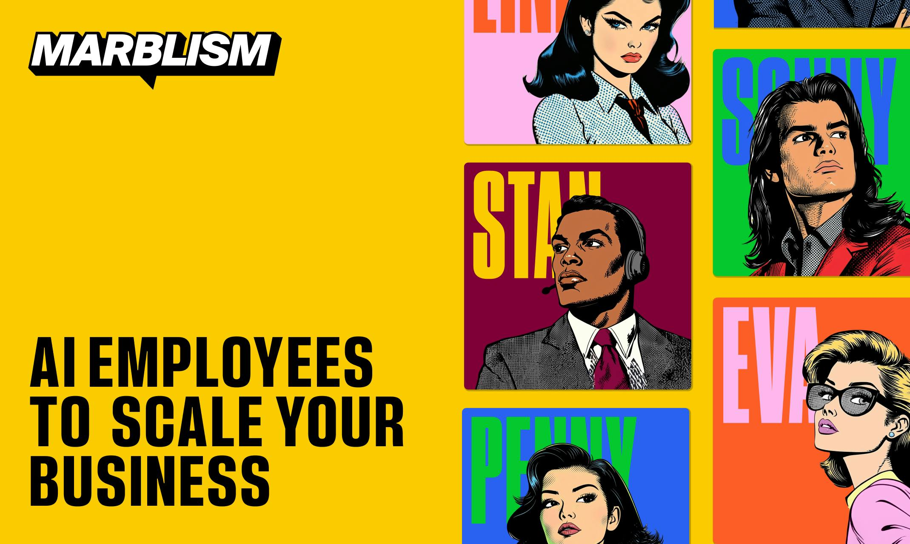
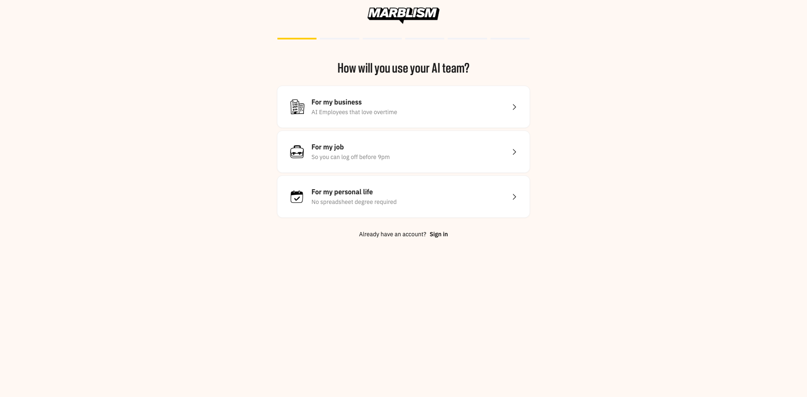
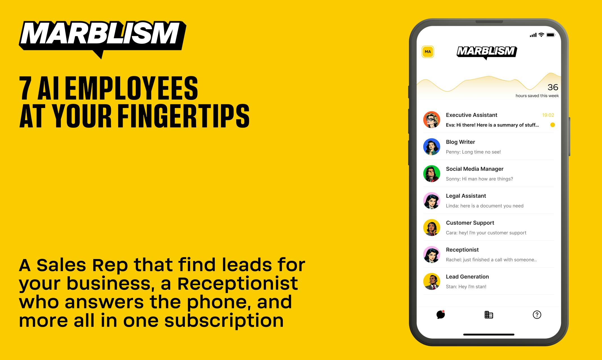
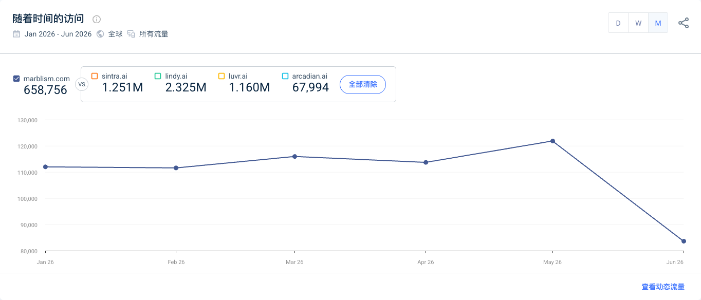

> 调研时间：2026-07-15。本文把官网与 Help Center、YC/HN/Product Hunt 历史、英国公司文件、创始人访谈与自报、第三方流量估算、社区反馈分层呈现。ARR、用户数、节省小时和业务成效均未经独立审计；Trustpilot 本轮只返回浏览器验证页，不作为素材。

## TL;DR

**Marblism 是面向小企业的一体化 AI 员工订阅。** 当前产品把邮件与日历、社媒、获客、SEO 内容、电话接待和合同辅助包装成 Eva、Sonny、Stan、Penny、Rachel、Linda 六个角色；所有方案都给全套员工、无限 workspace 和团队成员，但实际工作量受每月 **AI hours** 限制。[[source.marblism.homepage-2026-07-15]] [[source.marblism.pricing-2026-07-15]]

它最值得研究的不是角色数量，而是一次完整的产品换轨：Marblism 在 YC W24 时是 prompt-to-app 的 AI 工程师，2024 年 HN launch 得到 132 points、91 comments；团队后来承认旧产品虽然做到 10 万用户和 25 万美元 ARR，但非技术用户会卡在最后的 bug、安全和部署细节。2025 年它停止旧产品，把同一批 SMB 的需求改写为“不要让用户造软件，直接替用户完成工作”。[[source.hn.marblism-launch-2024]] [[source.indiehackers.marblism-pivot-2025]]

增长也不是单一 launch 带来的。旧产品先在 HN 验证开发者反馈，新产品再在 Product Hunt 做大众化放大，随后用 Meta ads、SEO 和一个 30%–40% lifetime commission 的 partner network 持续获客。X 的 Marblism 搜索结果被少数带链接账号高频重复发布占据，Reddit 的长篇“实测”也在评论中披露 affiliate commission。**声量是增长资产，但不能直接当自然口碑。** [[source.producthunt.marblism-2025]] [[source.marblism.partner-program-2026-07-15]] [[source.x.marblism-affiliate-distribution-2026]] [[source.reddit.marblism-affiliate-2026]]

规模信号存在但边界很多。官网自报 4 万+ businesses，创始人在 pivot 后阶段自报 250 万美元 ARR；第三方 2026 H1 月线约 65.9 万 visits、月均约 11.0 万，但 6 月降至约 8.4 万。当前没有可靠的活跃客户、留存、净收入、最新融资轮次或估值。[[source.marblism.about-2026-07-15]] [[source.linkedin.ulric-marblism-pivot-2025]] [[source.similarweb.marblism-2026-h1]]

## 产品：不是一个万能 Agent，而是六个预包装岗位

| AI 员工 | 当前职责 | 关键执行面 |
|---|---|---|
| Eva | Executive Assistant | inbox、邮件草稿、日历、会议笔记 |
| Sonny | Social Media Manager | 社媒内容、发布与互动 |
| Stan | Lead Generation | 找线索、触达与跟进 |
| Penny | SEO Blog Writer | 关键词研究与博客 |
| Rachel | Receptionist | 电话接听、转接与预约 |
| Linda | Legal Assistant | 合同总结、审阅与草拟 |

[[source.marblism.homepage-2026-07-15]]

角色不是单纯换头像。用户先创建 business/workspace，连接 Gmail、Outlook、Google Calendar、LinkedIn、Facebook、Instagram、X 等外部系统，再通过 dashboard 或 chat 给员工下达一次性、周期性任务。每个 business 有独立的 AI team；同一账号可以管理多个 business。[[source.marblism.task-creation-2026-07-15]]

这与 [[concept.character-first-ai-workforce]] 一致：购买者不需要先理解 workflow builder、tool calling 或模型选择，只需判断“我要一个销售、行政还是 SEO”。Marblism 和 [[company.sintra]] 都降低了 SMB 的 Agent 认知成本；Marblism 的岗位更少、更贴近办公室基础职能，Sintra 则提供更多 Helpers、Brain、Builder 和 Marketplace。

### “后台工作”仍需要管理和核验

官网强调员工自主、持续执行，Help Center 同时暴露了真实边界：官方专门写了一篇“员工说自己能做实际不能做的事”，举例 Eva 可能声称能发送邮件，但当前能力并不支持；文档明确说 hallucination 不能完全消除。[[source.marblism.hallucination-2026-07-15]]

这意味着角色化界面也会放大一个特殊风险：普通用户更容易把“员工的自然语言承诺”当成真实权限。产品需要的不只是模型准确率，还包括 capability discovery、执行回执、失败状态和 approval。否则角色越像人，错误承诺越有说服力。

Linda 也明确只是合同总结、审阅与草拟工具，不替代律师；对法律、邮件、电话和大规模触达，人的复核仍是产品闭环的一部分。[[source.marblism.linda-2026-07-15]]

首次打开 `ai.marblism.com/onboarding/` 时，`open/read` 在 Remix bootstrap 阶段提前返回了脚本文本；显式等待业务文案后，同一入口正常显示用途选择 onboarding：`For my business`、`For my job`、`For my personal life`，以及登录入口。**本轮只完成未登录首屏 smoke test，未注册或连接真实系统，因此不声称完成了邮件、电话、获客或法律任务。** [[source.marblism.app-onboarding-smoke-2026-07-15]]

## 定价：卖的是“员工”，计量的却是 AI hours

当前 Help Center 把所有方案统一为六名员工、无限成员和无限 workspace，区别是每月小时数与付费周期。2026-06-03 后的新客户基础方案为 50 hours：月付 44 美元，季度付款折合 33 美元/月，年付折合 24 美元/月。最高公开档为 10,000 hours：月付 6,000 美元，季度折合 4,500 美元/月，年付折合 3,300 美元/月。[[source.marblism.pricing-2026-07-15]]

| 月度额度 | 月付 | 季付折合/月 | 年付折合/月 |
|---:|---:|---:|---:|
| 50h | $44 | $33 | $24 |
| 100h | $82 | $62 | $45 |
| 500h | $360 | $270 | $198 |
| 1,000h | $700 | $525 | $385 |
| 4,000h | $2,520 | $1,890 | $1,386 |
| 10,000h | $6,000 | $4,500 | $3,300 |

这里的 hour 不是计算时长，而是厂商估算的“替用户节省的人类时间”。例如处理一封邮件记 20 秒、写一封邮件 5 分钟、联系一个 lead 5 分钟、一次电话 10 分钟、社媒草稿 30 分钟、博客或法律文档 1 小时。修改过程不重复计费，只记最终结果。额度不 rollover，用完后员工暂停，升级后继续。[[source.marblism.pricing-2026-07-15]]

这构成 [[concept.ai-hours-outcome-pricing]]：

- 对用户：比 token/credits 更接近“雇人省了多少时间”的购买语言；
- 对厂商：可把不同模型和工具成本统一折算；
- 对研究者：必须检查每类任务的固定估值，而不能只看“无限 leads/calls”的营销表述；
- 对产品：节省时间是模型假设，不是独立测量的真实 ROI。

因此 Marblism 不是严格无限使用。官网/第三方旧文里出现的 unlimited tasks 或 unlimited leads，必须与当前每月 AI hours 上限一起读。

## 演化：从“替你写软件”到“替你做工作”

| 时间 | 节点 | 证据与含义 |
|---|---|---|
| 2024-01 | MARBLISM LTD 成立；旧 AI Engineer 产品启动 | 英国公司文件与创始人访谈互相支持 |
| 2024-03 左右 | 创始人称融资 400 万美元 | 只有创始人经媒体转述的总额，未找到可靠单家分配 |
| 2024-09-17 | Launch HN：prompt 生成 full-stack web app | 132 points、91 comments；大量讨论集中在最后 2% 调试、安全与责任 |
| 2025-03/04 | 创始人公开说明停止 25 万美元 ARR 的旧产品，转向 AI employees | 自报旧产品 10 万用户；新产品两周 100 customers |
| 2025-08 | Product Hunt 新产品 campaign，#1 Product of the Day、586 points | listing 日期与活动日期有差异，本文把 8 月 28 日作为可见 campaign 节点 |
| 2025-09 | Cyril Pluche 退出英国公司董事与 PSC | 当前 YC 页只列 Ulric 为 active founder |
| 2025 后期 | Ulric 自报 pivot 后三个月达到 250 万美元 ARR、节省 60 万小时 | 未审计，且“pivot/relaunch”在多个阶段出现，不压成一个精确起点 |
| 2026-06 | 新 AI hours 套餐生效 | 从低价单一订阅扩为 50–10,000 小时用量阶梯 |

[[source.companieshouse.marblism-2026-07-15]] [[source.indiehackers.marblism-pivot-2025]] [[source.hn.marblism-launch-2024]] [[source.producthunt.marblism-2025]] [[source.linkedin.ulric-marblism-pivot-2025]] [[source.marblism.pricing-2026-07-15]]

旧产品的问题不是“没人感兴趣”，而是交付单位不对。HN 真实试用者描述：系统能生成大部分应用，但在错误、API 幻觉、隐私、安全和责任上仍需要开发者；创始人访谈也说，非技术用户会因一个小 bug 无法继续。**Marblism 没有放弃“非技术 SMB 想借 AI 完成数字工作”这个需求，只是把输出从一套待维护的软件，换成一组预定义业务结果。** [[source.hn.marblism-launch-2024]] [[source.indiehackers.marblism-pivot-2025]]

## 团队：两位 YC 联合创始人，当前公开控制人只剩 Ulric

### Ulric Musset

[[person.ulric-musset]] 是 Marblism 联合创始人，当前 YC 公司页唯一 active founder。其 LinkedIn 自称 founder @ Marblism，X 约 2,794 followers；此前创办 Vauban，并在被 Carta 收购后离开。Marblism 的创始人故事把他的经历与产品角色直接相连：此前公司扩到数十人，他本人使用人类 EA、LinkedIn 写手和 SEO 专家，于是把这些岗位重新包装成 AI employees。[[source.yc.marblism-2026-07-15]] [[source.marblism.about-2026-07-15]]

### Cyril Pluche

[[person.cyril-pluche]] 是 2024 AI Engineer 阶段的联合创始人，HN launch 由两人共同发布，YC W24 也列出两人历史。英国 Companies House 文件显示 Cyril 于 2025-09-11 卸任 director，并在 9 月 18 日不再是 person with significant control；当前 YC 页不再把他列为 active founder。**因此图谱保留其 founder 关系，但正文标为历史联合创始人。** [[source.hn.marblism-launch-2024]] [[source.companieshouse.marblism-2026-07-15]]

团队人数没有统一口径：About 页自报 16 humans + 6 AI，YC 当前写 team size 5，LinkedIn 员工搜索显示 47 个关联 profile。三者可能分别指内部团队、YC 维护字段和自报关联人员，不能选一个当精确 headcount。[[source.marblism.about-2026-07-15]] [[source.yc.marblism-2026-07-15]] [[source.linkedin.marblism-company-2026-07-15]]

## 融资：确认 YC W24，400 万美元仍只有总额自报

[[investor.y-combinator]] 官方公司页确认 Marblism 属于 Winter 2024，本库建立 [[investment.y-combinator-marblism-w24]] 高置信关系。[[source.yc.marblism-2026-07-15]]

创始人访谈说旧产品启动三个月后融资 400 万美元，但未给出完整投资人、轮次和单家金额。多个商业数据库列出的累计融资、投资方和 50 万美元口径互相冲突，而且可能仍在描述旧 AI Engineer 阶段。**本轮不据数据库批量生成 Pioneer、TRAC、Soma、Draper 等投资边，也不把 400 万美元拆给 YC。** 当前估值与后续融资未知。[[source.indiehackers.marblism-pivot-2025]]

## 规模与流量：真实获客机器，但 2026 H1 没有继续加速

官网自报 40,000+ businesses、4.8/5 和 50+ hours saved；About 页另写 5,000 partners、向 partners 支付超过 20 万美元。它们能说明公司选择的规模叙事，不能替代活跃、付费或留存数据。[[source.marblism.homepage-2026-07-15]] [[source.marblism.about-2026-07-15]]

第三方 Worldwide / All Traffic 月线：

| 月份 | Visits |
|---|---:|
| 2026-01 | 111,997 |
| 2026-02 | 111,598 |
| 2026-03 | 115,957 |
| 2026-04 | 113,708 |
| 2026-05 | 121,869 |
| 2026-06 | 83,627 |

合计约 65.9 万、月均约 11.0 万；6 月较 1 月约下降 25.3%。页面顶卡另显示 225.1 万 total visits，与月线冲突，本文不合并两套口径。[[source.similarweb.marblism-2026-h1]] [[traffic.similarweb.marblism-2026-h1]]

参与度约 1:56、1.80 pages/visit、54.68% bounce；mobile 57.67%。美国占 44.47%、英国 20.56%、印度 10.83%、加拿大 6.01%、澳大利亚 5.03%，说明网站受众明显集中在英语 SMB 市场，但不等于付费客户地理。

渠道结构：Direct 35.73%、Paid Search 23.44%、Organic Search 19.13%、Display 6.88%、Organic Social 4.47%、Paid Social 4.24%、Referral 3.69%、Email 2.13%、GenAI 0.28%。搜索约 81% branded；付费词包含 `sintra ai`、`kraya ai`、`town ai`、`viktor`，显示团队在竞品词上主动截流。[[source.similarweb.marblism-2026-h1]]

88.19% 出站流量流向 `ai.marblism.com`，说明营销站主要漏斗确实导向 app，但不能证明注册、付费或任务执行。

## GTM：两次 launch + performance marketing + partner network

### HN 是旧产品的产品真相测试

2024 HN launch 的价值不是单纯 132 points，而是评论直接暴露了产品-用户错配：非技术用户想“一句话完成应用”，但最后仍需要理解代码、隐私、ToS、安全和修复。这个反馈后来进入 pivot 因果链。[[source.hn.marblism-launch-2024]]

### Product Hunt 是新产品的视觉放大器

2025 Product Hunt 页面把复杂能力压缩成色彩强烈、角色明确的“AI employees”，获得 #1 Product of the Day 和 586 points。页面结构化数据的 listing 日期是 8 月 7 日，活动与评论集中在 8 月 28 日；因此本文只说 8 月完成了 Product Hunt campaign，不制造一个过度精确的唯一 launch date。[[source.producthunt.marblism-2025]]

### Partner 不是边缘渠道，而是内容生产系统

官方计划按推荐量给 30% 或 40% lifetime commission，并给被推荐用户 10%–25% discount。About 页自报已有 5,000 partners。[[source.marblism.partner-program-2026-07-15]] [[source.marblism.about-2026-07-15]]

X 搜索中，少数账号在几天内用高度相似的“AI employee 比人便宜、24/7、替代 payroll”文案密集发布，互动通常为 0–2；Reddit 两周实测作者也在回复中反复给 referral URL，并明确披露自己会拿佣金。**这证明 Marblism 已把伙伴变成分布式销售内容网络，但也使公开 review 的 provenance 成为必查字段。** [[source.x.marblism-affiliate-distribution-2026]] [[source.reddit.marblism-affiliate-2026]]

## 用户反馈：有真实试用线索，但独立样本仍弱

一条 r/smallbusiness 帖子来自刚注册一天的电商经营者，称 Stan 原本面向 B2B，但在其 B2C 用法下第一晚找到 3 个 leads；作者也提醒 Gmail 不能突然从每天 3 封放大到 200 封。帖子只有 1 分、少量评论，且体验时间极短，只能作为“获客场景可跑 + 邮箱暖域风险”的 S3 样本。[[source.reddit.marblism-smallbusiness-2026]]

另一条两周实测描述六个角色，但作者随后明确披露 affiliate commission，评论中继续贴 referral URL。它能说明用户会问多 inbox、电话转接、号码接入等具体问题，也能说明联盟内容如何进入社区；不能算独立口碑。[[source.reddit.marblism-affiliate-2026]]

Trustpilot 本轮返回的是“Please wait while we verify your browser”，没有抓到正文，故没有用星级或评论数量写结论。当前仍缺少：

- 足够规模的独立评论样本；
- 任务成功率、返工率和人工介入频次；
- 取消/退款体验与长期留存；
- 真实客户侧可核验的 ROI。

## 中文世界：已有高传播叙事，但产品认知仍被旧版本和低价口号混合

微信公众号 2024 年的中文材料仍把 Marblism 介绍成“一句话生成 Web 应用”，对应旧 AI Engineer 阶段；它对历史有用，但不能解释当前 AI employees。[[source.weixin.marblism-old-product-2024]]

2026 年一篇小红书笔记用“39 美元替代整个 marketing 团队”讨论营销岗位变化，获得 724 likes、719 collects、358 shares。它证明“低价 AI 劳动力”叙事在中文内容平台有传播力；但 Marblism 当前基础月付是 44 美元，而且六名员工不等于完整 Marketing 部门，更不证明岗位已经被替代。该笔记只作为中文市场叙事样本。[[source.xiaohongshu.marblism-marketing-2026]]

## 竞品：直接对手是 SMB AI team，不是所有 Agent 平台

| 层级 | 代表 | 关系 |
|---|---|---|
| 直接 SMB AI employee suite | [[company.sintra]] | 同样以命名角色、整套订阅和 SMB 低认知门槛销售；Sintra 更强调 Brain、Builder 和 Marketplace，Marblism 更强调固定岗位与 AI hours |
| SMB AI workforce / growth suite | [[company.artisan]]、[[company.11x]] | 共享“数字员工”语言，但更集中在销售/GTM，采购者与任务面更窄或更企业化 |
| 横向 Agent builder | [[company.lindy]]、[[company.relevance-ai]] | 能搭出类似流程，但用户需要自己设计 Agent、工具和治理 |
| AI workforce control plane | [[company.ema]]、[[company.helio]] | 目标是大型企业部署、生命周期和治理，不是低价一人公司工具 |
| 流量相似但需复核 | Luvr、Arcadian 等 | 算法相似只提供候选，不自动成为直接竞品 |

Marblism 付费搜索主动购买 `sintra ai` 等词，使 Sintra 的直接竞争关系不只来自研究分类，也有实际 acquisition 证据。[[source.similarweb.marblism-2026-h1]]

## 关键判断与风险

### 证据较强的事实

- Marblism 完成了从 YC W24 AI app builder 到 SMB AI employees 的实质产品转型；
- 当前公开产品是六名 AI 员工，按 AI hours 限量，不是无限任务；
- YC W24、两次公开 launch、partner program 和英语市场流量均有可验证证据；
- 当前只有 Ulric 出现在 YC active founder，Cyril 的英国公司退出文件可核验；
- 流量对 paid search、display、social 和 partner/referral 具有明显依赖。

### 研究判断

1. **真正的产品突破是重新定义交付单位。** 旧产品交付一套需要维护的软件，新产品交付一个可理解的业务岗位；两者服务的是同一批“想用 AI 扩张但不想成为开发者”的用户。
2. **AI hours 是比 credits 更高明的价值包装，但不是严格 outcome pricing。** 它把成本语言翻译成人类时间，却仍由厂商给每项任务固定估值，未与真实收入、质量或 accepted output 绑定。
3. **Partner network 既是优势也是研究风险。** 它可让小团队用分成替代前置广告预算，但公开讨论会被大量低互动推广内容占据，导致声量与满意度错位。
4. **角色化降低了配置成本，却提高了能力误解成本。** 官方 hallucination 文档已经证明用户可能相信员工口头承诺；产品护城河必须包括能力约束、执行可见性和复核，不只是人格与视觉。

### 未知与待验证

- 当前净 ARR、付费客户、活跃 workspace、留存与 churn；
- 400 万美元融资的完整轮次、投资方与当前估值；
- 六个员工的真实任务成功率、返工率和单位成本；
- 当前 16 humans、YC team size 5、LinkedIn 47 profiles 之间的组织口径；
- pivot 的唯一日期。现有证据更像 2025 年分阶段 relaunch，而不是一天完成。

## 证据导航

- 当前产品与边界：[[source.marblism.homepage-2026-07-15]]、[[source.marblism.pricing-2026-07-15]]、[[source.marblism.task-creation-2026-07-15]]、[[source.marblism.hallucination-2026-07-15]]、[[source.marblism.security-2026-07-15]]
- 演化与 launch：[[source.yc.marblism-2026-07-15]]、[[source.hn.marblism-launch-2024]]、[[source.indiehackers.marblism-pivot-2025]]、[[source.producthunt.marblism-2025]]
- 团队与融资边界：[[source.companieshouse.marblism-2026-07-15]]、[[source.linkedin.ulric-marblism-pivot-2025]]、[[source.linkedin.marblism-company-2026-07-15]]
- 增长与社区：[[source.similarweb.marblism-2026-h1]]、[[source.marblism.partner-program-2026-07-15]]、[[source.x.marblism-affiliate-distribution-2026]]、[[source.reddit.marblism-smallbusiness-2026]]、[[source.reddit.marblism-affiliate-2026]]
- 中文世界：[[source.weixin.marblism-old-product-2024]]、[[source.xiaohongshu.marblism-marketing-2026]]
- 本轮判断与过程：[[note.marblism-product-takeaway-2026-07-15]]、[[note.marblism-research-run-2026-07-15]]
