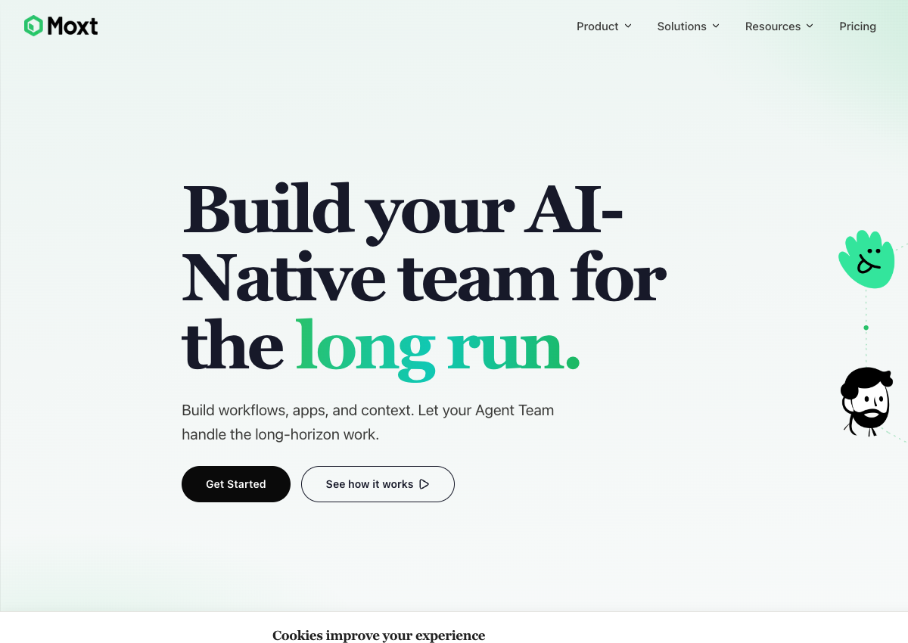
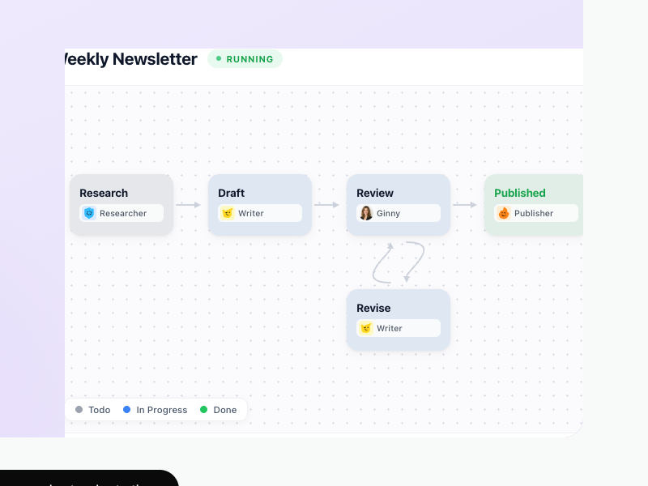
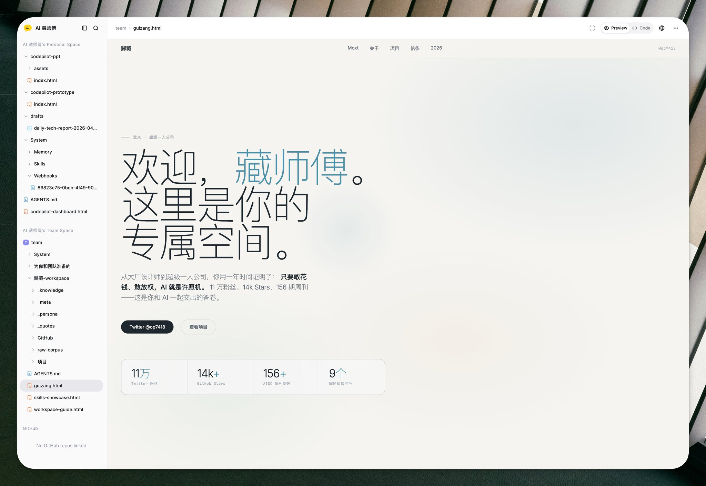
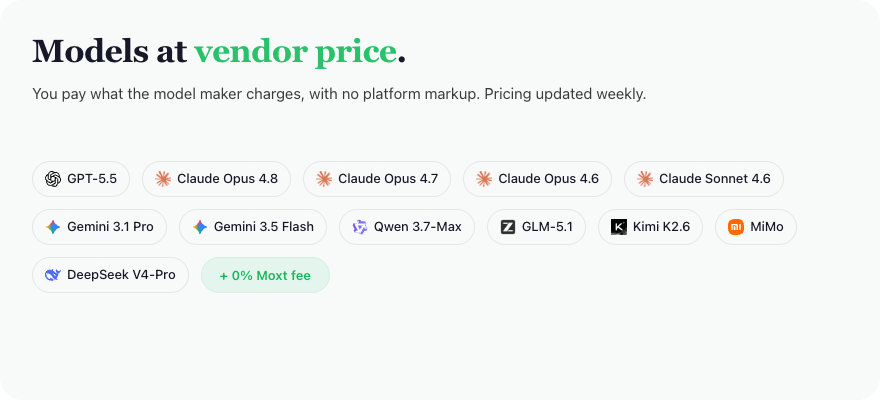

# Moxt
> **一句话**：Moxt 把 Markdown/CSV/HTML 与文件系统做成组织的 AI 原生上下文层，再把 AI teammate、长程工作流、MiniApp、自动化和模型计费叠在同一个工作空间里。

## TL;DR

Moxt 最值得关注的不是“可以创建多个 AI 员工”，而是它试图同时控制五层：**上下文底座、工作流状态、执行环境、模型消费和最终交付 UI**。如果这五层能够真正闭环，它就不是聊天产品，而更接近一套 AI-native work OS。

它也是一个典型的连续创业团队硬切换案例。团队此前连续做过 Motiff 与 Paraflow；Moxt 最初是两个人解决内部 Markdown 协作问题的实验，两天可用、第五天决定 all-in，三周后于 **2026-03-18** 公开上线。创始人称团队第二周已经停用 Jira，随后又把 Workflow、Hub、MiniApp、Heartbeat、30+ integrations 和成本明细迅速补上。[[source.moxt.founder-launch-essay]] [[source.moxt.founder-podcast-crossing]] [[source.moxt.whats-new]]

增长上，Moxt 不是从 Product Hunt、HN 或 Reddit 起量。Similarweb 估算显示主域月访问从 3 月约 8.4 万升至 4 月约 20 万、5 月约 20.4 万，6 月回落至约 14.6 万。85.7% 流量来自 Direct，搜索仅 4.7%；4 月底中文 AI KOL/创作者在微信、知乎、腾讯内容分发、小红书与 X 集中发布实测。现阶段更像是**团队存量声誉 + 创始人访谈 + 视频演示 + 中文创作者放大**，还不是 SEO 或英文开发者社区形成的自增长。[[source.moxt.similarweb-2026-h1]] [[source.moxt.community-scan-2026-07-15]]

最大的未知不是功能，而是商业与留存：尚未找到可验证的收入、付费用户、融资、留存或活跃 workspace 数据；免费席位、模型零加价有利于获客，但平台最终靠什么形成高毛利仍待验证。

## 产品到底是什么

### 1. 上下文不是聊天记录，而是可管理的文件

Moxt 的核心主张是：Word、PDF、Notion block 等面向人类 GUI 的结构对 agent 太“脏”，组织知识应尽量转成 Markdown、CSV、HTML 和目录树。每个 AI teammate 的 Rules、Skills、Memory、Integrations、Automations、Heartbeat 也尽量显式化、文件化。

这让上下文从一次性 prompt 变成组织资产，并允许人直接检查、修改、版本化和迁移。创始人把 Moxt 解释为 More Context；更准确地说，它卖的是**可持续压缩、更新和执行的组织上下文**。[[concept.agent-native-context-workspace]]

### 2. AI teammate 是执行身份，不是一个头像

每个 teammate 有独立角色、记忆、技能、集成和自动化，可以被 @、在工作流里承接阶段、通过 Heartbeat 主动检查任务。Agent Board 负责让人看到谁在做什么、进度和异常；高风险动作仍可要求人审批。

### 3. Workflow 与 MiniApp 把“回答”变成“交付”

Hub 已提供跨部门需求分发、创意刷新、客户 onboarding 等工作流，也提供 Kanban、DataTable、Agent Channels、SEO/销售/客户成功 teammates 和 HTML 模板。MiniApp 有真实数据库，可由人和 agent 共同使用；HTML/数据看板/表单/演示文稿可以直接成为交付物。

这一步很关键：如果 agent 只产出文本，最终还要回到旧 SaaS；如果 agent 能同时更新状态、数据库和界面，Moxt 才可能成为工作发生的地方，而不仅是生成层。[[source.moxt.homepage]]

### 4. CLI 是补技术用户，不代表本地执行已经完整

官网已经宣传 moxt CLI，但 Pricing 仍将 Local Agents 标为 coming soon，Bring Your Own Agent 也未完全开放。现阶段应理解为“终端 agent 可接入 Moxt 上下文/协作面”，不能直接写成完整 local-first runtime。[[source.moxt.pricing]]

## 从内部工具到公开产品

Moxt 是团队五年中的第三次产品尝试。第一项做了约四年，第二项约六个月；结合公开履历，前两项很可能对应 Motiff 与 Paraflow，但官方文章没有直接逐一命名，因此这里保持为推断。

这条连续性解释了三周上线速度：

- 产品与设计团队不是临时拼起。
- 已经有 Motiff/Paraflow 的品牌、用户与创作者网络。
- 内部就是第一批高密度用户，能够快速 dogfood。
- 原有产品的设计系统、AI 生成和协作经验可以复用。

真正值得学习的是停止条件：不是等旧产品失败，而是新原型在第五天获得团队一致判断后，立即放弃仍有不错 beta 反馈的上一项产品。这是高风险的组织决策，不应只概括为“快速开发”。[[source.moxt.founder-launch-essay]]

## 团队

- **[[person.ryan-haoran-zhang]]**：联合创始人。公开履历连续覆盖 Motiff、Paraflow 与 Moxt；是产品叙事与方法的主要对外表达者。
- **[[person.pulin-yu]]**：公开招聘地图与 LinkedIn 将其列为 founding member；曾参与前两项产品。
- **[[person.shawn-yu-moxt]]**：LinkedIn 自述 Head of Growth。

LinkedIn 公司页给出的员工区间是 **11–50**，员工检索只出现 5 位公开关联者；两者都不能当作精确 headcount。部分成员仍使用 Motiff/Paraflow 头衔，反而构成同一核心团队连续转向的证据。[[source.moxt.linkedin-company]]

融资方面，只有 Bonjour 团队地图声称 Monolith、光合创投参与；未找到 Moxt 官方、机构官方 portfolio 或独立融资报道交叉验证。搜索片段还混入同一播客频道中其他公司的融资描述。因此本库不建立投资边，也不写轮次、金额或估值。[[source.moxt.funding-claim-bonjour]]

## 增长与 GTM

### 第一段：创始人叙事先解释新范式

3 月 18 日官网与创始人长文同时发布；4 月 6 日，十字路口用 72 分钟访谈完整解释“为什么不是飞书 + agent”。对于一个需要用户改变文件、会议、文档和任务习惯的产品，这种长内容不是附属营销，而是 category education。[[source.moxt.x-launch]] [[source.moxt.founder-podcast-crossing]]

### 第二段：视频与具体案例放大

官方 4 月和 6 月的视频互动明显高于首发。4 月底又出现一批具体实测：迁移 Claude Code skills、蒸馏个人写作风格、飞书接入、GitHub issue、定时选题、多人互审、HTML dashboard。这些内容把抽象的“AI-native workspace”翻成可感知的工作场景。[[source.moxt.guizang-long-review]] [[source.moxt.zhihu-workflow-review]] [[source.moxt.creator-review-lengyi]]

### 第三段：中文内容圈比英文社区更强

小红书可见官方、Koji 和产品创作者内容，其中部分笔记的收藏数高于点赞，说明用户把它当作“待尝试工具/工作流”保存。相反，Product Hunt、HN、Reddit、V2EX、Linux.do 暂无实质讨论。[[source.moxt.xiaohongshu-search-2026-07-15]]

这个分布也解释了流量地域：美国与中国合计占绝大多数，但渠道仍以 Direct 为主。它目前的传播资产是**人和内容**，不是搜索页面。

## 流量与规模判断

| 月份 | 主域访问估算 |
|---|---:|
| 2026-03 | 约 84,400 |
| 2026-04 | 约 199,800 |
| 2026-05 | 约 204,300 |
| 2026-06 | 约 145,900 |

其他信号：

- Desktop 95.26%，符合复杂工作台而非消费移动应用。
- 美国 48.17%、中国 45.75%，与团队背景和双语传播相符。
- Direct 85.74%；Organic Search 4.71%，其中品牌词约 86%。
- 访问时长 15:05、10.62 pages/visit、跳出率 28.81%，如果估算方向正确，说明访问者并非只看一页官网；但无法从第三方数据区分官网浏览、登录态产品或内部测试。
- Similar sites 给出 n8n、Kore.ai、OutSystems、Kilo.ai，更多反映自动化/开发者受众相邻，不应直接当作竞争集合。

4–5 月的快速放大是真实方向信号，6 月回落也说明 launch/KOL 峰值尚未完全转成稳定自然增长。所有数字均为 Similarweb 模型估算，不代替 GA、活跃 workspace、留存或收入。[[traffic.similarweb.moxt-2026-h1]]

## 商业模型

当前策略是：

- 不收 seat fee，不做订阅。
- $1 = 100 credits，credits 不过期。
- 模型按供应商价格，0% markup。
- 云 sandbox 当前免费，未来可能按 runtime 计费。

这是强烈的获客和组织扩张策略：邀请更多人和 AI teammate 不增加席位成本，也减少采购阻力。但它暂时放弃了 SaaS 最传统的 seat 毛利。合理推断是未来价值可能来自 runtime、企业治理、托管、集成或高级工作流；官网尚未给出明确承诺，不能把推断写成既定商业模式。[[source.moxt.pricing]]

## 竞争位置

- **[[company.helio]]**：更强调持久 AI workforce 的身份、权限、通讯与长期工作；Moxt 更强调文件上下文、工作流和 MiniApp。
- **[[company.raft]]**：更靠近连接本地 agent runtime 的协作 OS；Moxt 当前更云端一体化，并掌握模型消费与 sandbox。
- **[[company.multica]]**：更偏 issue/task 驱动的 agent 管理；Moxt 的对象更广，覆盖文件、流程、应用和业务模板。
- **[[company.dust]]**：更成熟的企业 agent 平台，企业知识、权限与部署能力更强；Moxt 的差异是从工作空间和可生成 UI 出发。
- **Notion / 飞书 + AI**：最大替代方案。Moxt 的挑战不是证明 agent 能写文档，而是证明团队值得迁移整个协作范式。

## 关键判断与风险

1. **真正的护城河候选是上下文与工作状态，不是 agent 数量。** 多 agent 很容易复制；长期积累的组织文件、规则、记忆、工作流和 MiniApp 更难迁移。
2. **连续团队资产是早期速度的重要原因。** 三周上线不能简单复制，它建立在数年的产品、设计和分发积累上。
3. **KOL 传播已经证明 category appeal，尚未证明持续留存。** 4 月底文章高度集中且明显正向；是否为协调投放未披露，不能直接断言。
4. **上手门槛真实存在。** 实测者明确称需要几天理解，飞书接入也有配置摩擦。Hub 和模板是在降低 blank-page problem，但还需观察能否让普通团队形成稳定习惯。
5. **免费席位与零模型加价降低获客阻力，也推迟商业验证。**
6. **数据与权限风险会随一体化程度上升。** 条款说明内容可能发送给第三方模型；企业客户还需要更具体的 DPA、数据驻留、审计与认证证据。[[source.moxt.terms]]

## 更适合谁

更适合：

- 上下文密集、反复执行的知识工作团队。
- 已经使用 Claude Code/skills/Markdown 工作流，希望把个人 agent 升级为团队协作的人。
- 内容、增长、产品、研究和小型 agency 等能快速重构流程的团队。

暂不适合直接押注：

- 只需要一次性问答或单一自动化的用户。
- 不愿迁移文档与工作状态的成熟组织。
- 在采购前必须获得明确 DPA、认证、数据驻留和精确权限证明的高合规企业。

## 待验证

- 真实付费用户、ARR、活跃 workspace、留存和团队扩张。
- Monolith、光合创投是否确实投资，以及对应法律实体、轮次和金额。
- Local Agents / BYOA 的实际开放范围。
- 企业权限、审计、DPA、SOC 2 等完成状态。
- 6 月回落后，Workflow/Hub 能否带来下一轮稳定增长。
- 英文开发者与企业用户是否会形成独立社区，而非依赖中文内容圈。

## 证据索引

**S1 官方**

- [[source.moxt.homepage]]
- [[source.moxt.whats-new]]
- [[source.moxt.pricing]]
- [[source.moxt.terms]]
- [[source.moxt.x-launch]]
- [[source.moxt.founder-launch-essay]]

**S2 强第三方 / 访谈 / 平台**

- [[source.moxt.founder-podcast-crossing]]
- [[source.moxt.linkedin-company]]
- [[source.moxt.ryan-jike-profile]]
- [[source.moxt.similarweb-2026-h1]]

**S3 社区体验**

- [[source.moxt.guizang-x-review]]
- [[source.moxt.guizang-long-review]]
- [[source.moxt.zhihu-workflow-review]]
- [[source.moxt.creator-review-lengyi]]
- [[source.moxt.xiaohongshu-search-2026-07-15]]

**S4 待核验**

- [[source.moxt.community-scan-2026-07-15]]
- [[source.moxt.funding-claim-bonjour]]
