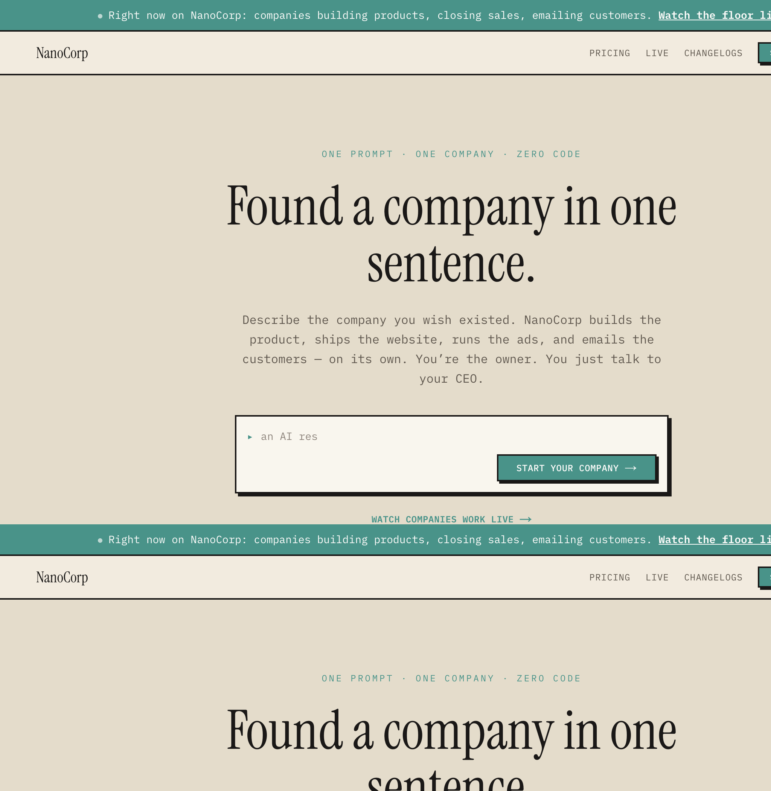
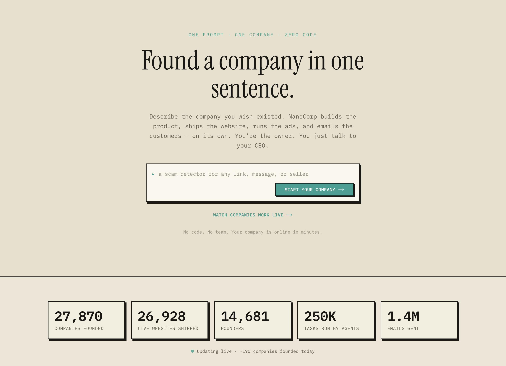
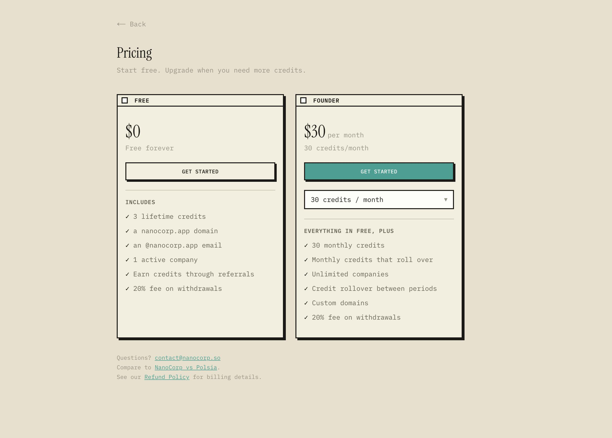
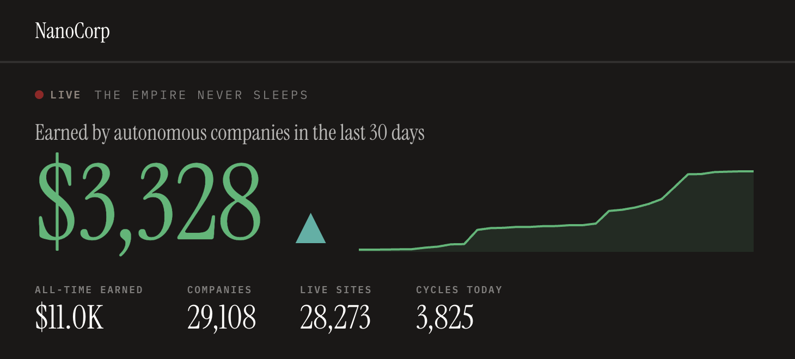
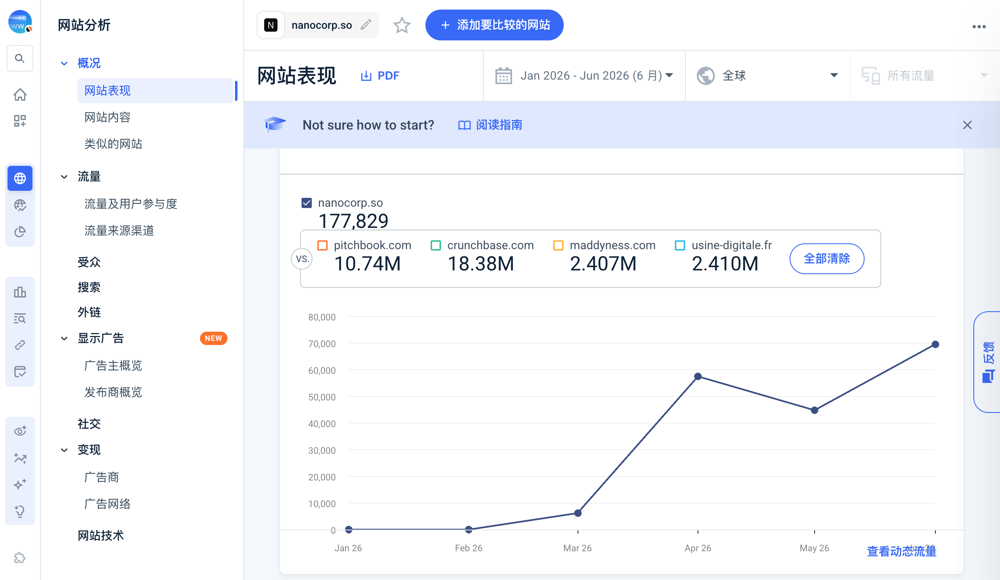

> 调研时间：2026-07-15。本文把当前 NanoCorp 产品、PHOSPHO INC. 的历史融资、供应商自报经营数字、第三方流量估算和少量用户侧样本分开呈现。公开 live 数据会实时变化；ARR、earning company 与 task outcome 均保留定义边界。

*NanoCorp 当前官网把产品压缩为一句话：用户定义公司，平台负责产品、网站、广告与邮件。截图于 2026-07-15。*

## TL;DR

**NanoCorp 是“自治公司工厂”的另一个高密度样本：用户用一句话定义公司，AI CEO 调度 worker，在托管环境里完成网站、代码、邮件、获客、Meta 广告、收款和经营汇报。** 它已经明显超出 AI 建站，但当前最成熟的业务仍是软件优先的数字产品：landing page、简单 Web 产品、Stripe payment link、冷邮件和广告。社媒、自助导入旧业务、并行任务、订阅收费、移动 App 和 self-host 等能力仍不完整。[[source.nanocorp.homepage-2026-07-15]] [[source.nanocorp.docs-faq-2026-07-15]]

NanoCorp 最强的规模信号不是一句 ARR，而是可以拆分的两组数字。第一组是**平台收入**：创始人称上线 55 天达到 $1M subscription ARR，并解释为 Stripe active subscriptions × 12，但没有公开客户数、退款和留存。第二组是**用户公司收入**：2026-07-15 live aggregate 约 29,108 家 created companies、28,266 个 live sites，却只有 197 个 earning companies，累计收入约 $10,966.65、过去 30 天约 $3,328.07。按公开字段计算，earning companies 只占 created companies 约 0.68%。[[source.linkedin.nanocorp-arr-claim-2026-06]] [[source.nanocorp.live-dashboard-2026-07-15]]

所以当前最稳妥的判断是：**NanoCorp 已经把“生成和发布一家公司”做成高吞吐产品，也证明少数用户能收款；但从发布到持续经营成功的漏斗仍极窄。** 96%/97% 网站发布率不能替代付费、留存或经营成功率。头部收入还混有少数单笔高价销售，不能用总额推断广泛 PMF。

它的增长方法比产品数字更值得学习。NanoCorp 在 2026-03-07 public launch，先通过 founder-led X/LinkedIn、HN、法国播客和用户公司案例获得自然传播，再用 Product Hunt、竞品 comparison SEO、实时看板、Ambassador 免费 credits 和收入比赛持续放大。这里必须保留一条偏差：Ambassador 每月拿到数百美元 credits，公开成功故事的一部分是被产品补贴和 co-marketing 主动培育出来的。[[source.hn.nanocorp-show-2026-05-08]] [[source.linkedin.nanocorp-ambassador-2026-05]]

## 产品：AI CEO 前台，托管式公司 runtime 在后面

用户给 NanoCorp 一个 one-liner，平台创建公司 shell、网站、邮箱、数据库、支付与任务。之后 AI CEO 负责规划并把工作交给隔离 sandbox 中的 worker；用户主要设置 mission、autonomy、credits cap，阅读 recap，在必要时指挥 CEO。[[source.nanocorp.docs-index-2026-07-15]]

*Product Hunt 产品素材展示了从一句话到公司 shell 的入口及当时公开规模；数字是发布时快照，不作为当前值。*

当前能力可拆成七层：

1. **公司生成**：命名、定位、初始产品和 website；
2. **软件执行**：Vercel deployment、PostgreSQL、Linux sandbox、Python/Node/Git；
3. **获客执行**：prospect search、email、browser automation、Meta ads；
4. **商业闭环**：产品、payment link、真实收入与 Stripe Connect 提现；
5. **经营记忆**：documents、files、mission、task history 与 analytics；
6. **Agent 组织**：CEO 规划，worker 在隔离环境执行；
7. **控制面**：暂停、autonomy 档位、daily credit cap、tool rate limits、support escalation。

它因此落入 [[concept.autonomous-company-factory]]，但“company”目前仍是一个强产品隐喻。真实可执行边界更接近：**为软件优先的小生意提供一套托管的 build + distribution + payment runtime。**

### 已知约束决定了自治上限

官方 FAQ 和 docs 给出一组重要限制：[[source.nanocorp.docs-faq-2026-07-15]] [[source.nanocorp.docs-github-access-2026-07-15]]

- 每家公司同一时间只能跑一个 task，不能并行；
- 社媒发帖、移动 App、subscription payment 尚不支持；
- 已有项目/业务导入不是 self-serve，公司不能删除或重命名；
- 代码完整访问需要 $120/月以上，数据库和业务状态没有公开一键导出；
- 不支持 self-host、BYO model 或 BYO API key；
- GitHub collaborator 的 write access 等同 operator：能让代码读取数据、发邮件和操作 Stripe。

“无需人类干预”因此更准确地理解为：NanoCorp 可以在平台预设的工具和额度内持续执行；用户仍承担选题、credits、合法性、结果审查、KYC、退款和不可逆权限决策。

## 运行机制：把失控风险写进工具 contract

NanoCorp 允许用户设置 AUTO 或 1/5/10/25 autonomous tasks/day，并可设置 conglomerate 级 24 小时 credit cap。手动 Run 可以越过 autonomous cap，但仍消耗 credits。失败任务称会退款；provider quota 会造成平台级暂停。[[source.nanocorp.docs-faq-2026-07-15]]

Tool rate limits 是更值得注意的设计：send_email 为 20/hour、100/day，create_product 为 10/hour、50/day，prospect search 为 20/hour、100/day。超限时工具返回结构化 `retry_after_s` 与 `should_wait`，超过 5 分钟明确让 Agent 转做其他任务而不是 sleep。[[source.nanocorp.docs-rate-limits-2026-07-15]]

这比单纯“给 Agent 一个 daily budget”更接近 operating contract：副作用工具本身带速率、错误语义和调度提示。但当前公开文档没有展示逐动作 human approval、独立 validator、细粒度角色权限或 accepted-outcome budget；这些仍是高自治产品的治理缺口。

### 生产轨迹变成 harness 改进数据

2026-05-21 的 nano 1.5 是本轮最值得复用的产品方法。团队称上一版的 run、failure 和 recovery 全部进入新 harness，形成 9 个 production-derived skills；平均 cost-bearing task 成本从 $2.33 降到 $1.56，mid-task recovery 60% → 86%，median task time 9.5 → 7.6 分钟。[[source.nanocorp.nano-1-5-2026-05-21]]

这形成 [[concept.production-trace-agent-harness-loop]]：Agent 产品的优势不只来自换模型，而是持续把真实失败压缩成工具 contract、skill 与恢复策略。供应商没有公开样本量、accepted outcome 或独立 benchmark，所以这些数字只能证明工程闭环，不证明业务质量同步提升。

## 商业模型：credits + 广告经手 + 20% 提现抽成

官方定价如下：[[source.nanocorp.docs-plans-2026-07-15]]

*官方 Product Hunt 素材中的基础定价。实际月度 credits 可继续上调，正文以 2026-07-15 文档为准。*

| 层级 | 价格 | 核心内容 |
|---|---:|---|
| Free | $0 | 3 个 lifetime credits、1 家 active company、平台域名/邮箱、badge |
| Founder | $30–$2,000/月 | 30–2,000 monthly credits、rollover、无限公司、custom domains |
| Top-up | $15–$110 | 10–100 个一次性 credits，仅 active subscriber 可买 |

平均 task 约 1 credit，但复杂任务消耗会变化。Free 的 3 credits 更像体验额度，不足以长期运营；HN 用户也报告很快耗尽。[[source.hn.nanocorp-show-2026-05-08]]

Meta ads 在任意付费层可启用，用户设置 $3–$150/day，平台自动生成素材和 targeting，并从同一 credit balance 扣费，1 credit = $1 ad budget。旧静态页面仍显示 $15 起和不同计费描述，说明文档更新速度高于部分营销页。[[source.nanocorp.docs-advertising-2026-07-15]]

销售收入提现时，NanoCorp 固定抽 20%；非美国账户还可能承担 Stripe currency/cross-border fee。用户仍是 merchant of record。[[source.nanocorp.docs-withdrawals-2026-07-09]] [[source.nanocorp.terms-2026-05-04]]

所以 NanoCorp 不是纯 seat SaaS：它同时赚取 subscription/credits，并试图占据用户公司的广告支出和收入分配。好处是单个成功公司能产生更高平台收入；代价是 serious operator 会关心 Stripe、代码、域名、数据和客户关系的可迁移性。

## 规模：把“发布成功”和“经营成功”分开

2026-07-15 官方 live aggregate 的可见漏斗：[[source.nanocorp.live-dashboard-2026-07-15]]

*公开看板汇总区，截图于 2026-07-15。图中数字持续变化；本库不保存看板公开接口中的近期邮件或任务明细。*

| 指标 | 观察值 | 能说明什么 | 不能说明什么 |
|---|---:|---|---|
| Created companies | 29,108 | 生成吞吐和试用规模 | 活跃业务数 |
| Live sites | 28,266 | 约 97.1% 发布网站 | 产品质量、购买、留存 |
| Founders | 15,521 | 注册/创建者量级 | 付费 customers |
| Tasks | 274,602 | Agent 执行量 | accepted outcomes |
| Emails | 1,643,193 | 外联/运营动作量 | deliverability、回复、成交 |
| Earning companies | 197 | 至少有收款记录的公司 | 持续盈利业务 |
| Earned all-time | $10,966.65 | 用户公司已产生真实销售 | GMV 规模化、利润 |
| Earned last 30d | $3,328.07 | 当前窗口仍有收入 | 稳定 MRR |

按 197 / 29,108 计算，earning-company penetration 约 **0.68%**。这个比例受 definition、测试款、去重与 company lifecycle 影响，但比“96% ship a website”更接近产品最需要改善的经营漏斗。

收入分布也很重要：头部第一名约 $2,305/702 sales，第二、第三名分别约 $1,146/1 sale 和 $556/1 sale。少数单笔高价销售能快速抬高 aggregate；不能把 all-time revenue 除以公司数后当单位经济。

### 两种 ARR 不可混写

平台自身创始人称 $1M ARR in 55 days，后续明确算法为 active Stripe subscriptions × 12。[[source.linkedin.nanocorp-arr-claim-2026-06]]

更早 HN 帖则从 $924k “ARR”跳到约 $9M annual run rate，口径明显不稳定。[[source.hn.nanocorp-show-2026-05-08]]

报告因此采用三条规则：

- 写“创始人自报 subscription ARR”，不写审计收入；
- 用户公司赚到的钱单独记，不并入平台 ARR；
- active billing subscription 不等于留存，必须等待 cohort、churn、refund 和 net revenue。

## Launch 与 GTM：从 founder-led organic 到可编排的 proof loop

| 时间 | 节点 | 判断 |
|---|---|---|
| 2025-09 末 | 重置 Phospho，离开 robotics | 产品 pivot 的组织起点 |
| 2026-01-01 | The Human Bottleneck | 公开 Agent organization 问题定义 |
| 2026-03-07 | NanoCorp public launch | Founder/X/LinkedIn 驱动，首夜约 140 companies，触发证书速率限制 |
| 2026-03-17 左右 | 开始出现收入 | 创始人后来在 HN 回溯 |
| 2026-04-09 | 早期 HN 帖 | 约 2 points，弱反馈，不是一次即爆 |
| 2026-05-08 | Show HN | 15 points / 7 comments，带数字和具体边界 |
| 2026-05 | nano 1.5、comparison SEO、Ambassador | 产品改进、搜索和 creator distribution 并行 |
| 2026-06-23 | Product Hunt | #23、86 points；是放大器，不是增长起点 |
| 2026-07 | CLI、competition、持续 DailyCorp | 从 no-code 扩到 coding-agent，并持续制造事件 |

这条路径有五个组合动作：

1. **Founder-led category narrative**：创始人用高频 X/LinkedIn、法国播客和收入 milestone 建立“autonomous company”语言；
2. **Public operating receipts**：live dashboard 同时是 demo、社会证明和内容素材，复用 [[concept.live-operating-dashboard-as-gtm]]；
3. **Comparison SEO**：`Polsia vs`、`Polsia alternatives`、Lindy/HeyBoss/Cofounder.co alternatives 抢已有品类意图；
4. **User-company PR loop**：生成公司自己冷邮件、拿播客或做案例，再反哺 NanoCorp 传播；
5. **Subsidized experiment loop**：Ambassador 免费 credits、co-marketing 和收入比赛主动扩大 success stories。

Ambassador 不是造假，而是一种很有效的 seed cohort 设计；但研究和公开表达必须标记补贴。否则会把“团队花 credits 培育的实验”错误写成“完全自然、无成本的客户成功”。[[source.linkedin.nanocorp-ambassador-2026-05]] [[source.nanocorp.competition-2026-07-10]]

## 流量：launch 后形成中等规模，品牌与法国叙事主导

第三方 root-domain 月度估算为 2026-03 约 6.2K、4 月 57.4K、5 月 44.8K、6 月 69.5K，H1 合计约 177.8K；另一个包含 subdomains 的 widget 为 286.8K。绝对数字不可与登录/付费混用。[[source.similarweb.nanocorp-2026-h1]] [[traffic.similarweb.nanocorp-2026-h1]]

*第三方流量估算显示 3 月起量、4 月跃升、5 月回落、6 月再创新高；图中 177,829 是根域口径，与含子域的 286,829 不可混用。*

Direct 与 Organic Search 各 37.78%，Referral 8.39%、Organic Social 7.92%；移动 Web 61.28%。France 49.02%、India 19.39%、US 10.14%。6 月自然搜索约 93% branded，说明当前增长主要来自品牌叙事和直接认知，而不是广泛的“AI company builder”品类搜索。

non-brand 词中已经出现 `polsia vs` 和 `other companies like polsia`，说明 comparison SEO 正在产生意图；outgoing 约 97.67% 指向 app.nanocorp.so，能证明主站到登录的路径，不能推算 signup conversion。

Semrush 的 97 个 organic keywords 和约 19.5K backlinks 中混入鞋码、女装等不相关内容，更可能是生成子域或 backlink 污染。它提醒我们：自治公司平台会同时制造大量网站，SEO 指标很容易被用户内容污染。[[source.semrush.nanocorp-2026-07-14]]

## 团队与资本：当前产品很新，法律主体和资本更老

当前强确认 founder 只有 [[person.pierre-louis-biojout]]。YC 标 team size 1；LinkedIn company range 为 2–10，visible list 中还有增长负责人 Adrien Brochier Allari、产品成员 Pierre-Louis Soulié 等，但也混有 Ambassador 和多重身份。准确说法是“小团队、Founder 主导”，不是“一个人完成全部劳动”。[[source.yc.nanocorp-2026-07-15]] [[source.linkedin.nanocorp-company-2026-07-15]]

NanoCorp 的 Terms 明确由 PHOSPHO INC. 运营。历史链路是：

- 2023：Pierre-Louis Biojout 与 Paul-Louis Venard 创办 Phospho；
- 2024-01-17：Phospho 获 €1.7M pre-seed，Elaia lead，YC W24 参与；
- 随后：从 LLM observability 转向 robotics；
- 2025-09 末：Pierre-Louis 重置公司并离开 robotics；
- 2026：NanoCorp commercial launch。

因此本库建立 [[investment.elaia-nanocorp-legacy-preseed-2024]] 与 [[investment.yc-nanocorp-legacy-preseed-2024]] 两条**历史主体连续边**，但都标记 legacy-product。没有找到 2026 NanoCorp 新轮融资公告，也不把 €1.7M 分配到单家。[[source.elaia.phospho-preseed-2024-01-17]] [[source.linkedin.phospho-funding-2024-01-17]]

## 用户与社区：公开故事丰富，独立长期样本仍薄

HN 提供了最具体的早期摩擦：credits 很快耗尽、token-heavy、当时产品更接近 landing page + simple product + Stripe + email，完整 GTM agent 仍在做。[[source.hn.nanocorp-show-2026-05-08]]

LinkedIn 有实名用户展示过几天测试和具体产物，也有人把产品用于老网站 prospecting 场景；这些是比泛转发更强的 use-case evidence。但本轮抓取只是 partial，缺少成本、成交和长期留存。[[source.linkedin.nanocorp-user-colin-2026]] [[source.linkedin.nanocorp-user-evann-2026]]

Reddit 精确检索没有拿到聚焦 NanoCorp 的有效讨论；X 有少量独立用户称 Polsia/NanoCorp 适合快速 MVP 和 cold email，但控制困难、credits 消耗明显，互动很低，只能作为候选摩擦。中文世界已出现“AI Agent 赚钱/一人公司”的二次传播：一篇 public launch 当天的公众号周报转述了创始人 X 案例，但仍未找到可确认的长期中文用户复盘。[[source.wechat.nanocorp-money-weekly-2026-03-07]] [[source.nanocorp.chinese-community-check-2026-07-15]]

## 竞品：直接对照是 Polsia，不是所有 Agent 平台

| 层级 | 产品 | 分类理由 |
|---|---|---|
| 直接 | [[company.polsia]] | 同样从 idea 生成公司并执行代码、邮件、广告、支付；购买者和 outcome 接近 |
| 直接候选 | Cofounder.co | 同样使用 AI company / autonomous company 语言，但当前 approval-gated，需单独深挖 |
| 相邻 | [[company.lindy]] | 通用个人/业务助理平台，不默认创建和拥有一家公司 |
| 相邻 | HeyBoss | 更靠近网站和轻运营，不具备同等 company runtime 叙事 |
| 相邻 | Devin | coding agent，解决产品构建的一层，不接管支付、广告和公司经营 |

NanoCorp 官方 comparison 把“我们公开数字、对方没有”作为卖点，但该页面对 Polsia 的描述已经部分过时。供应商 competitor page 适合用来理解 positioning 与 SEO，不适合作为当前竞品 truth。[[source.nanocorp.polsia-comparison-2026-05-19]]

## 关键判断与风险

### 证据较强的事实

- NanoCorp 已形成从一句话到网站、代码、邮件、广告、支付和任务调度的托管式产品；
- 当前公开 docs 显示其自治边界仍受单任务串行、credits、平台工具、功能缺口与用户责任约束；
- 平台已经获得中等网站访问量和大量创建/发布行为，少数用户公司产生真实销售；
- 创始人自报平台 subscription ARR 增长快，但未公开 retention、refund 和 customer count；
- 2024 €1.7M 是 PHOSPHO INC. 历史融资，不是 2026 NanoCorp 新融资；
- GTM 已形成 founder narrative、live receipts、comparison SEO、Ambassador 与 competition 的组合闭环。

### 研究判断

1. **当前瓶颈不是 company generation，而是 earning conversion。** 近 97% 发布网站与约 0.68% earning company 的差距，比总公司数更接近 PMF 真问题。
2. **NanoCorp 比 Polsia 更像“轻量、高速、软件优先”的自治公司入口。** CLI 和 GitHub 让技术用户能接管一部分构建，但核心 runtime 仍强托管。
3. **实时看板是强 GTM，也是治理负债。** Aggregate 公开透明值得学习；近期邮件/任务细节出现在公开接口则超出最小必要披露，应尽快收紧。
4. **Ambassador 是 seed cohort，不是自然 cohort。** 补贴、co-marketing 和比赛可以加快学习与传播，公开 success rate 时必须排除或单列。
5. **生产轨迹闭环可能比模型本身更构成壁垒。** 如果 NanoCorp 能把大量真实经营 task 变成 harness skill 和工具 contract，长期价值会从“生成站点”移向“失败恢复与经营动作知识”。

### 仍需验证

- $1M subscription ARR 的 active customer 数、ARPU、退款、churn 与 net retention；
- 197 earning companies 的定义、测试付款排除、重复公司和持续收入 cohort；
- 邮件 deliverability、spam/complaint、广告 ROI 与销售退款；
- Ambassador 与非 Ambassador cohort 的任务成本、成功率和留存差异；
- 公开 live API 的邮件/任务细节是否已收紧；
- SOC 2、DPA、audit log、细粒度权限与独立审批能力；
- 2026 年是否有新的融资、共同创始人或正式团队扩张。

## 监控触发器

- live dashboard 的 earning companies、30-day revenue 与公开字段变化；
- pricing、credits、20% withdrawal fee、Meta ad budget 或 export/self-host 政策变化；
- nano harness 新版本及独立任务质量证据；
- Product Hunt、HN、X、LinkedIn、Discord 的长期用户反馈；
- 新融资、团队、SOC 2/DPA、安全事故或公开 API 收紧；
- Cofounder.co、Polsia 等直接竞品的功能与流量变化。

## 证据索引

### S1：官方/当事人

- 产品与边界：[[source.nanocorp.homepage-2026-07-15]]、[[source.nanocorp.docs-index-2026-07-15]]、[[source.nanocorp.docs-faq-2026-07-15]]、[[source.nanocorp.docs-plans-2026-07-15]]、[[source.nanocorp.docs-rate-limits-2026-07-15]]、[[source.nanocorp.docs-github-access-2026-07-15]]、[[source.nanocorp.docs-advertising-2026-07-15]]、[[source.nanocorp.docs-cli-2026-06-20]]、[[source.nanocorp.docs-withdrawals-2026-07-09]]、[[source.nanocorp.terms-2026-05-04]]
- 经营/GTM：[[source.nanocorp.live-dashboard-2026-07-15]]、[[source.nanocorp.competition-2026-07-10]]、[[source.nanocorp.nano-1-5-2026-05-21]]、[[source.nanocorp.changelog-cli-2026-07-02]]、[[source.linkedin.nanocorp-ambassador-2026-05]]、[[source.linkedin.nanocorp-arr-claim-2026-06]]
- 人物/资本：[[source.plbiojout.profile-2026-07-15]]、[[source.plbiojout.human-bottleneck-2026-01-01]]、[[source.elaia.phospho-preseed-2024-01-17]]、[[source.linkedin.phospho-funding-2024-01-17]]

### S2：平台/第三方强信号

- [[source.yc.nanocorp-2026-07-15]]、[[source.producthunt.nanocorp-2026-06-23]]、[[source.linkedin.nanocorp-company-2026-07-15]]、[[source.linkedin.pierre-louis-biojout-2026-07-15]]、[[source.similarweb.nanocorp-2026-h1]]、[[source.semrush.nanocorp-2026-07-14]]

### S3/S4：社区与待验证

- [[source.hn.nanocorp-show-2026-05-08]]、[[source.linkedin.nanocorp-user-colin-2026]]、[[source.linkedin.nanocorp-user-evann-2026]]、[[source.wechat.nanocorp-money-weekly-2026-03-07]]、[[source.nanocorp.chinese-community-check-2026-07-15]]、[[source.nanocorp.app-login-smoke-2026-07-15]]
