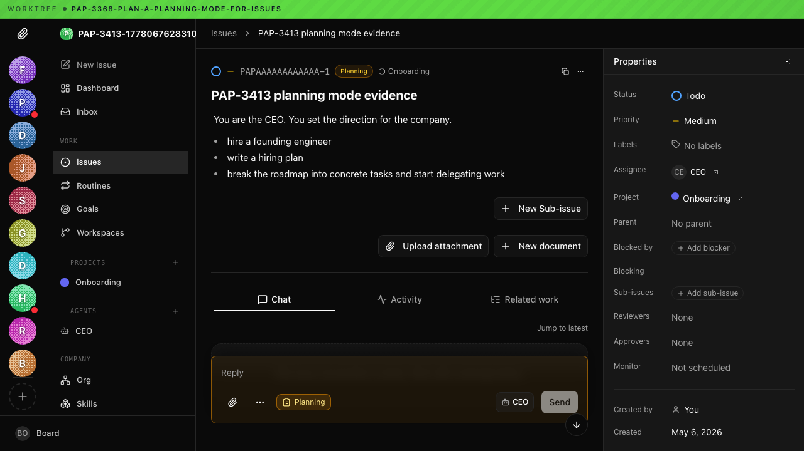
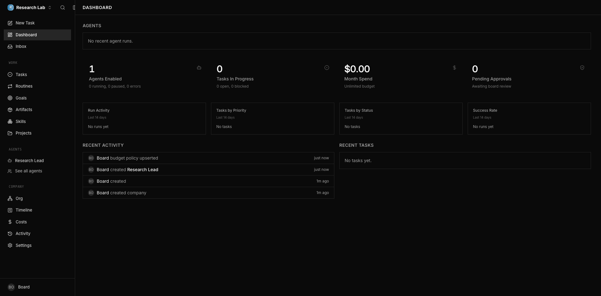
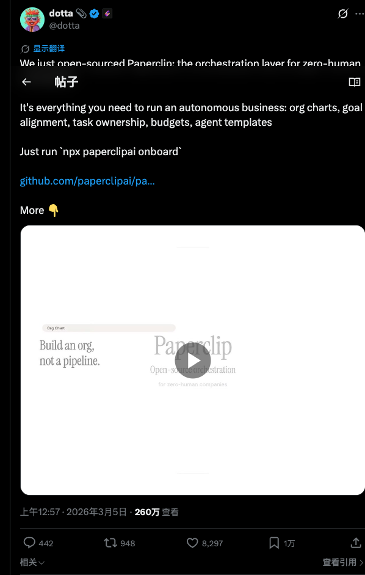
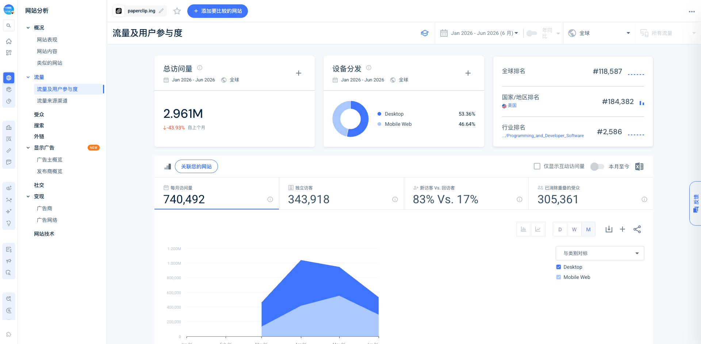

> 调研时间：2026-07-15。本文区分产品事实、平台数据、用户报告与研究判断。GitHub stars、网站 visits 和社交互动反映分发与关注，不等同付费、生产部署或留存。

## TL;DR

**Paperclip 是一个开源、自托管、model-agnostic 的 AI 劳动力控制面。它不造 Agent，也不替代 Claude Code、Codex、OpenClaw 或 Hermes；它把这些 runtime 当作可替换员工，用组织架构、目标、Issue、预算、审批、心跳、例行工作和审计来管理。** [[concept.agent-company-control-plane]]

它是目前“Agent 公司控制面”最完整、也最值得警惕的样本：产品不只做了 landing page，实际安装会启动本地数据库、创建公司与 Agent，UI 中有任务、组织架构、成本、审批、活动与 Skills；但官网所说的 hard budget、human control 和 immutable audit，只有在 adapter 正确上报成本、权限没有绕出控制面、秘密没有进入模型输出、Agent 不陷入循环时才成立。[[source.paperclip.homepage]] [[source.paperclip.docs-costs]]

增长路径非常清晰。Dotta 在 2026-03-04 UTC 用一句类别定义、27 秒视频和一条 `npx` 命令首发；帖文当前约 260 万 views，GitHub 约 7.37 万 stars。第三方估算显示官网流量 3 月约 45.6 万 visits、4 月升至 103.5 万、5 月 94.2 万、6 月回落至 52.8 万。**这是一次强烈的开源品牌爆发，不是已经被证明的线性业务增长。** [[source.paperclip.x-launch]] [[traffic.similarweb.paperclip-2026-h1]]

Paperclip 最重要的价值，不是“让 Agent 自动开公司”，而是把人类此前散落在聊天、终端、看板和账单里的管理动作显性化。它也暴露了下一阶段的真实瓶颈：Agent 可以更快地产生工作，人类的判断、验收和责任却不会同比扩容。LinuxDo 用户所说的“自己变成多个 Agent 的传话筒”，比 zero-human company 更接近当前产品现实。[[source.paperclip.linuxdo-human-bottleneck]]

## 产品：公司不是比喻，而是数据模型

Paperclip 的对象模型接近一套轻量企业操作系统：

| 控制层 | 主要对象 | 解决的问题 |
|---|---|---|
| 方向 | Company、Mission、Goal、Project | Agent 为什么做这件事 |
| 组织 | Org chart、Agent、Role、Delegation | 谁负责、向谁汇报、如何分工 |
| 工作 | Issue、Sub-issue、Assignee、Reviewer、Approver | 工作合同、状态、依赖与交接 |
| 执行 | Adapter、Workspace、Heartbeat、Routine | 如何唤醒 runtime、在哪里执行 |
| 治理 | Budget、Cost、Approval、Execution policy、Audit | 花多少钱、谁批准、发生了什么 |
| 复用 | Skill、Plugin、Template、Export/Import | 如何复制组织能力与环境 |

这套模型和 [[company.raft]]、Bloome 的 channel/chat-native 协作不同，也和 [[company.multica]] 的本地 coding team 不完全相同。Paperclip 的主界面不是“大家在一个房间聊天”，而是“Board 管理一个有目标、层级、预算和责任的组织”。[[source.paperclip.readme]]

### Issue 是工作合同

任务有 owner、状态、优先级、项目、阻塞关系、sub-issues、reviewer 与 approver；Agent 在任务 thread 中回传工作，runtime 由 adapter 唤醒。它延续了 [[concept.issue-native-agent-management]] 的路线：把 chat session 降级为执行细节，把 Issue 升级为稳定责任边界。

这一设计适合可拆解、可验收、可追责的工作；开放探索则会显得僵硬。GitHub #49 的 19 条评论要求先和 Agent brainstorm，再生成任务，说明 ticket-first 会迫使用户过早把模糊问题形式化。当前 Ask/Planning mode 已部分缓解，但 CEO chat 仍在 roadmap。[[source.paperclip.github-chat-gap]]

### Adapter 解耦是优势，也是治理漏洞的来源

官方已列出 Claude Code、Codex、Cursor、Gemini、Grok、Hermes、OpenCode、Pi、ACPX、process、HTTP/external 等 adapter。控制面不绑定模型，让团队可以替换 runtime、继续使用已有订阅和本地工具。[[source.paperclip.docs-adapters]]

但 Paperclip 能看到什么、限制什么，取决于 adapter 的 contract：

- adapter 是否上报 token、cost、session 与状态；
- workspace、凭据和工具权限是否被正确注入；
- 外部动作是否经过 approval/execution policy；
- Agent 输出是否可能把 secret 再写回日志或 UI。

所以 model-agnostic 不是纯粹优点。它把产品竞争从“支持几个模型”推进到 **adapter observability 与 policy enforcement 是否完整**。

## 实际体验：它不是空壳

本轮在隔离目录中运行稳定版 `2026.707.0`，只用本地 `process` dummy agent 验证产品面，没有调用付费模型：

1. `npx paperclipai onboard --yes` 完成 9 项 doctor check；
2. 自动启动 loopback-only embedded PostgreSQL，并执行 134 个 migrations；
3. onboarding 要求创建公司、使命、team lead、adapter 与 heartbeat；
4. 控制面包含 Dashboard、Inbox、Tasks、Routines、Goals、Artifacts、Skills、Projects、Agents、Org、Timeline、Costs、Activity 与 Settings；
5. 创建 dummy agent 后，Dashboard 能显示 Agent、任务、支出、审批、活动和成功率等组织指标。

[[source.paperclip.local-product-smoke]]

这证明核心控制面可运行，但不证明真实 Agent 能在复杂项目中稳定协作。本轮没有注入 API key、没有运行模型、没有测试生产权限与多人部署。

## 治理：卖点成立，但不是闭环

Paperclip 把治理放在首页中心：预算达到上限自动停止、招聘和战略需要 Board 批准、所有工具调用和决策都可追踪。方向是对的，但当前公开证据显示三类断点。

### 1. 预算只对“看得见的成本”生效

GitHub #8856 报告，subscription-authenticated Claude 的 `billed_cents=0`，约 30 个 Agent 的预算不累积、warning 与 auto-pause 均不触发。#8947 进一步给出 Hermes adapter 的解析问题：CLI 不输出 token/cost，最终 usage 与 cost 为空。两条 Issue 当前均 open。[[source.paperclip.github-budget-subscription]] [[source.paperclip.github-hermes-cost]]

因此官网的“hit the budget, they stop”需要加条件：**只有当 adapter 向控制面提供可靠、可执行的计量，预算才是 hard stop。** 对订阅 quota、token window 和外部 API 支出，还需要独立的 runs/tokens/quota policy。

### 2. 自主运行会放大空转、重试和错误拓扑

- #2854 用户称 3 个没有任务的 heartbeat 消耗约 30% Claude Max 计算窗口；[[source.paperclip.github-heartbeat-cost]]
- #9539 个体用户报告升级和 auth 恢复期间出现约 3,560 万 input tokens、约 20 美元单轮成本；[[source.paperclip.github-cost-blowup]]
- LinuxDo 用户报告配置错误后 Agent 无限循环、刷出上百 Issue，Reviewer/Approver 没能帮助收敛。[[source.paperclip.linuxdo-bugs]]

这些都不是足以证明“Paperclip 普遍失控”的统计样本，但它们指向同一工程结论：budget、retry cap、heartbeat policy、work queue 和 human attention 必须作为一套控制环设计，不能各自存在就算治理完成。

### 3. 控制面不能替人判断“这是不是有用的工作”

社区里最常见的失败不是 server crash，而是 Agent 互相生成文档、组织角色不断扩张、代码或最终交付很少。也有用户肯定 UI 和自动 GitHub 操作，但随后仍要求更好的使用指导。[[source.paperclip.linuxdo-experience]]

Paperclip 能记录“谁做了什么”，却不能自动回答“这项工作值得做吗、输出可接受吗、组织拓扑是否合理”。真正应追踪的指标是 accepted deliverables、human interventions、rework、time-to-review 和 cost per accepted output，而不是 Issue 数、Agent 数或 token 数。

## 团队

当前更像一支三人核心团队，而不是大规模企业软件组织：

- **[[person.dotta]]**：创始人兼 CEO，使用化名公开活动；GitHub 主账号 `cryppadotta` 是仓库绝对主贡献者。其公开历史包括 Forgotten Runes、crypto-quant 与 Dotlicense。
- **[[person.devin-foley]]**：联合创始人、CTO、Human in the Loop；LinkedIn 当前写“Building Paperclip - WE'RE HIRING”，GitHub 是第二大贡献者。[[source.paperclip.linkedin-devin]]
- **[[person.scott-tong]]**：LinkedIn 显示与 Paperclip 关联的设计成员；Designer Fund 官方履历显示其曾任 Cambly Head of Design、Pinterest 产品设计负责人，并联合创办 IFTTT。[[source.paperclip.designerfund-scott]]

LinkedIn 公司页显示 2–10 employees，并可见 3 个关联成员；自报关联不能当精确 headcount。[[source.paperclip.linkedin-company]]

这支团队的优势是产品与设计密度：Paperclip 用组织语言包装复杂 orchestration，首发视频能让人迅速看懂。但小团队同时面对 adapter、数据库、权限、安全、多人协作、插件和大规模开源贡献，维护面非常宽。

## 融资边界

本轮没有找到 Paperclip Labs 的官方融资公告、金额、估值或可交叉验证的投资机构，因此不建立 investment 边。

数据库搜索片段曾出现 Offline Ventures，但 Paperclip/Paperclip Labs 同名主体很多，且没有官方或强第三方支持。当前只能记录“未验证”，不能写成已融资。

## 增长与 GTM

### 起量 sequence

- **2026-02-16**：git 初始提交；
- **2026-03-02**：GitHub 仓库创建；
- **2026-03-03**：npm package 创建并发布首个稳定版本；
- **2026-03-04 UTC / 03-05 中国时间**：Dotta 首发，当前约 260 万 views；
- **2026-03-08**：创始人称项目已经 takeoff，同时承认贡献 slop 与 prompt injection 风险；
- **2026-03-09**：v0.3.0，官方称数日内已有 25+ contributors；
- **2026-03-27 至 04-16**：Greg Isenberg、The Next New Thing、AI Engineer 等视频持续演示；
- **2026-07-07**：稳定版 `2026.707.0`；GitHub 已约 7.37 万 stars、1.37 万 forks；
- **2026-07-14**：创始人把产品重新表述为 task manager、org chart、employee training 与 agentic OS 四层。

### 为什么传播有效

1. **一句类别定义**：“If OpenClaw is an employee, Paperclip is the company.” 把复杂控制面映射到熟悉组织心智。
2. **视频优先**：27 秒视频展示组织图与任务流，承担 elevator pitch；比文字列功能更快。
3. **一条命令完成试用**：`npx paperclipai onboard --yes` 把好奇心直接转成安装。
4. **开源 artifact**：用户不仅转发观点，也能 star、fork、提 Issue、交 PR。
5. **founder-led distribution**：Dotta 当前约 6.2 万 X followers，首发由 founder 而非新产品账号完成。
6. **creator relay**：开发者视频和教程把 27 秒 pitch 扩成可复现工作流；第三方估算中 social 流量约 71% 来自 YouTube。

HN 只有一次 3 points、0 comments 的提交，Product Hunt 未找到正式 launch。Paperclip 不是 HN/PH 打榜故事，而是 X 视频 + GitHub + npm + creator demo 的开源分发。[[source.paperclip.hn-launch]]

## 流量：爆发、见峰、回落

| 月份 | 第三方估算 visits | 节点 |
|---|---:|---|
| 2026-01 | 无数据 | 尚未发布 |
| 2026-02 | 无数据 | 开发期 |
| 2026-03 | 456,311 | 首发与 GitHub 起量 |
| 2026-04 | 1,035,254 | creator demos 与开源扩散见峰 |
| 2026-05 | 942,148 | 仍在高位 |
| 2026-06 | 528,256 | 较 5 月下降约 44% |

半年合计约 296.2 万 visits。6 月参与度估算约 2 分 29 秒、1.69 pages/visit、65.51% bounce；桌面 53.36%、移动 web 46.64%。[[source.paperclip.similarweb-2026-h1]]

渠道为 direct 42.84%、organic search 42.17%、referral 9.30%、organic social 3.52%、generative AI 1.05%，付费渠道接近零。搜索约 98% 为品牌词，说明 organic search 的高占比主要是**品牌需求承接**，不是成熟的非品牌 SEO。

Referral 中 GitHub 约占 50%，docs 约 14%；outbound 约 92% 去 GitHub、7% 去 docs。这支持“官网是开源仓库和文档的入口”，但也说明 visits 不能直接当 app usage。Similar sites 自动给出 Claude、ChatGPT、Hugging Face 等，它们是受众/搜索邻近，不是直接竞品。

地域估算以印度 29.47% 为首，美国 12.99%，德国 5.89%，越南 4.40%，巴西 4.09%。这更像全球开发者分发，而不是已被证明的美国 enterprise traction。

## 社区：强注意力，弱集中口碑

### 正向信号

- GitHub 约 7.37 万 stars、1.37 万 forks、17 个稳定 releases，且发布后几天就有 25+ contributors；[[source.paperclip.github-repo]] [[source.paperclip.x-v030]]
- 官网收集了多个 builder 对 UI、无模型锁定和“mission control”的肯定；这些是官方精选 testimonials，不能当独立样本；
- LinuxDo 也有用户肯定开局设计、自动 GitHub 项目与组织心智，说明价值并非只存在于官方 demo。[[source.paperclip.linuxdo-experience]]

### 反证更有决策价值

- Bug 与配置错误会被多 Agent 并发放大；
- 文档/规划产出容易替代真正交付；
- Issue 越多，Agent 越可能在自己的工作队列中困住；
- Reviewer/Approver 的存在不保证 review 质量；
- 用户需要知道何时应使用“公司心智”，何时多开几个 Codex session 更直接；
- v2026.529.0 曾被报告 Agent 输出把 secret 明文显示在 UI；Issue 仍 open，但最新版是否可复现本轮未核实。[[source.paperclip.github-secret-leak]]

Reddit 聚焦讨论很少，新建的 `r/PaperClip_AI` 规模也很小；HN 没形成讨论。中文公众号搜索约有 315 条结果，但大多转述“零人公司”叙事，说明认知扩散，不说明产品使用。[[source.paperclip.wechat-overview]]

## 竞品与边界

| 类型 | 代表 | 与 Paperclip 的关系 |
|---|---|---|
| Agent 公司控制面 | Paperclip、Conductor 等 | 最直接：组织、任务、预算、审批、审计和 runtime 管理 |
| Issue-native coding team | [[company.multica]] | 都以 Issue 为合同；Multica 更贴近本地 coding 交付，Paperclip 更像通用公司 OS |
| Agent-native collaboration OS | [[company.raft]]、Bloome | 以 channel、identity、shared context 为中心，更适合协商与开放协作 |
| AI employee OS | [[company.helio]]、[[company.viktor]] | 更强调预制岗位、业务责任或进入现有 Slack/Teams |
| Agent runtime | OpenClaw、Hermes、Claude Code、Codex | 互补而非直接竞品；Paperclip 管理它们 |
| 现有工具组合 | Linear/Jira + GitHub + Slack + billing | 结构性替代；成熟团队可能只需要连接层，不愿迁移公司状态 |

直接竞品不能按 Similarweb similar sites 判断。关键比较维度是：谁拥有组织状态、工作合同在哪里、runtime 在哪里执行、成本是否可计量、审批能否覆盖外部动作、最终交付如何验收。

## 关键判断与风险

### 1. Paperclip 抢的是 Agent labor 的 management plane

模型与 runtime 越可替换，组织、权限、成本、责任和证据越重要。Paperclip 不是“另一个多 Agent framework”，而是在定义 Agent 工作的管理协议。

### 2. 治理能力必须按 failure path 验证

有 budget 字段不等于能阻止超支，有 approval 不等于能覆盖外部动作，有 audit log 不等于 secret 不会进入日志。对治理产品，功能清单价值低，控制环闭合才是产品。

### 3. 公司心智既是 GTM 优势，也是使用风险

“员工/公司”让用户迅速理解产品，却也诱导用户招聘过多角色、制造不必要 handoff 与文档。对小任务，直接 Agent session 可能更高效；只有任务有持续责任、并行依赖、预算和审阅需求时，组织层才创造净价值。

### 4. 开源规模已被证明，商业规模没有

7 万 stars、近 300 万半年 visits 和持续发布足以证明类别与分发；当前没有公开定价、收入、客户、留存、部署或融资数据。不要把 popularity 写成 company scale。

### 5. 真正瓶颈正在从执行迁到 human attention

当 Agent 产出速度超过人类阅读、纠偏和验收速度，更多自主性只会扩大 backlog。Paperclip 长期价值取决于能否压缩人类判断成本，而不是单纯增加“员工数”。

### 6. 小团队面对的是企业基础设施级责任

adapter compatibility、成本计量、secret、执行权限、多人 auth、数据隔离和 supply-chain review 都是高风险面。开源社区能加快功能，也会带来 PR slop 和攻击面；创始人自己已经公开承认这一点。[[source.paperclip.x-takeoff]]

## 待验证

- Paperclip Labs 的融资、投资机构、估值、收入、定价与法律主体细节；
- 真实生产部署、周/月留存、活跃公司、活跃 Agent 与付费客户；
- accepted deliverables、human interventions、review time、rework 和单位成本；
- subscription、Hermes 和其他 adapter 下预算治理的修复状态；
- v2026.707.0 auth/retry 成本异常是否可复现；
- secret redaction、prompt injection、command policy 与低信任贡献的最新安全状态；
- 多人模式、RBAC、SSO、审计导出、数据驻留与企业合规；
- Ask/Planning 能否解决 ticket-first 对探索任务的限制；
- Scott Tong 的正式职务，以及团队完整 headcount；
- 4 月流量峰值之后，GitHub/官网兴趣能否转成持续使用。

## 证据库

### S1：官方与原始材料

- [Paperclip 官网](https://paperclip.ing/) · [[source.paperclip.homepage]]
- [GitHub 仓库](https://github.com/paperclipai/paperclip) · [[source.paperclip.github-repo]]
- [README 与产品边界](https://github.com/paperclipai/paperclip/blob/main/README.md) · [[source.paperclip.readme]]
- [Agent Adapters](https://docs.paperclip.ing/guides/org/agent-adapters/) · [[source.paperclip.docs-adapters]]
- [Costs & Budgets](https://docs.paperclip.ing/guides/day-to-day/costs/) · [[source.paperclip.docs-costs]]
- [Approvals](https://docs.paperclip.ing/guides/day-to-day/approvals/) · [[source.paperclip.docs-approvals]]
- [Heartbeats & Routines](https://docs.paperclip.ing/guides/projects-workflow/routines/) · [[source.paperclip.docs-routines]]
- [Trust & Low-Trust Review](https://docs.paperclip.ing/administration/trust-and-low-trust-review/) · [[source.paperclip.docs-trust]]
- [2026-03-04 首发帖](https://x.com/dotta/status/2029239759428780116) · [[source.paperclip.x-launch]]
- [发布数日后的 takeoff 复盘](https://x.com/dotta/status/2030781244183851492) · [[source.paperclip.x-takeoff]]
- [v0.3.0 与早期贡献者](https://x.com/dotta/status/2031125444330664195) · [[source.paperclip.x-v030]]
- [四层产品定义](https://x.com/dotta/status/2077029848602874009) · [[source.paperclip.x-four-pillars]]
- [model-decoupled orchestration 判断](https://x.com/dotta/status/2076355610698731801) · [[source.paperclip.x-model-decoupling]]
- [Founder demo](https://www.youtube.com/watch?v=qbCQ-AS5q2c) · [[source.paperclip.youtube-founder-demo]]
- [Paperclip Labs LinkedIn](https://www.linkedin.com/company/paperclip-paperclip/) · [[source.paperclip.linkedin-company]]
- [Devin Foley LinkedIn](https://www.linkedin.com/in/devinfoley/) · [[source.paperclip.linkedin-devin]]
- [Designer Fund：Scott Tong](https://designerfund.com/team) · [[source.paperclip.designerfund-scott]]

### S2：强第三方与平台估算

- [Greg Isenberg 产品演示](https://www.youtube.com/watch?v=C3-4llQYT8o) · [[source.paperclip.youtube-greg-demo]]
- [2026 H1 网站流量估算](https://www.similarweb.com/website/paperclip.ing/) · [[source.paperclip.similarweb-2026-h1]]

### S3：用户报告与社区样本

- [订阅计费下预算治理不生效 #8856](https://github.com/paperclipai/paperclip/issues/8856) · [[source.paperclip.github-budget-subscription]]
- [Hermes 不回传 usage/cost #8947](https://github.com/paperclipai/paperclip/issues/8947) · [[source.paperclip.github-hermes-cost]]
- [升级后 35M token 成本异常报告 #9539](https://github.com/paperclipai/paperclip/issues/9539) · [[source.paperclip.github-cost-blowup]]
- [空闲 heartbeat 成本 #2854](https://github.com/paperclipai/paperclip/issues/2854) · [[source.paperclip.github-heartbeat-cost]]
- [chat before task 缺口 #49](https://github.com/paperclipai/paperclip/issues/49) · [[source.paperclip.github-chat-gap]]
- [workspace unavailable #469](https://github.com/paperclipai/paperclip/issues/469) · [[source.paperclip.github-workspace-gap]]
- [secret leak 报告 #7601](https://github.com/paperclipai/paperclip/issues/7601) · [[source.paperclip.github-secret-leak]]
- [LinuxDo：bug 与循环](https://linux.do/t/topic/2185124) · [[source.paperclip.linuxdo-bugs]]
- [LinuxDo：使用体验分歧](https://linux.do/t/topic/1886384) · [[source.paperclip.linuxdo-experience]]
- [LinuxDo：人类注意力瓶颈](https://linux.do/t/topic/1833711) · [[source.paperclip.linuxdo-human-bottleneck]]
- [HN 低互动提交](https://news.ycombinator.com/item?id=47903549) · [[source.paperclip.hn-launch]]
- [中文内容扩散样本](https://mp.weixin.qq.com/) · [[source.paperclip.wechat-overview]]

## 相关资产

- 产品判断：[[note.paperclip-product-takeaway-2026-07-15]]
- 本轮过程与反思：[[note.paperclip-research-run-2026-07-15]]
- 流量快照：[[traffic.similarweb.paperclip-2026-h1]]
- 产品模式：[[concept.agent-company-control-plane]]、[[concept.issue-native-agent-management]]
- 对照对象：[[company.multica]]、[[company.raft]]、[[company.helio]]、[[company.viktor]]
