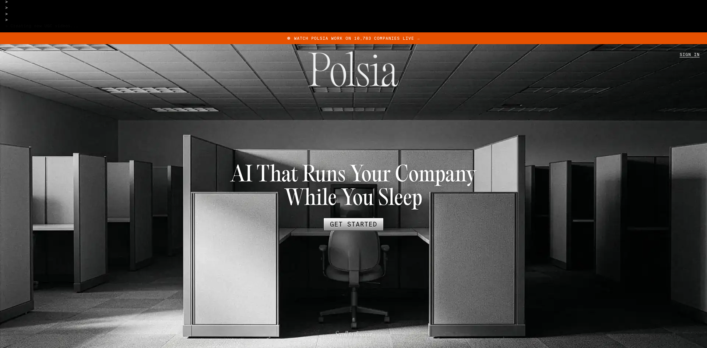
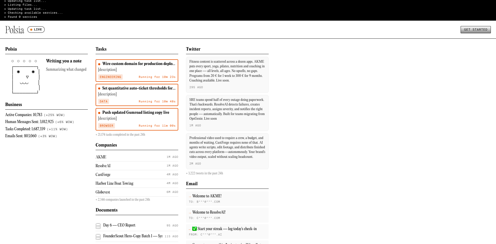
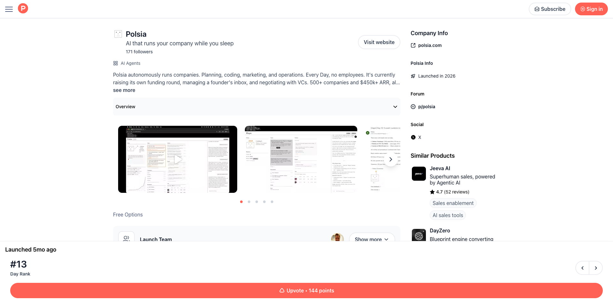
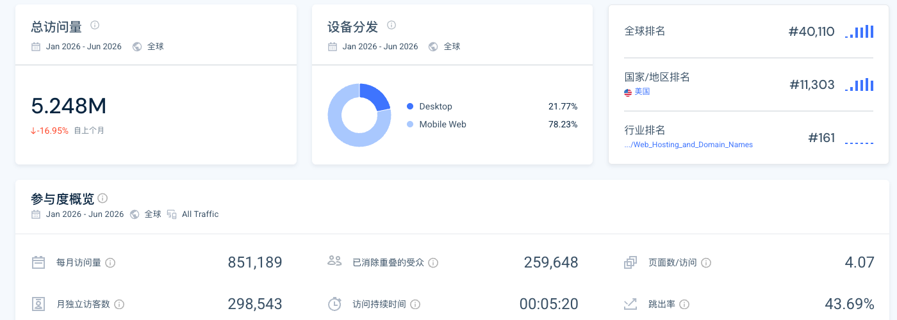

> 调研时间：2026-07-15。本文将官网与公开 API 的自报经营数据、创始人访谈、条款/隐私政策、第三方流量估算、社区用户自述和批评性审计分层呈现。Polsia 数据变化很快，文中数字均保留观察日期；“ARR”“active company”“churn”等未经审计且部分定义未公开。

## TL;DR

**Polsia 不是传统的“给公司配几个 AI 员工”，而是一套面向个人创业者的自治公司操作系统：用户输入一个 idea，平台替他选择并提供网站、数据库、邮件、支付、广告和模型等基础设施，再让 Agent 持续写代码、做研究、发推、投广告、回复客户、修 bug 和收款。** 它比 [[company.teamday]]、[[company.sintra]]、[[company.marblism]] 更激进：不是把 Agent 放进现有团队，而是尝试直接生成并运营一家公司。[[source.polsia.homepage-2026-07-15]] [[source.polsia.about-2026-07-15]]

这家公司已经获得真实规模，但公开叙事需要拆账。2026-07-15 重新读取官方 public dashboard API：headline “ARR” 为 **$8.53M**，其中 subscription MRR 为 **$422,889**，即订阅年化约 **$5.07M**；其余约 **$3.46M** 来自把过去 30 天的任务包、广告代投、boost、域名等现金流乘以 12。它是 annual run rate，不等于标准 SaaS ARR，更不等于客户赚到的钱。同期官方还报 9,449 paying users、10,783 active companies、225,241 total companies、12.9% trial-to-paid，以及定义未充分解释的 52.1% 30-day paid churn。[[source.polsia.public-dashboard-api-2026-07-15]]

**最值得研究的不是“AI 是否真的一个人融了 3000 万美元”，而是 Polsia 把产品、GTM、融资和商业模型做成了同一个闭环。** 实时看板既是产品演示、社会证明和投资人 data room，也是持续可截图、可争议、可传播的内容；公司自动发出的高频产品推文又把每个生成公司变成获客素材。创始人 [[person.ben-cera]] 也承认“零员工”是很强的 marketing story / performance art。[[source.gtmnow.ben-cera-polsia-2026-06-01]] [[concept.live-operating-dashboard-as-gtm]]

产品的主要风险与它的自治程度成正比。条款允许 Agent 代表用户执行广告、邮件、支付、退款和交易动作，但把合法性、成本、权限与结果审查责任主要留给用户；社区中已有多名自称付费用户报告任务循环、token 消耗、站点不可用、取消后扣费或支持无法解决问题。官方实时 feed 也会直接出现失败任务。上述社区样本不能代表全部用户，却和 52.1% 自报 churn、4.8% created-to-active 比例形成了需要持续追踪的同向信号。[[source.polsia.terms-2026-06-19]] [[source.reddit.polsia-agents-of-ai-2026-03-05]] [[source.reddit.polsia-cannot-recommend-2026-06-21]]

## 产品：不是协作 workspace，而是托管式公司工厂

Polsia 的用户路径是：给出创业想法，平台创建 company shell，自动准备 landing page、数据库、邮件、支付和任务，再每天自我规划并执行工作。创始人称默认节奏包含夜间任务和早晨 recap；用户不需要先选择模型、数据库、托管商或邮件供应商。[[source.polsia.about-2026-07-15]] [[source.gtmnow.ben-cera-polsia-2026-06-01]]

它实际覆盖六层：

1. **公司生成**：从 idea 生成名称、定位、网站和最初任务；
2. **产品执行**：写代码、部署、数据库、修 bug 与持续迭代；
3. **GTM 执行**：市场研究、X 内容、冷邮件、SEO、Meta 广告；
4. **客户运营**：回复邮件和支持请求，把重复问题转成 bug report；
5. **商业基础设施**：Stripe Connect、域名、Postmark、Hunter、GitHub、Render/Neon 等；
6. **代理控制面**：任务列表、实时 feed、成本、权限和公开 dashboard。

这构成 [[concept.autonomous-company-factory]]：平台生成“公司”的速度极高，但创建、上线、活跃、付费和成功是五个不同阶段。Polsia 当前 225,241 个 total companies 与 10,783 个 active companies 的巨大差距，说明“公司生成能力”不能直接转写成“运营公司规模”。

### 实时面板是真实 operating receipt，也是叙事机器

2026-07-15 的 live 页面显示 10,783 active companies、约 302 万 human messages、169 万 tasks、80 万 emails；过去 24 小时又显示 21,174 个任务、2,346 个新公司、3,222 条推文与 3,701 封邮件。页面不是静态 demo：活动流会实时更新，也能看到 “Database connection not available” 等失败项。[[source.polsia.live-dashboard-2026-07-15]]

这类看板比官网 feature list 更有证据价值，因为它展示系统正在执行什么；但仍有三个边界：

- task completed 不等于用户接受的业务结果；
- company launched 不等于产品可购买、有用户或有收入；
- tweet/email 数量不等于有效触达，更不能替代 deliverability、投诉率和转化率。

## 规模：官方数字很大，但必须拆口径

官方 public API 在 computed_at=2026-07-14 的核心字段如下：[[source.polsia.public-dashboard-api-2026-07-15]]

| 指标 | 官方值 | 本文如何解释 |
|---|---:|---|
| Headline ARR | $8,533,458 | 混合 run rate，不是纯订阅 ARR |
| Subscription MRR | $422,889 | 年化约 $5,074,668 |
| 过去 30 天其他现金流 | $288,232 | 任务包、广告代投、boost、域名等；年化约 $3.46M |
| Paying users | 9,449 | 官方字段，未公开付费 cohort 定义 |
| Active companies | 10,783 | 页面主卡；daily metrics 另报 10,579，口径略有差异 |
| Total companies | 225,241 | 创建量，不等于经营中公司 |
| Created → active | 约 4.79% | 本文按 10,783 / 225,241 计算 |
| Trial → paid | 12.9% | API 同时给出 4,888 / 37,849 |
| 30-day paid churn | 52.1% | API 给出 4,091 / 7,854，但定义与 cohort 窗口不完整 |
| DAU | 7,615 | 活跃定义未公开 |
| Daily AI cost | $3,039 | 仅 AI 成本，不含人、供应商、广告、支付和基础设施 |
| Cost per task | $0.08 | 平均口径，不代表复杂 coding task 成本 |

Headline ARR 的可复算式为：$422,889 × 12 + ($28,928.79 user company + $61,613 instant packs + $114,665.86 ad spend + $82,620 boost + $404.81 domains) × 12 ≈ $8.53M。**公开接口让口径可审计，这是优点；把不同稳定性的现金流统一叫 ARR，则会高估经常性。**

一周前的 headline 为 $8.42M，当前约高 1.36%；API 另有 wow_arr_growth_pct=-40.3，但没有清楚解释这是总量变化还是新增速度变化，本文不解读该字段。

## 商业模型：订阅只是入口，平台同时抽交易和买量

2026-06-01 访谈中的公开定价是约 $49/月 + 约 20% revenue share。Ben 解释，$49 是按每天约一个任务、服务器、数据库和 API 成本接近盈亏平衡来定；额外任务约 $1–$2。更复杂代码库的单任务成本曾上升到 $20–$30，意味着 $49 方案可能亏损。[[source.gtmnow.ben-cera-polsia-2026-06-01]]

现行 Terms 进一步显示：[[source.polsia.terms-2026-06-19]]

- 通过 Polsia 管理的广告账户投放，目前收 20% platform fee；用户配置的 $100 预算示例中约 $80 用于广告、$20 为平台费；
- 客户通过 Polsia 收款，目前也收 20% platform fee，另有 Stripe processing fee；
- 收款有 14 天 hold，用户仍是 merchant of record；
- Stripe Connect 提现最低 $50，当前每月 cap 为 $500；
- 订阅自动续费，默认不退款；
- Agent 可在权限内发起、批准、修改、退款或取消交易。

因此 Polsia 的经济模型更接近 **低价订阅 + 用量包 + 广告经手费 + 商业结果抽成**。它不是只卖“数字员工 seat”，而是试图占据用户公司的成本流与收入流。好处是单个赢家可能贡献远高于订阅的收入；风险是 serious business 会更倾向自有 Stripe、广告账户和域名，平台锁定与 20% 抽成也可能抬高迁移意愿。

## Launch 与 GTM：争议不是副作用，而是设计的一部分

| 时间 | 节点 | 规模/含义 |
|---|---|---|
| 2025-04 | Ben 称创建新 C-corp | 产品探索期，不等于 Polsia public launch |
| 2025 夏 | 创始人称获得 $1M pre-seed | 投资人未确认，暂不建 investment 边 |
| 2025-12 左右 | 创始人访谈称自治公司产品成形 | 与更早多个 SaaS 实验区分 |
| 2026-02-18 | Product Hunt launch | #13、144 points、171 followers；当时写 500+ companies、$450k+ ARR |
| 2026-05-22 | 公布融资 | $30M、$250M valuation；LinkedIn 帖约 2,342 reactions / 503 comments / 132 reposts（观察时） |
| 2026-06-01 | GTMnow 长访谈 | 系统解释定价、成本、外部人力和“performance art” |
| 2026-07-14/15 | 公开 API / live dashboard | $8.53M headline run rate、10,783 active companies |

[[source.polsia.producthunt-2026-02-18]] [[source.linkedin.ben-cera-polsia-funding-2026-05-22]] [[source.gtmnow.ben-cera-polsia-2026-06-01]]

Product Hunt 并不是主爆发点：#13 与 144 points 说明它完成了可见 launch，但没有登顶。真正的放大器是产品名、零员工叙事、公开融资看板和后续融资本身。

Ben 明确说，Polsia 反过来是 AISLOP，争议命名带来了免费传播；他也承认保持 solo 是很好的营销故事，如果开始招人，就会变成“another dude who has a startup”。“AI 跑公司”因此既是产品假设，也是创始人强制 dogfood 的内容策略。[[source.gtmnow.ben-cera-polsia-2026-06-01]]

公司 X 账号约 2.45 万 followers，并以极高频率发布 “Built by Polsia / Live soon” 的生成公司案例；许多单条互动接近零。**这种分发机制的价值是持续占领时间线和制造可见产量，不是证明每个生成项目有需求。** [[source.x.polsia-profile-2026-07-15]]

## 流量：规模已不小，付费分发和品牌叙事贡献明显

第三方 Worldwide / All Traffic 估算显示，2026 年 1–6 月约 5.248M visits，当前月约 851,189，月独立访客约 298,543，访问时长 5:20、4.07 pages/visit、bounce 43.69%。美国占 78.52%，移动 Web 占 78.23%。这些绝对值为第三方估算，不等于登录用户、付费用户或收入。[[source.similarweb.polsia-2026-h1]] [[traffic.similarweb.polsia-2026-h1]]

渠道结构：Direct 51.33%、Organic Search 12.75%、Display Ads 10.91%、Paid Social 6.67%、Organic Social 6.16%、Referral 6.04%、Paid Search 3.83%、Email 1.84%、GenAI 0.42%。社交流量中 X 48.07%、YouTube 21.11%、Facebook 19.01%。自然搜索 95% 为品牌词，说明当前流量主要来自对 Polsia/Ben 的直接认知，而不是广泛品类词。

Semrush 同期给出自然流量约 8.4K、206 个自然关键词、336 付费流量、936 referring domains，但热门主题出现鞋码、女装等与产品无关的词。这个结果更像生成内容/子域带来的搜索意图污染，不能用来证明 Polsia 已建立高质量 SEO。[[source.semrush.polsia-2026-07-15]] [[traffic.semrush.polsia-2026-07-15]]

## 团队与融资：“零员工”不等于零人类劳动

[[person.ben-cera]] 在 2026-05-22 的 LinkedIn 帖中直接宣布：Polsia 融资 $30M，估值 $250M，并致谢 Sound Ventures、True Ventures、Offline Ventures、Adjacent、Tekton Ventures、Drysdale Ventures、VaynerFund 与未具名 angels。帖子没有说明 lead、单家金额或轮次名称，因此本库将七家机构建为本轮 participant，round 保持 unknown，不把 $30M 分配到单家。[[source.linkedin.ben-cera-polsia-funding-2026-05-22]]

创始人访谈还提到此前在夏季获得 $1M pre-seed 且大部分未花；由于投资人和精确日期未确认，仅在正文保留，不生成融资边。[[source.gtmnow.ben-cera-polsia-2026-06-01]]

Ben 的公开履历包括 Columbia，以及约 4.5 年作为 CloudKitchens employee #2、参与 Future Foods 虚拟餐饮品牌业务。LinkedIn 的 Polsia company page 显示 0–1 employee range；员工检索返回 total 7，其中可见 Ben 和 fractional head of growth/advisor Jeddi Mees。关联人数不是正式员工数。[[source.linkedin.ben-cera-2026-07-15]] [[source.linkedin.polsia-company-2026-07-15]]

更关键的是 Ben 自己在访谈中解释，他与四家 agency/infrastructure 公司存在商业合作，这些公司的工程师为他构建方案，再由他接入 Polsia。他还在融资帖中致谢 Sapiom、Blaxel、Anchor Browser、AgentMail、Stripe、Render、Anthropic、OpenAI、Meta、X、Neon、GitHub、Postmark、AWS 等基础设施伙伴。**所以准确说法是“Polsia 没有正式 payroll employees”，不是“没有外部工程、人类支持、供应商和创始人判断”。**

融资也不是 AI 单独完成。AI 处理 data room、投资人 brief 和部分 diligence 往返；Ben 明确说自己参加 final calls，线下信任、既有关系和签字仍由人承担。[[source.linkedin.ben-cera-polsia-funding-2026-05-22]] [[source.gtmnow.ben-cera-polsia-2026-06-01]]

## 治理与责任：自治程度越高，用户承担的副作用越大

Terms 将 Polsia 定义为用户授权的 electronic agent。用户负责审查输出、监控费用和权限、确认邮件/广告/交易合法；平台可以通过共享广告账户、共享或服务方管理的第三方凭据执行。公司 dashboard 默认可公开并可能被索引；生成页面使用 polsia.app 子域，官方反而建议用户迁到自有域，因为该 URL 可能被移除。[[source.polsia.terms-2026-06-19]]

Privacy Policy 说明会收集 prompt、output、自动截图、交互、广告与连接服务数据，并可能用于改进产品，包括训练/微调模型。Subprocessor 清单包括 Anthropic、AWS Bedrock、OpenAI、Meta Marketing API、Stripe、GitHub、Gmail、Browserbase、Postmark、Hunter.io、Render、Neon、Sentry 等。[[source.polsia.privacy-2026-06-24]] [[source.polsia.subprocessors-2026-07-15]]

本轮没有找到可核验的 SOC 2 报告或独立安全认证。生产前端当前仍公开 source map；这本身不等于存在可利用漏洞，但会扩大实现细节暴露面。本文不复制源码、个人数据或历史泄露内容，只记录该配置事实。历史批评称 fund dashboard 曾暴露个人/财务信息；2026-07-15 复查对应 API 已返回 401，不能把历史状态写成当前仍公开。[[source.polsia.public-source-map-2026-07-15]] [[source.polsia.zero-arr-critique-2026-05]]

## 社区：不是“一边倒”，但可靠性与计费问题反复出现

Reddit 的公开讨论同时有正面惊喜、怀疑和具体失败。它们都是无法核验身份与付款的个人自述，只能作为 S3 线索：

- 2026-03 的 120-comment 讨论里，有用户认为 setup 很快，也有人称任务昂贵、反复 hallucinate、消耗 credits 后停止；另有人展示了可运行结果。[[source.reddit.polsia-agents-of-ai-2026-03-05]]
- 2026-05 融资讨论里，争议主要围绕 AISLOP 命名、ARR、零员工和广告质量；后续出现实际 trial 用户称任务标记完成后又被 recap 判定未完成、迁移产品失败。[[source.reddit.polsia-funding-discussion-2026-05-24]]
- 2026-06 的 r/Polsia 帖中，一位用户自述为 72 小时 “mad max” 花 $500，初期进展后被错误卡住，等待工程师处理，最终全额退款；另一名评论者称 MVP 始终报错并消耗 token，随后取消。[[source.reddit.polsia-cannot-recommend-2026-06-21]]

Hacker News 对批评站的讨论有 35 points / 15 comments，并被 flagged。评论既质疑 Polsia，也质疑批评站本身是 AI 生成、论证过度。最稳妥的用法是把它当作“争议进入技术社区”的信号，而不是共识投票。[[source.hn.polsia-zero-arr-2026-05-24]]

当前 Trustpilot 页面触发浏览器 verification，本轮无法读取当前评分和完整评论；因此不采用搜索摘要作为当前口碑。2026-05-28 的台湾媒体报道曾引用当时 2.1/5 和扣费/支持投诉，但这是历史二手口径。[[source.bnext.polsia-2026-05-28]]

## 中文世界：首先传播的是融资神话，其次才是产品验证

搜狗微信以 “Polsia AI” 检索约 127 条结果，小红书也出现多条围绕“零员工、3000 万美元、2.5 亿美元估值”的内容，单篇达到数百点赞/收藏。36Kr/铅笔道与数位时代则进一步拆解订阅、广告、收入分成与高 churn 争议。[[source.polsia.chinese-community-check-2026-07-15]] [[source.36kr.polsia-2026-05-26]] [[source.bnext.polsia-2026-05-28]]

但中文内容大多是二次转述或观点文章，不是本地用户长期使用记录。小红书一篇标题写“第一批 AI 一人公司开始倒闭”，正文实际主要讨论 OPC 管理负担，并没有证明 Polsia 倒闭。这种标题/正文错位说明互动量只能衡量叙事传播，不能直接当产品事实。[[source.xiaohongshu.polsia-one-person-company-2026-07-01]]

LinuxDo 与 V2EX 精确检索未命中。这里只能说本轮没有找到，不代表从未讨论。

## 竞品地图：同叫 AI 员工，控制权与服务边界完全不同

| 层级 | 产品 | 与 Polsia 的差别 |
|---|---|---|
| 直接 | [[company.teamday]] | 同为 AI company 语言；TeamDay 把可替换 harness 放入共享 workspace，Polsia 则替用户选择全套基础设施并主动跑外部业务 |
| 直接 | [[company.marblism]]、[[company.sintra]] | 都以 SMB/个人创业者为对象；二者更像命名助手团队，Polsia 进一步接管广告、支付、域名与公司级执行 |
| 直接/范式对照 | [[company.paperclip]] | Paperclip 是开源、本地优先的 Agent control plane；Polsia 是托管、强默认、抽交易与广告费用的公司运营商 |
| 相邻 | [[company.raft]]、[[company.helio]]、[[company.multica]] | 更强调人机协作、Agent roster 或组织工作面，不默认替用户创建新公司 |
| 相邻 | [[company.relevance-ai]]、[[company.ema]] | 面向企业的 Agent builder / control plane，治理与集成更重，目标客户不同 |
| 候选待调研 | AutoFounder、Nanocorp | 社区中被提及的 autonomous company 产品，尚未完成主体核验，不能直接列为已确认竞品 |

Similarweb 的 similar sites、Stripe/Google 等 referral/outbound 不是直接竞品；它们更多反映用户路径与基础设施。竞品判断必须同时核对购买者、自治程度、公司状态、外部动作和收费方式。

## 关键判断与风险

### 证据较强的事实

- Polsia 已形成从 idea 到代码、营销、广告、邮件、支付和持续任务的托管式自治公司产品；
- Product Hunt 首发是 2026-02-18，发布时约 500+ companies / $450k+ ARR，自此规模快速扩大；
- 官方 API 当前可复算出约 $5.07M 订阅年化与 $8.53M 混合 run rate；
- Ben Cera 宣布融资 $30M、估值 $250M，七家机构参与可由创始人直接表述确认；
- “零员工”只描述正式雇佣，不代表没有外部工程师、供应商、人类 final calls 和创始人支持；
- 社区有具体正反用户样本，失败集中在可靠性、任务/credits、支持和扣费，但样本不能代表总体。

### 研究判断

1. **Polsia 当前最大的产品创新不是 Agent 数量，而是把“公司基础设施 + 持续执行 + 分发 + 收款”封成一个强默认系统。** 它减少了创业者的选型成本，也把迁移、权限和责任集中到平台。
2. **公开看板是它最强的 GTM 资产。** 同一份运行数据同时服务用户、投资人、媒体和批评者；透明度提高信任，也让口径和失败更容易被审计。
3. **商业模型比 headline ARR 更有价值。** 订阅解决 Agent 计算成本，广告与收入分成押注用户成功；但广告代投年化和一次性任务包不应被当成稳定订阅。
4. **“零员工”是约束式 dogfooding，也是一种叙事套利。** 它迫使创始人使用产品，却通过外部伙伴工程和 vendor stack 转移了部分劳动，并没有消灭人类组织。
5. **当前规模证明 demand 和叙事成立，尚未证明大量用户公司成立。** 4.8% created-to-active、52.1% 30-day paid churn 与社区失败样本，都要求后续优先追踪 cohort retention、客户收入和 accepted outcomes。

### 待验证

- paid churn、active company、DAU、ARR 各字段的精确定义与 cohort；
- 用户公司中有收入、留存客户、持续广告 ROI 的比例；
- 支付/广告/邮件自动动作的投诉、退款、误发与人工复核率；
- $30M 融资的轮次名称、lead 与 $1M pre-seed 投资方；
- 当前订阅价格、任务包价格和 $500/月提现上限是否调整；
- SOC 2、渗透测试、事故响应与当前 source map 配置；
- AutoFounder、Nanocorp 等是否构成同层直接竞争。

## 证据导航

- 产品与运行：[[source.polsia.homepage-2026-07-15]]、[[source.polsia.about-2026-07-15]]、[[source.polsia.live-dashboard-2026-07-15]]、[[source.polsia.public-dashboard-api-2026-07-15]]
- 定价与责任：[[source.polsia.terms-2026-06-19]]、[[source.polsia.privacy-2026-06-24]]、[[source.polsia.subprocessors-2026-07-15]]
- Launch 与人物：[[source.polsia.producthunt-2026-02-18]]、[[source.linkedin.ben-cera-polsia-funding-2026-05-22]]、[[source.gtmnow.ben-cera-polsia-2026-06-01]]
- 流量与搜索：[[source.similarweb.polsia-2026-h1]]、[[source.semrush.polsia-2026-07-15]]
- 社区与中文：[[source.reddit.polsia-agents-of-ai-2026-03-05]]、[[source.reddit.polsia-funding-discussion-2026-05-24]]、[[source.reddit.polsia-cannot-recommend-2026-06-21]]、[[source.bnext.polsia-2026-05-28]]、[[source.36kr.polsia-2026-05-26]]
- 本轮判断与过程：[[note.polsia-product-takeaway-2026-07-15]]、[[note.polsia-research-run-2026-07-15]]
