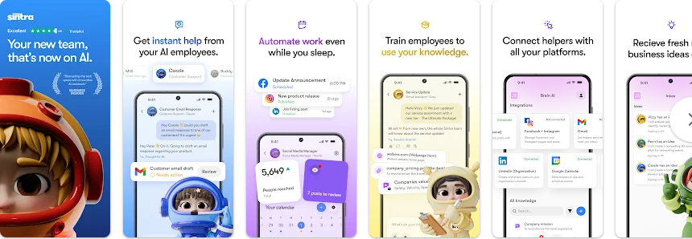
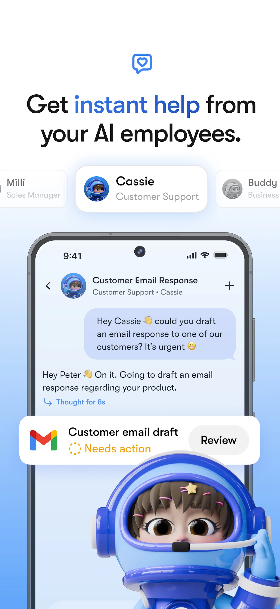
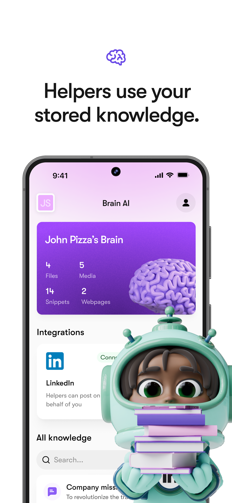
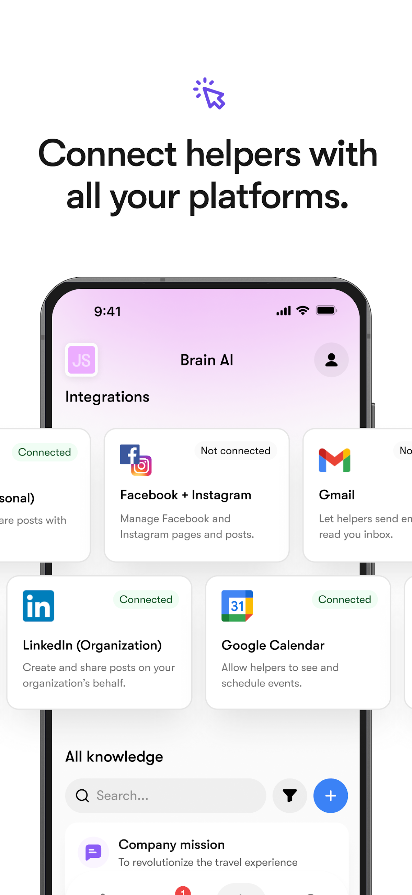
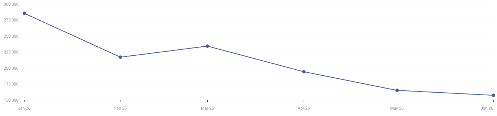

> 调研时间：2026-07-15。本文把官方产品文档、应用商店、投资方与媒体报道、第三方流量估算、平台评论和中文社区分层呈现。ARR、付费客户数与业务成效均未经过独立审计；官网当前被 Cloudflare challenge 拦截，正文主要以可完整读取的 Help Center、应用商店和公开 app 登录边界为准。

## TL;DR

**Sintra 是面向个体创业者和小型企业的“AI office out of the box”。** 它不要求用户先学 Agent Builder，而是先交付 12 个有名字、形象、职责和人格的 Helpers：社媒、客服、销售、SEO、邮件、数据、招聘、电商与行政等。每个 workspace 用 Brain AI 保存业务上下文，通过 1000+ Composio 集成连接外部工具，再以 chat、Inbox、定时任务和 automations 执行工作。[[source.sintra.helpers]] [[source.sintra.workspace-features]] [[source.sintra.integrations]]

这套产品最值得学习的不是底层模型，而是 [[concept.character-first-ai-workforce]]：**先让 SMB 觉得自己“雇了一支团队”，再把上下文、工具调用、权限和调度藏在角色背后。** 创始人称他们原本只是试验 12 个角色，但约 90% 用户选择整套，团队因此转向集成式 office。2026 年 Helper Builder 和 Marketplace 又把固定 12 人扩成自定义角色平台。[[source.tech-eu.sintra-seed-2025]] [[source.sintra.helper-builder]]

Sintra 已经有显著规模信号。2025 年融资报道记录其自报 1200 万美元 ARR、4 万付费客户和公开发布后 57 天达到 100 万美元 ARR；2026 年 iOS 商店有 2207 个评分、4.65 分，文案称 6 万+ businesses。它完成了由 [[investor.earlybird]] 领投的 1700 万美元 Seed，[[investor.inovo-vc]] 与 [[investor.practica-capital]] 参与。**但这些是公司/渠道口径，不代表 2026 当前 ARR、留存或真实活跃客户。** [[source.sintra.app-store-2026-07-15]] [[source.earlybird.sintra-seed-2025]]

增长机器同样鲜明：第三方月线显示 sintra.ai 2026 年上半年月均约 20.9 万访问，但从 1 月约 28.5 万降到 6 月约 15.7 万。Affiliate 约 15.7%、Paid Search 约 16.8%、Display 约 11.2%，Social 里 YouTube 占 73.2%；高观看量 review 明确披露 sponsored 或 affiliate，X 和 Reddit 也充满折扣码。**Sintra 不是主要靠自然产品口碑起量，而是一台 character brand + paid search + display + creator affiliate 的消费级 SaaS 获客机器。** [[source.similarweb.sintra-2026-h1]] [[source.youtube.sintra-sponsored-review-2026]] [[source.youtube.cybernews-sintra-affiliate-2025]]

最大的风险在“执行质量与计量”。当前文档明确说复杂多步 chained workflows 尚未开放、没有 public API；250 月 credits 只够大约 12–50 次 5–20+ credits 的复杂任务，且 workspace 用完 credits 后 Helpers 停止工作。社区与 Google Play 的负面样本也集中在定时发布、账号连接、图片质量、credits、退款和支持。**所以 Sintra 已证明“角色化 AI 团队”能卖，但还没有公开证明它能稳定替代一组员工。** [[source.sintra.credits]] [[source.reddit.sintra-digital-marketing-2025]] [[source.sintra.google-play-2026-07-15]]

## 产品：把 Agent 平台包装成一间小公司办公室

### 12 个角色是入口，不是完整架构

当前预置 Helpers 包括：Buddy（业务发展）、Cassie（客服）、Commet（电商）、Dexter（数据）、Emmie（邮件营销）、Gigi（个人成长）、Milli（销售）、Penn（文案）、Scouty（招聘）、Seomi（SEO）、Soshie（社媒）和 Vizzy（行政助理）。[[source.sintra.helpers]]

角色设计解决了 SMB 的购买理解问题：用户不需要先描述“我要一个多 Agent workflow”，只需要说“我需要一个社媒经理”或“我需要有人处理邮箱”。这与通用自动化平台的空白画布相反，也解释了为什么 Soshie 社媒场景最早成为主用例。[[source.tech-eu.sintra-seed-2025]]

但角色只是前台。实际产品由以下层次组成：

1. **Workspace**：每个业务、品牌、客户或项目一套隔离环境；Brain、聊天、集成和任务不跨 workspace 共享。
2. **Brain AI**：保存网站、文件、品牌规范、片段和偏好，让所有 Helpers 使用同一业务上下文。
3. **Helpers**：角色、提示、工具和预置 use cases。
4. **Integrations**：访问 Gmail、Calendar、社媒、CRM、财务和其他系统。
5. **Chat / Inbox**：人发起工作，自动任务结果回到 Inbox。
6. **Automations / scheduled tasks**：让重复工作在后台运行。

[[source.sintra.workspace-features]]

### Brain AI 是可用性的核心，但不是独有技术 moat

Brain AI 让用户不用在每次对话重新解释公司、品牌和产品。Workspace 还支持团队共享，受邀成员无需单独订阅。Helpers 可以自动委派给另一个 Helper，后台并行 chat 则彼此独立。[[source.sintra.workspace-features]]

官方模型文档显示 Sintra 按任务调用 Claude、GPT、Gemini、Imagen 与转录模型；例如 memory extraction、消息路由、CSV、QuickBooks、图片和网站分析使用不同模型。**这说明产品价值在 orchestration、上下文和 UX，而不是自研基础模型。** [[source.sintra.models]]

### 1000+ 集成扩大了动作面，但执行边界仍很现实

2026 年帮助文档称 Sintra 通过 Composio 支持 1000+ 集成，并明确“没有 public API”。Helpers 可以发送邮件、发布社媒、建日历、读取分析或写回外部工具。[[source.sintra.integrations]]

文档同时给出了几条不能忽略的边界：

- 复杂 multi-step chained workflows 尚未提供；
- 当前不能自行构建任意 custom automation；
- Cassie 不能直接嵌入客户网站或 WhatsApp 作为对外客服，receptionist 也不能直接接外部电话；
- 不支持的 integration action 会失败；定时任务的结果主要留在 app 内，没有默认长期导出；
- 财务写操作要求 approval，不能把“后台运行”理解为所有动作无需审批。

[[source.sintra.workspace-features]] [[source.sintra.helpers]] [[source.sintra.recurring-tasks]] [[source.sintra.models]]

因此当前 autonomy 更像“人设定任务和权限，系统在已连接动作内执行，再由人 review”，而不是让一组 AI 自主经营公司。

### 从固定 12 人走向 Builder 与 Marketplace

Helper Builder 允许用户定义名称、角色、人格、边界、skills 和 avatar；系统会把 SOUL.md、Rules、Skills 与 look.md 存进 Brain。Marketplace Helper 则由他人构建，用户“hire”后保留原始身份，但可加自己的规则和技能。[[source.sintra.helper-builder]]

这是产品方向上的重要变化：

- 2024：用固定 12 人验证 character-first 入口；
- 2025：补 Brain、集成、自动化和 workspace；
- 2026：开放自定义 Helper 与 Marketplace，尝试让角色成为分发单元。

如果 Marketplace 形成有效供给，Sintra 会从“12 个卡通助手订阅”变成面向非技术 SMB 的 Agent application platform；如果没有，Builder 只是另一个 custom GPT 界面。

## 定价与计量：低门槛叙事背后是 credits 经济

官网 Help Center 当前列出：

| 方案 | 月付 | 年付 | 每月 credits |
|---|---:|---:|---:|
| Individual Helper | 39 美元 | 234 美元 | 150 |
| Sintra X（12 Helpers） | 97 美元 | 468 美元 | 250 |

同一文档又写“Individual Helper Plans 已不再销售”，表格仍保留该方案。它还明确 Apple/Google Play 有独立定价。iOS 商店当前写 Sintra X 从 39 美元/月、299 美元/年起；Google Play 也写 39 美元/月起。**这不是一个统一公开价格，而是网站与应用商店分渠道报价，网站文档内部还有旧方案残留。** [[source.sintra.pricing]] [[source.sintra.app-store-2026-07-15]] [[source.sintra.google-play-2026-07-15]]

Credits 决定了真实可用量：

- chat message 约 0.1–1 credit；
- 抓网站约 0.5；
- 拉一周邮件约 1；
- 基础 scheduled task 约 1–5；
- research task 约 3–10；
- 多工具复杂任务约 5–20+。

250 credits 理论上只够约 12 次 20-credit 复杂任务，或 50 次 5-credit 复杂任务；多 workspace 不能共享 credits。Top-up 从 37.5 美元/150 credits 到 1200 美元/4800 credits，按月续费且不可退款。**“12 个 AI 员工只需 97 美元”是席位包装，真实单位经济更接近任务量与模型消耗。** [[source.sintra.credits]]

退款政策是 14 天内联系 support 申请，单纯取消订阅不等于已申请退款。多条 Reddit 评论正是在这一点上产生争议。[[source.sintra.pricing]] [[source.reddit.sintra-social-media-2024]]

## 演化：从提示词周末项目到 AI office

| 时间 | 节点 | 证据与含义 |
|---|---|---|
| 2018 | Chris 16 岁、Rokas 15 岁开始为当地小企业做营销 | 创始人故事来自 CEO 访谈，说明产品对 SMB 工作的理解先于 Agent 技术 |
| 2023 初 | 周末做出 Notion prompts 产品并传播 | 最初产品不是 AI employees；需求和现金流推动重做 |
| 2024-05-15 | Sintra 2.0 公开发布 | 12 Helpers + Brain 的 character-first 版本正式上线 |
| 发布后 57 天 | 自报达到 100 万美元 ARR | 高速起量，但无独立审计 |
| 2024-10-31 | iOS 首次上架 | 产品进入移动分发 |
| 2025-06-10 | 宣布 1700 万美元 Seed | 同期自报 1200 万美元 ARR、4 万付费客户 |
| 2026 | 1000+ integrations、scheduled tasks、Helper Builder、Marketplace | 从固定角色产品向 SMB Agent 平台扩张 |

[[source.tech-eu.sintra-seed-2025]] [[source.sintra.app-store-2026-07-15]] [[source.sintra.integrations]] [[source.sintra.helper-builder]]

早期 PMF 叙事可信的部分是产品转向：创始人称传统工具“不令人兴奋”，角色化后用户更愿意聊天，而且约 90% 用户选择全部 12 个 Helpers。ARR、客户数与 57 天增长仍是公司口径。[[source.tech-eu.sintra-seed-2025]]

## 团队：营销、设计和工程三人组

### Chris Sidlauskas

[[person.chris-sidlauskas]] 是联合创始人兼 CEO。公开故事显示他与 Rokas 从少年时期的 SMB 营销 agency 起步，后来经营面向美国品牌的电商增长业务，再在 2023 年启动 Sintra。LinkedIn 当前标题为 co-founder @ sintra.ai，约 3475 followers；X 账号 [@chrisdoeslove](https://x.com/chrisdoeslove) 只有约 80 followers，说明 founder-led distribution 更可能发生在 LinkedIn、采访和 paid creator 网络，而不是创始人 X 自带流量。[[source.tech-eu.sintra-seed-2025]]

### Rokas Judickas 与 Vasaris Kaveckas

[[person.rokas-judickas]] 是联合创始人、founding designer，负责角色和产品体验；[[person.vasaris-kaveckas]] 是联合创始人、founding engineer。两人的组合与产品形态高度一致：Sintra 的壁垒候选不是前沿模型研究，而是 SMB 需求理解、角色品牌、产品设计和快速工程整合。[[source.practica.sintra-portfolio]] [[source.tech-eu.sintra-seed-2025]]

LinkedIn 公司页显示 11–50 employees，但 employees 检索 total 为 61 个关联 profile；两种字段定义不同，不能写成精确 headcount。公开样本可见多名 software engineer、founding engineer、product designer 和 Head of Finance，团队主体仍在立陶宛。[[source.linkedin.sintra-company-2026-07-15]]

## 融资：一笔已确认 pre-seed entry，一笔 1700 万美元 Seed

| 时间 | 轮次 | 金额 | 投资方 |
|---|---|---:|---|
| 2024 | Pre-seed entry | 未披露 | [[investor.inovo-vc]]；Inovo 官方 portfolio 只确认自己的 entry stage |
| 2025-06 | Seed | 1700 万美元整轮 | [[investor.earlybird]] 领投，Inovo、[[investor.practica-capital]] 与未具名 angels 参与 |

[[source.inovo.sintra-portfolio]] [[source.earlybird.sintra-seed-2025]] [[source.practica.sintra-portfolio]]

1700 万美元不能拆成单家金额。当前未找到后续轮次、当前估值或 2026 ARR 的可靠披露，因此这些都应写“未知”。

## 规模：有消费级采用，但活跃和留存仍不可见

### 应用商店提供了强于官网自报的采用信号

- iOS：4.65/5，2207 个 ratings；当前版本 3.0.1，2026-07-02 更新；文案称 6 万+ businesses。
- Android：页面顶部 4.7、914 reviews、10K+ downloads；评分区显示 4.6、870 reviews，两个页面区块自身也有小幅口径差异。
- Google Play 文案仍写 6000+ businesses，与 iOS 的 6 万+ 相差一个数量级，可能是文案更新不同步，不能替公司选择口径。

[[source.sintra.app-store-2026-07-15]] [[source.sintra.google-play-2026-07-15]]

评分和下载证明产品不是 demo，但不能推导付费客户、月活、ARPU 或 retention。2025 年媒体的 4 万 paid customers 与 2026 iOS 的 6 万 businesses 也不能直接算增长，因为“paid customers”和“businesses”定义不同。

### 公开 app 只验证到登录边界

本轮打开 app.sintra.ai，未登录时进入 email/Google 登录或 Get Started；没有创建账户或消耗付费额度。因此报告能验证 app 存在与认证入口，不能声称实际完成了 Helper 工作流。[[source.sintra.app-login-smoke-2026-07-15]]

## 增长与 GTM：把“AI 团队”做成消费 SaaS 获客漏斗

### 网站流量有体量，但 2026 H1 明显下行

第三方 Worldwide / All Traffic 月线：

| 月份 | Visits |
|---|---:|
| 2026-01 | 285,172 |
| 2026-02 | 216,600 |
| 2026-03 | 233,888 |
| 2026-04 | 193,901 |
| 2026-05 | 164,769 |
| 2026-06 | 157,044 |

月线合计约 125.1 万、月均约 20.9 万，6 月较 1 月下降约 44.9%。页面顶卡另显示 303.8 万 total visits，与月线不一致；本文只用月线判断趋势，不把两套口径合并。[[source.similarweb.sintra-2026-h1]] [[traffic.similarweb.sintra-2026-h1]]

美国占 29.94%，英国 10.72%，印度 9.64%，加拿大 5.16%，印度尼西亚 5.05%。这与媒体所说“主要服务美国 SMB”方向一致，但网站地理不等于付费客户地理。[[source.tech-eu.sintra-seed-2025]]

### Paid + affiliate 是核心，不是辅助

渠道结构：Direct 27.49%、Organic Search 17.85%、Paid Search 16.77%、Affiliate 15.69%、Display 11.20%、Organic Social 2.86%、Paid Social 3.31%、Referral 2.59%、Email 1.59%、GenAI 0.65%。搜索约 68% branded、32% non-brand；付费词包括 best ai agents、ai social media content creation and management、ai team 等。[[source.similarweb.sintra-2026-h1]]

几个来源互相咬合：

1. Social 中 YouTube 占 73.18%；
2. 3.5 万 views 的 Daniel review 明确写“This video was sponsored by Sintra AI”，并附 72% 折扣；
3. 5.5 万 views 的 Cybernews review 披露 affiliate link 和 70%+ coupon；
4. Display publisher 里 Cybernews 占约 10.48%，Impact 也是主要媒体/affiliate 基础设施；
5. X 的高互动长帖带 75% 或 85% 折扣码；
6. 91.24% 出站流量流向 app.sintra.ai，说明官网漏斗确实把访问导向产品，但不能证明购买。

[[source.youtube.sintra-sponsored-review-2026]] [[source.youtube.cybernews-sintra-affiliate-2025]] [[source.x.sintra-affiliate-distribution-2026]]

这是一套成熟的 creator performance marketing：用“12 个 AI employees”做高可视化 hook，以 review、折扣和长期 coupon 拉转化，再用 app/annual plan 回收 CAC。风险是评价生态被佣金污染，用户很难区分独立 review 与广告。

### 没有 Product Hunt 或 Hacker News 起量证据

本轮对 Product Hunt 和 HN 做精确检索，没有找到 Sintra 产品的有效 launch 或有影响力讨论；HN 搜索还被同名的 Sinatra 音乐/框架污染。官方 X 当前也只有约 570 followers。**Sintra 的发行路线不是开发者社区首发，而是 SMB 广告、移动商店、SEO、YouTube creators、affiliate 与品牌角色。** [[source.x.sintra-profile-2026-07-15]]

## 用户反馈：价值集中在社媒和上下文，问题集中在执行与 credits

### 正面信号

- 应用商店评分量和平均分较高；
- Reddit 有用户认可 Gmail、Drive、Analytics 集成与 Brain 逐步学习上下文；
- 社媒 idea、caption 和基础 email 场景被多次提及为可用；
- 角色与一体化 workspace 对不想自己搭 workflow 的 SMB 有理解成本优势。

[[source.sintra.app-store-2026-07-15]] [[source.reddit.sintra-social-media-2024]]

### 反复出现的问题类型

- LinkedIn 帖子立即发布而不是按未来时间 schedule；
- Facebook Page 授权、社媒连接或 server loading 失败；
- 图片质量、文字拼写和编辑成功率不足；
- 跨 Helper 协作在不同版本中表现不一致；
- credit 消耗快，失败或反复修正会放大成本感知；
- 取消订阅与申请退款不是同一动作，用户认为流程不透明；
- 部分用户把产品评价为“GPT wrapper”，只使用 1–2 个 Helpers。

[[source.reddit.sintra-digital-marketing-2025]] [[source.reddit.sintra-smallbusiness-2025]] [[source.reddit.sintra-social-media-2024]] [[source.sintra.google-play-2026-07-15]]

这些是 S3 单用户样本，不能估算缺陷率或 churn。部分负面评论会顺带推荐 Marblism、Tailforce、Blaze 等竞品，也可能带利益偏差；但相同问题跨 Reddit 与 Google Play 重复出现，值得进入产品风险清单。

### “高分 review”也必须审计来源

LovedByCreators 的 299-score 长评看似强口碑，但 subreddit 本身是 affiliate marketing 社区，AutoModerator 直接推广 affiliate 教程，版主评论使用 playosinc.pxf.io 跳转并索要 discount code。它应作为“推广渠道样本”，不能计入自然用户证明。[[source.reddit.sintra-affiliate-review-2025]]

同理，X 上的“75% OFF for life”指长期折扣，不等于买断 lifetime plan；官方定价页明确说只卖 recurring subscription。报告不把两者混为一谈。[[source.x.sintra-affiliate-distribution-2026]] [[source.sintra.pricing]]

## 中文世界：出现了产品方法讨论，也出现了数字抄错

小红书一篇笔记把 Sintra 总结为“情感化 PMF / character-first”，与创始人访谈高度一致：它销售的不是 prompt，而是给孤独、忙乱的小企业主一支可理解的团队。该笔记是分析，不是事实来源。[[source.xiaohongshu.sintra-character-first-2025]]

另一篇高互动笔记标题写“ARR 1700 万、融资 1200 万”，正好把英文报道的 1200 万美元 ARR 与 1700 万美元融资对调。它有 235 likes、371 collects、144 shares，说明二手内容可以在数字错误下继续传播。[[source.xiaohongshu.sintra-arr-funding-mismatch-2025]]

微信公众号出现把 Oracle、ServiceNow 与 Sintra 放在一起的“企业 AI 治理”文章，其中对 Sintra 的 SMB 分层有启发，但把它与大型企业控制面并列容易高估其治理能力。该文作为中文市场叙事样本保留为 S4，不用于产品事实。[[source.weixin.sintra-enterprise-ai-2026]]

## 竞品：真正的直接对手是 SMB AI team，而不是所有 Agent 平台

| 层级 | 代表 | 关系 |
|---|---|---|
| 直接 SMB AI employee suite | Marblism | 同样用命名员工覆盖 inbox、social、SEO、lead gen、calls 和 support；官网也称 4 万+ businesses，是当前最直接的下一个研究对象 |
| 横向 Agent / automation platform | [[company.lindy]]、[[company.relevance-ai]] | 可以构建同类 workflow，但更偏 builder、复杂自动化与企业控制；Sintra 胜在角色包装和低认知门槛 |
| 企业 AI workforce / governance | [[company.ema]]、[[company.helio]] | 竞争“AI 员工”叙事，但目标客户、采购周期、安全治理和客单价不同 |
| 社媒/内容执行 | Ocoya、Blaze、Hookle | 只与 Soshie 主场景竞争，不是完整 AI office |
| 算法相似但非竞品 | Synta、Vizzy Labs、LobeHub、Replika | 受众或关键词邻接；Synta 是 n8n workflow builder，Vizzy Labs 是 UGC 平台，不能直接叫 AI employee 竞品 |

[[source.marblism.homepage-2026-07-15]] [[source.similarweb.sintra-2026-h1]]

Sintra 与 Marblism 的流量月线也可作为后续优先级：Sintra 2026 H1 约 125.1 万 visits，Marblism 约 65.9 万；Sintra 体量更大但持续下降，Marblism 大致维持 8.4–12.2 万/月。下一轮应比较两者的角色、任务闭环、credits、review 网络与留存线索，而不是只比较首页功能。

## 关键判断与风险

### 已有证据支持

- Sintra 是真实运行的 SMB AI workforce 产品，具有应用商店、付费获客、流量和融资规模信号。
- 产品不是 12 个 prompt wrapper 的简单并列，而是 Workspace + Brain + integrations + tasks + Builder 的完整架构。
- character-first 是实际产品和分发策略，不只是文案。
- 增长高度依赖 paid、display、YouTube 和 affiliate，且 2026 H1 网站流量下行。

### 研究判断

- **Sintra 的 moat 候选是 SMB 角色品牌、上下文沉淀、集成/任务 UX 和获客网络，不是模型。**
- **“AI employee”对 SMB 首先是 packaging innovation。** 用户购买的是少操心和一体化，不是 Agent 技术参数。
- **Builder/Marketplace 是最重要的二次增长赌注。** 它能提高角色供给和长尾覆盖，也会让产品重新面对通用平台的复杂度。
- **credits 把低价员工叙事改写成任务计量。** 如果执行失败需要反复修正，用户同时损失时间和 credits，负面感受会比普通 SaaS 更强。
- **creator affiliate 既是增长优势，也是信任负债。** 当 review 生态被 coupon 占据，品牌必须用更强的客户侧结果和透明退款来补信任。

### 待验证

- 2026 当前 ARR、付费客户、月活、留存、CAC payback 和各渠道 LTV；
- 2026 H1 流量下滑是否来自品牌预算、季节性、漏斗迁移到 app，还是用户增长放缓；
- 250 credits 下真实 SMB 每月可完成的有效任务数，以及失败任务是否计费；
- scheduled tasks、跨 Helper delegation 和外部写操作的成功率、人工 review 率与 rollback；
- Helper Marketplace 的 creator 供给、安装、收入分成和留存；
- 可公开核验的 SOC 2/ISO 等安全材料；当前帮助文档仍建议删除敏感信息，并称安全缺陷场景下应谨慎上传。[[source.sintra.sensitive-data]]
- Google Play 6000 businesses、iOS 6 万 businesses 与 2025 四万 paid customers 的定义和更新时间。

## 证据边界

- **S1 官方**：Help Center、应用商店、官方 X、公开 app 登录边界；用于产品、价格与渠道当前状态。
- **S2 第三方强证据**：Tech.eu 访谈/融资、Earlybird、Inovo、Practica、LinkedIn、Similarweb；公司增长数字仍标注自报。
- **S3 社区弱证据**：Reddit、YouTube affiliate、X 折扣码、小红书分析；用于发现问题类型和 GTM 结构，不估算整体口碑。
- **S4 待核验**：affiliate subreddit、中文数字错置、泛企业 AI 文章和未登录 app smoke；不进入规模结论。

产品判断见 [[note.sintra-product-takeaway-2026-07-15]]，本轮过程见 [[note.sintra-research-run-2026-07-15]]。
