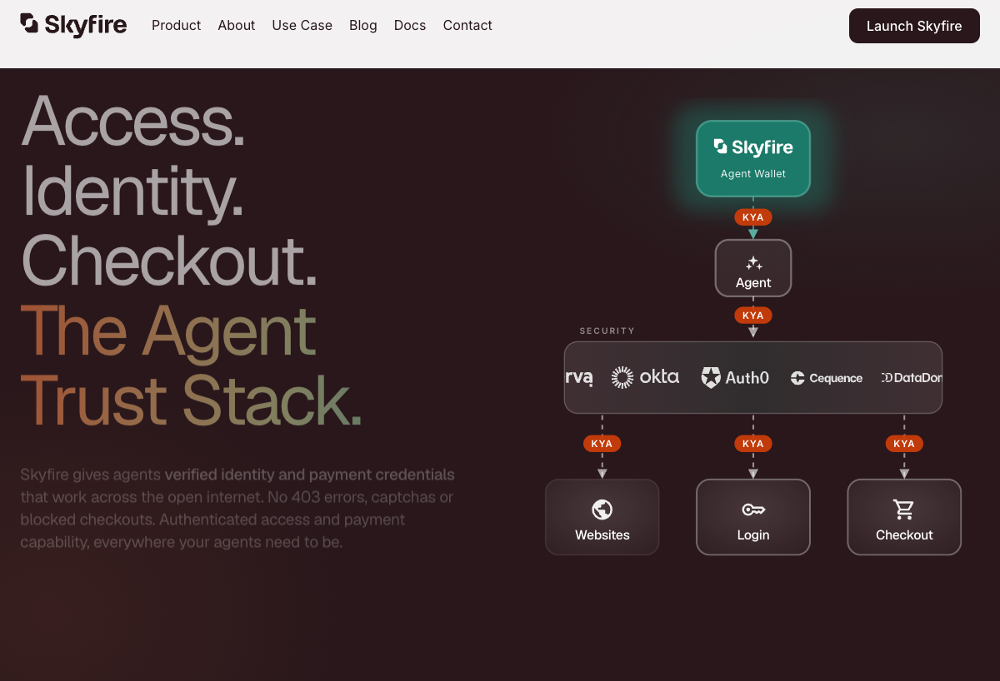
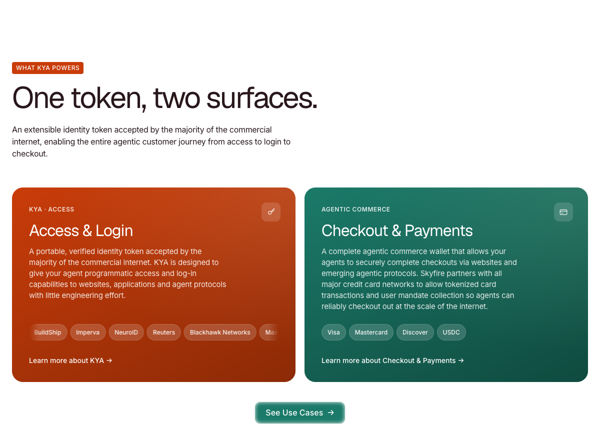
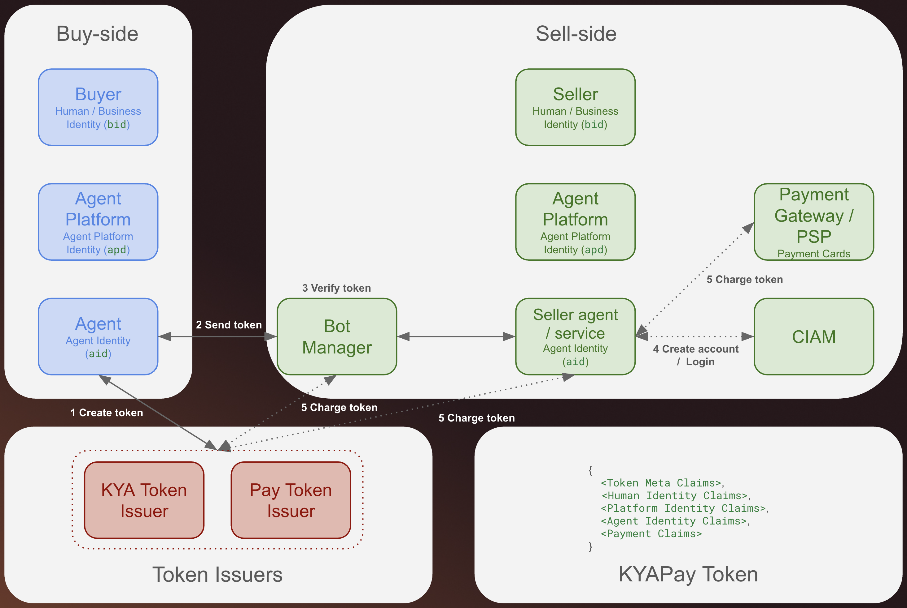

# Skyfire

## TL;DR

Skyfire 最初以“AI Agent 的 Visa”进入市场：给 Agent 钱包、预算与支付 token，使其能够购买 API、数据和数字服务。到 2026 年，它已经把主叙事扩成 **Agent Trust Stack**，试图同时解决 Agent 的身份、网页访问、登录、用户授权和结账。

这个升级不是简单加功能。单纯支付层容易陷入低费率、同质化和“商户为什么要接受未知 Agent”的冷启动；Skyfire 把 KYA（Know Your Agent）推到入口，用同一个凭证绑定人类主体、Agent、Agent 平台和用户 mandate，再借 Experian、Akamai、Fastly 等身份、安全和边缘基础设施伙伴进入商户侧。它真正想占据的不是一个钱包，而是 Agent 与商业互联网之间的信任接口。

但目前公开证据更能证明“协议、产品与伙伴网络已成形”，还不能证明“大规模商业采用已发生”。官网和合作公告展示了广泛伙伴、Demo 与覆盖率口径，文档也有完整 buyer/seller、token、settlement 和 MCP 流程；另一方面，社区讨论很薄、Product Hunt 几乎没有放大、官网流量规模不大，且没有公开 GMV、活跃 Agent、交易量、收入或付费客户数。官网已宣传 tokenized card checkout，最新钱包文档却仍写“目前不支持向商户直接提供 tokenized card details”，这是本轮最重要的能力口径冲突。

## 它在解决什么

Agent 要完成真实商业任务，至少会遇到五个断点：网站不知道它是谁、Bot 管理系统可能直接拦截、登录无法代表具体用户、商户不知道授权边界、传统支付凭证不适合直接交给 Agent。Skyfire 试图用一套 trust credential 把这些断点串起来。

官网当前把产品分为两个 surface：

- **KYA Access & Login**：向网站、应用、API、MCP、UCP、A2A 等目标声明 Agent、平台及其背后的人类主体。
- **Checkout & Payments**：Agentic Wallet 管理预算、稳定币与支付凭证，结合用户 mandate 完成 checkout。

这套结构进一步拆成三个产品层：Know Your Agent、Agentic Wallet、Buy for Me。官网的表达是 Access → Identity → Checkout，而不是把支付孤立成最后一步。

## 产品与协议怎么运作

### KYA：把责任主体带进请求

KYA token 包含或关联三层身份：Agent 平台、具体 Agent、背后的人类或企业 principal。Skyfire 对接入的买方 Agent 平台做 KYB，并由自己或可信平台验证 principal；卖方可以要求姓名、邮箱、组织等特定字段，买方只选择性披露该服务要求的字段。验证是可选的付费订阅，但如果服务要求的验证级别不足，token 创建会失败。

这意味着 KYA 不是“所有 Bot 的身份证”。官方安全文档明确限定：它面向商户、内容出版商和服务提供方与“由人指定的 Agent”开展商业活动。对于真正以自身为经济主体、没有人类 principal 的自主 Agent，KYA 仍有结构性盲区。

### KYAPay：身份与支付意图的签名信封

Skyfire 有 `kya`、`pay`、`kya-pay` 三类 token。典型路径是：

1. Agent 发现 Seller Service。
2. 买方创建符合卖方身份和金额要求的 token。
3. Token 由买方直接提交给卖方，Skyfire 不在传输链路中。
4. 卖方通过公开 JWKS 验签、检查 audience、seller/service、expiry、JTI、来源 IP 等 claims。
5. 服务交付后，卖方对 `pay` 或 `kya-pay` token 发起 charge，Skyfire 执行结算。

Token 使用 JWS/JWT 标准，卖方仍保留最终放行权。官方反复强调 “KYA tokens are not a free pass”。

### 支付与结算

创建支付 token 时，买方会承诺一笔最高金额；卖方可以按实际交付金额一次或多次 charge。Token 有 10 秒到 24 小时有效期，但有效期内签发的 token 在过期后仍有 24 小时 charge window；窗口关闭后约 3 小时内结算，最坏可接近 51 小时。停用服务不会自动作废已经签发的 token。

钱包可通过卡、Base 上的 USDC、ACH 或 wire 入金，其中 ACH/wire 仅对付费订阅开放。Skyfire 还提供 Verified Service Guarantee：对带绿色 Verified Seller 标识的服务，买方可在 5 天内就未交付或严重不符提出争议；是否赔付由 Skyfire 决定。这是责任层的早期补丁，但不等于完整的 Agent 争议和责任分配体系。

### MCP 与开发者入口

Skyfire 提供生产和 sandbox 环境、REST API、公开 JWKS，以及 MCP Server。MCP 暴露 seller discovery、创建 KYA、创建 PAY、创建 KYA-PAY 等操作。未携带凭证访问公开 MCP endpoint 会得到标准 `401 unauthorized`，证明端点存在并受认证保护；本轮没有账号和资金，因此没有完成真实 token issuance 或支付实测。

## 产品演进

- **2024-08-21**：Beta 发布并宣布 $8.5M seed。核心叙事是让 Agent 拥有钱包、预算和支付能力，目标客户是 Agent builder、LLM、数据/API 服务商。[[source.venturebeat.skyfire-seed-2024-08-21]]
- **2024-10-24**：Coinbase Ventures 与 a16z CSX 加入战略融资，确认累计融资达到 $9.5M；同期强调 Base、USDC 与稳定币结算。[[source.theblock.skyfire-strategic-2024-10-24]]
- **2025**：公开文档逐步形成 buyer/seller service、KYA/KYAPay、service discovery、MCP 和 live implementation。
- **2026**：主叙事升级为 Agent Trust Stack；KYA 不再只是支付前的验证，而是用于网站访问、登录、Bot 管理与 checkout。Experian、Akamai、Fastly 等合作把产品推向身份、风控与 edge enforcement。[[source.experian.skyfire-agent-trust-2026-05-15]]、[[source.fastly.skyfire-partnership-2026-06-10]]

这条时间线说明 Skyfire 的 wedge 在变化：从“Agent 没有支付能力”，转向“商户不信任 Agent，因此支付之前先要解决访问、身份、意图和责任主体”。

## 商业模式与 GTM

2024 年发布时，Skyfire 表示会从交易中抽成，并对验证等增值软件收取 SaaS 订阅费。当前文档仍明确 KYA Individual/Organization verification 需要订阅，但没有公开价目表。本轮没有找到可靠的收入、GMV 或交易费率公开数据。

GTM 更像三条并行线路：

- **开发者线路**：Docs、REST API、MCP、sandbox、Dappier/BuildShip/Apify 示例，先让 Agent builder 能接。
- **商户基础设施线路**：与 Bot 管理、身份、风控、CDN/edge 平台合作，让商户在不大改后端的情况下识别和执行 KYA policy。
- **协议与生态线路**：推广 KYA/KYAPay 为开放标准，用合作伙伴和支付网络构成接受面。

合作公告能证明双方至少共同发布了集成和方案，但官网列出的 logo、Demo、协议成员或 partner 不能自动等同于付费客户、生产流量或收入。报告不把 Experian、Akamai、Fastly、Visa、Mastercard、DataDome 等统一写成“客户”。

## 团队与融资

两位创始人都来自支付基础设施：[[person.amir-sarhangi]] 曾创办 Jibe Mobile（2015 年被 Google 收购），后任 Ripple 产品副总裁；[[person.craig-dewitt]] 曾在 Ripple 和 Bloomberg 从事支付/金融产品。官方团队页还列出工程负责人 Ankit Agarwal、商务负责人 Randall Davies、财务负责人 Todd Parker 和法务负责人 John Vangel。

LinkedIn 公司页给出的员工区间为 **11-50 人**、约 3,000 followers；这只能作为平台快照，不能当精确 headcount。官网当时开放 3 个岗位：BD Director、Senior DevOps Engineer、Senior AI Solutions Engineer，招聘方向与“伙伴集成 + 企业落地”一致。[[source.linkedin.skyfire-company-2026-07-14]]

已确认融资口径：

- 2024-08-21：$8.5M seed，参与者包括 Neuberger Berman、Brevan Howard Digital、DRW VC、Circle、Gemini、Draper Associates、Ripple 等 16 家机构或战略方。
- 2024-10-24：Coinbase Ventures 与 a16z CSX 提供战略追加，累计融资从 $8.5M 增至 **$9.5M**，即该次合计约 $1M，双方分配未公开。
- 本轮没有找到可靠的后续融资金额，因此只写“截至 2024-10 已确认累计 $9.5M”。

投资人结构本身是信号：早期名单高度偏加密、稳定币和支付基础设施；Coinbase、Circle、Gemini、Ripple 的参与，解释了产品最初从 USDC 和 Agent wallet 切入。后续与身份、安全、边缘网络的合作，则体现它在扩大接受面。

## 流量与外部规模信号

[[traffic.similarweb.skyfire-2026-h1]] 显示，2026 年 1-6 月 `skyfire.xyz` 的第三方估算总访问约 **68,733**，页面同时给出月访问 2,184、月独立访客 1,362；自然搜索占 71.07%，Direct 占 18.83%，生成式 AI 占 4.37%，Email 占 5.73%。美国约占 67.72%，其后是印度、英国、加拿大和越南。

搜索中品牌词占 89%，非品牌词只有 11%；非品牌关键词也主要围绕 Skyfire docs、token validation、KYA/Experian。这不是成熟品类需求广泛外溢的形态，更像合作新闻、融资传播和技术集成带来的定向品牌查询。第三方流量只能衡量官网 attention，不能替代 API 调用、活跃 Agent、token issuance、GMV 或收入。

Product Hunt 页面只有极弱互动，HN 未检索到聚焦讨论，说明 Skyfire 不是靠传统开发者 launch 平台形成大规模声量；它的传播主轴是融资媒体、创始人网络和企业合作公告。[[source.producthunt.skyfire-2024-08-21]]

## 社区反馈

社区证据必须降级处理：

- 2024 年 Reddit 发布帖仅 1 分、2 条评论。唯一具体质疑是 2%-3% 交易费会破坏模型，发帖方回复“目前 0% fee”。样本太小，不能据此判断定价接受度。
- X 上多数内容来自官方、合作伙伴和赛道图谱；少量独立评论质疑 KYA 对“Agent 自身作为 principal”的覆盖，以及支付协议普遍缺少跨轨计量、定价和 reconciliation。
- 中文检索未在 V2EX、Linux.do、即刻或小红书找到可核验的 Skyfire 用户反馈。公众号有关于 Agent 支付责任层的深度讨论，认为现有协议擅长证明授权和行为，却仍没有解决 Agent 做错后由谁承担损失。它是赛道分析，不是 Skyfire 用户评价。[[source.wechat.agent-payment-liability-2026-07-10]]

因此当前最稳妥的结论是：**生态话语权和伙伴露出明显强于公开用户口碑**。[[source.community.skyfire-2026-07-14]]

## 关键判断

### 1. 真正的产品升级是从 payment rail 变成 trust admission layer

Skyfire 发现支付不是第一个门槛。Agent 在付款前就可能被 WAF/Bot Manager 拦截，商户还要知道它代表谁、被授权做什么、是否值得放行。KYA 先进入 access/login，再把 payment credential 附着其上，战略位置比单一钱包更靠前。

### 2. 身份可能比支付更有商业价值

支付费率容易被卡组织、稳定币和开放协议压低；KYA verification、policy、risk signal 和 enterprise integration 更可能形成订阅与网络效应。Skyfire 当前的招聘和合作都支持这一方向，但尚无收入拆分可验证。

### 3. 伙伴网络是进入商户侧的可行 GTM，但不是 adoption 终点

与 Experian、Akamai、Fastly、DataDome 等合作，能把 KYA 带到 identity、bot security 和 edge enforcement 层，避免逐个改造商户。这可能形成很强的分发杠杆。问题是公开资料尚未证明有多少商户启用、多少 Agent 被验证、多少 checkout 成功完成。

### 4. Agent 支付的难题已经从“能不能付”移到“错了算谁的”

KYA/KYAPay 能证明主体、授权与交易行为；Verified Service Guarantee 也提供有限兜底。但自然语言 mandate 的遗漏、Agent 在授权范围内违背真实意图、跨法域争议和消费者保护仍未解决。这个空白不是单靠 JWT claims 能完成的。

## 风险与待验证

- **能力口径冲突**：官网称 Agentic Wallet 可用 tokenized cards 在互联网 checkout；更新于本轮前 4 天的钱包文档仍写不支持向商户直接提供 tokenized card details，正在开发中。需要真实账户或合作方实施文档验证。
- **规模证据缺失**：无公开 GMV、交易量、token 数、活跃 Agent、生产商户、收入或留存。
- **覆盖率口径不透明**：官网称覆盖超过 60% 的 Web，创始人社媒曾出现更高口径，但没有说明分母、计算方式或“覆盖”的技术定义。
- **中心化依赖**：协议使用开放 JWT/JWKS，但身份验证、token issuer、wallet、charge 和 settlement 仍高度依赖 Skyfire。
- **责任边界**：KYA 识别“谁在行动”，不自动回答“行动错误后谁赔偿”；Guarantee 范围有限且由 Skyfire 自行裁定。
- **隐私与敏感身份**：选择性披露降低暴露，但把人、平台、Agent 和行为持续绑定，会带来数据治理和跨域信任问题。
- **社区样本薄**：当前公开讨论不足以判断真实开发者满意度或商户接受度。

## 证据导航

- 产品现状：[[source.skyfire.home-2026-07-14]]、[[source.skyfire.official-product-2026-07-14]]
- 钱包与安全边界：[[source.skyfire.wallet-doc-2026-07-14]]、[[source.skyfire.security-doc-2026-07-14]]
- 团队：[[source.skyfire.about-team-2026-07-14]]、[[source.linkedin.skyfire-company-2026-07-14]]
- 融资：[[source.venturebeat.skyfire-seed-2024-08-21]]、[[source.theblock.skyfire-strategic-2024-10-24]]
- 合作：[[source.experian.skyfire-agent-trust-2026-05-15]]、[[source.fastly.skyfire-partnership-2026-06-10]]
- GTM/社区/流量：[[source.producthunt.skyfire-2024-08-21]]、[[source.community.skyfire-2026-07-14]]、[[source.similarweb.skyfire-2026-h1]]
- 研究判断：[[note.skyfire-product-takeaway-2026-07-14]]
