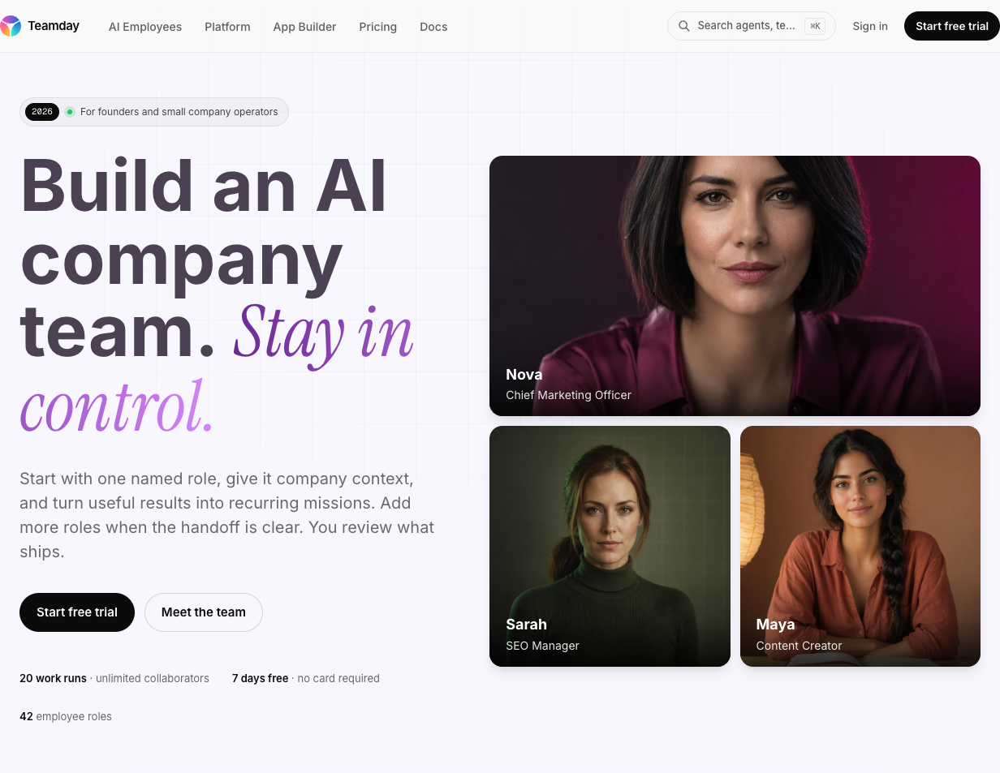
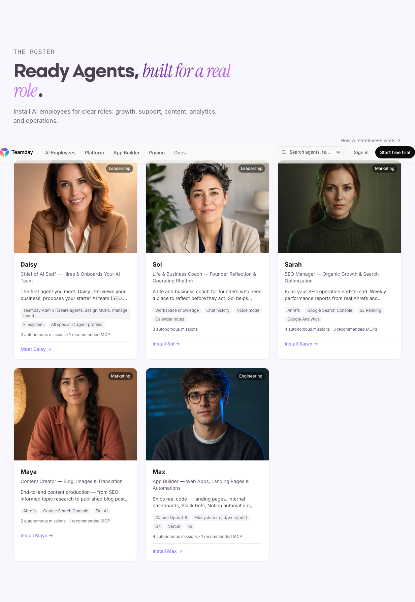
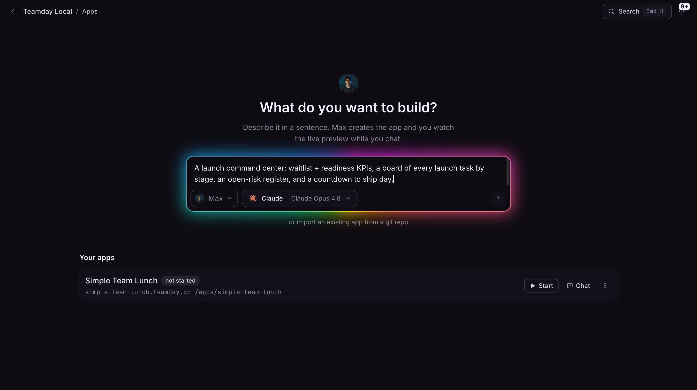
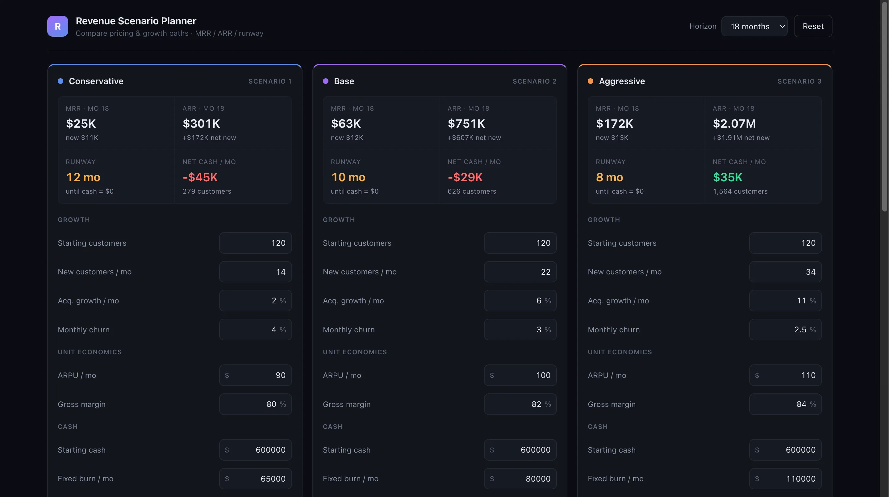
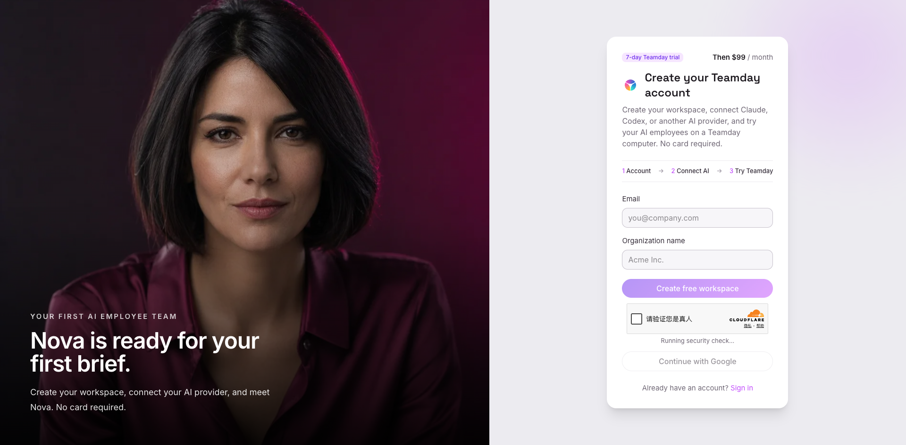
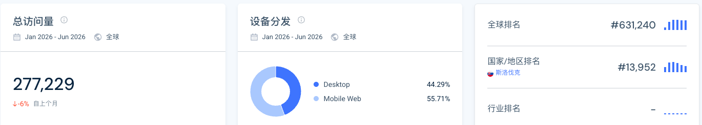

> 调研时间：2026-07-15。本文把官网、产品文档、条款与安全政策、changelog、创始人公开说明、GitHub、LinkedIn、社区检索与第三方流量估算分层呈现。`launch_date` 记录的是 2026-07-13 付费自助访问开放，不代表产品从该日才存在。

## TL;DR

**TeamDay 是一个“AI company workspace”：用户选择 SEO、内容、应用开发等岗位，把 Claude Code、Codex、Gemini CLI 等执行器接入共享公司记忆、文件、任务、周期 mission、审批和应用环境。** 它卖的不是一个万能聊天机器人，也不只是 42 个角色头像；更接近 [[concept.agent-company-control-plane]] 与 [[concept.agent-native-context-workspace]] 的交叉：底层 harness 可以替换，TeamDay 负责公司上下文、工作编排、权限和结果检查。[[source.teamday.homepage-2026-07-15]] [[source.teamday.features-2026-07-15]] [[source.teamday.docs-2026-07-15]]

它在 2026-07-13 才开放付费 self-serve，但产品并非两天前诞生。GitHub 组织和 agents 仓库可追溯到 2024 年，2025 年 changelog 已出现 HubSpot、Agent Collections、SQL 与多模型能力；2026 年才快速叠加 Spaces、MCP、missions、Feed、team 和 app builder。**准确说法是“2026 年 7 月开放商业自助购买”，不是“2026 年 7 月首次 launch”。** [[source.teamday.paid-launch-2026-07-13]] [[source.teamday.changelog-2026-07-15]] [[source.teamday.github-2026-07-15]]

产品谱系同样重要。创始人 [[person.jozo-kovac]] 先做 [[company.ayanza]]；他在 2024 年公开表示，TeamDay 可以与 Ayanza 连接，但为降低理解成本，团队会把它做成“全新且完全独立”的产品。两个产品仍共享创始人和 7Segments/Ayanza 法律线索，Ayanza 官网也继续在线。因此本库保留两个独立 company，而不是把 TeamDay 写成 Ayanza 改名、收购或自然升级。[[source.linkedin.jozo-teamday-ayanza-relation-2024]] [[source.ayanza.homepage-2026-07-15]]

当前最明显的矛盾是：产品能力面很宽，外部验证却很薄。TeamDay 有完整文档、公开代码和 founder dogfooding；但没有找到公开融资、独立客户案例、稳定社区口碑、Product Hunt/HN launch 或可验证的 SOC 2 证书。第三方流量约每月 1.6 万 visits，搜索 97% 非品牌，关键词被 OpenRouter、Polsia 以及鞋码/服饰内容占据。**这是一个有真实工程底座、刚进入付费验证期、尚不能用网站流量证明产品市场匹配的早期产品。** [[source.similarweb.teamday-2026-h1]] [[source.semrush.teamday-2026-07-15]]

## 产品：角色化前台，控制面后台

首页展示 42 个员工角色，当前可见 roster 包括 Chief of AI Staff、SEO specialist、content creator、app builder 等。用户先选角色、给 brief，再查看执行过程与输出；公司上下文会在后续任务和周期工作中保留。[[source.teamday.homepage-2026-07-15]] [[source.teamday.how-it-works-2026-07-15]]

角色只是入口，底层是六个互相连接的系统：

1. **Company memory**：公司说明、文件、历史工作和共同上下文；
2. **Human-and-AI Feed**：人在同一工作流中检查、评论和批准；
3. **AI employee team**：不同岗位共享公司环境，而不是孤立聊天；
4. **Durable work**：任务在文件、Git、terminal、browser computer、secrets 和 MCP 中持续；
5. **Recurring missions**：把一次性提示升级成周期工作；
6. **AI App Builder**：把内部工作产物部署成带数据库和 Agent API 的应用。[[source.teamday.features-2026-07-15]] [[source.teamday.docs-2026-07-15]]

这决定了 TeamDay 与简单“命名 AI 员工”产品的差别：它不要求用户先理解 workflow graph，但内部仍保留任务、工具、权限和审批结构；Claude Code、Codex、Gemini CLI、Grok、Qwen 等被当作可替换执行器。**如果这一层能稳定工作，护城河应来自公司状态和治理，而不是某个模型或人物设定。**

### App Builder 是能力扩张，也是范围风险

TeamDay 声称员工能创建带实时预览、scoped Postgres、Git 导入、Agent/mission API 和公开/私有发布的 full-stack app。官方展示的 Revenue Scenario Planner 是一次可重复验证的 operating receipt：它证明系统在 2026-07-13 能生成一个具体应用，但不证明客户采用、收入贡献、交付速度或长期可靠性。[[source.teamday.app-builder-2026-07-15]]

App Builder 使 TeamDay 从“岗位助手”进一步进入 web coding 和内部工具市场，也扩大了安全、部署、数据隔离与维护责任。对一个公开团队规模很小的产品，**功能广度本身不是采用证据，反而应提高对失败路径、权限和服务含量的检查标准。**

### 本轮只完成未登录 smoke test

Starter signup 页面能打开，流程显示 account、connect AI、try Teamday，并出现 Cloudflare human check。本轮没有注册、接入 provider、上传公司数据或执行 mission，因此不能声称产品已实际完成邮件、浏览器、代码或部署任务。[[source.teamday.signup-smoke-2026-07-15]]

## 定价：不是按席位，而是按工作负载与计算容量

| 方案 | 价格 | Workspace | Work runs | Computer minutes | Provider 成本 |
|---|---:|---:|---:|---:|---|
| Trial | 7 天 | 试用 | 20 | 120 | 最多 $5，无需信用卡 |
| Starter | $99/月 | 1 | 50 | 1,000 | BYOK |
| Team | $299/月 | 最多 5 | 500 | 10,000 | 含 $100 managed actual cost |
| Enterprise | 定制 | 定制 | 定制 | 定制 | dedicated compute、SSO/SAML 等 |

所有公开方案都写 unlimited collaborators；额外 100 美元 managed provider balance 售价 125 美元。[[source.teamday.pricing-2026-07-15]]

这不是传统 SaaS 的 per-seat pricing，而是 **workspace + work run + computer minute + model cost**。它让人类成员数量不再成为收入主轴，更符合 AI 员工产品的成本结构；但 `work run` 是否代表成功结果、失败重试是否计费、一个 mission 如何拆 run，仍需要真实账单和任务样本验证。

条款仍保留另一套 PAYG credits + 50% platform fee / BYOK 描述，与当前 Starter/Team 页面不完全一致。定价页是当前购买口径，条款显示产品仍在快速迁移，不能把两套机制拼成一个确定模型。[[source.teamday.terms-2026-07-15]]

## 产品演化：先有 Agent 能力，再有“AI 公司”包装

| 时间 | 可验证节点 | 含义 |
|---|---|---|
| 2024-05-30 | TeamDay-AI GitHub org 创建 | 产品/团队活动早于付费 launch |
| 2024-07-19 | `agents` repo 创建 | Markdown agents、squads、skills 已进入公开资产 |
| 2024-07-29 | Jozo 公开五级 Agent 演化，并解释 Ayanza 关系 | “独立新产品”定位形成 |
| 2024-12 | changelog 出现图片上传 | 已有可用产品迭代 |
| 2025-02 | HubSpot、Agent Collections、SQL、多模型与 billing | 不应把 2026-07 当产品起点 |
| 2026-02 至 04 | Library、Spaces、MCP、missions、Feed、team、app builder 密集上线 | 从 Agent 工具扩成公司 workspace |
| 2026-07-13 | 付费 self-serve access 开放 | 商业化入口，不是产品出生日期 |

[[source.teamday.changelog-2026-07-15]] [[source.teamday.github-2026-07-15]] [[source.teamday.paid-launch-2026-07-13]]

TeamDay 目前没有一个被 Product Hunt 或 HN 放大的单一公众 launch；它更像两年持续开发后，在 2026 年把能力重新收束成“AI company team”，再开放购买。[[source.teamday.launch-platform-check-2026-07-15]]

## 产品谱系：Ayanza 不是被收购或消失的旧壳

[[company.ayanza]] 当前仍把自己定义为 AI-assisted team productivity / project management，AI 页强调 brainstorming、writer 与 knowledge assistant。TeamDay 则从对话辅助走向能使用文件、代码、浏览器与 mission 的执行员工。[[source.ayanza.homepage-2026-07-15]] [[source.ayanza.ai-platform-2026-07-15]]

Jozo 对两者关系的原话逻辑是：高要求客户可以连接 Ayanza，但为了简单，会做一个“something completely new and fully distinct”，最终由客户偏好决定。[[source.linkedin.jozo-teamday-ayanza-relation-2024]]

因此当前最稳妥的建模是：

- 两个独立产品/公司主体；
- 共享 founder 与法律/运营连续性线索；
- Ayanza 提供协作与上下文经验，TeamDay 把它向 Agent 执行层推进；
- 没有证据支持 rename、acquisition 或融资自动继承。

## 团队与融资：solo-founder 叙事，资本情况未知

[[person.jozo-kovac]] 是唯一可确认的人类 founder。TeamDay 官网以营销方式把 Claude 称作 AI co-founder；本库不把模型建立为 person。2026-03 的官方文章明确称 Jozo 为 solo founder，并描述他用 Claude Code “Buddy”开发产品。文章还称一个 activation agent 调整 onboarding 后，6 个试用者中 2 个 activation，相比 3.8% baseline 更高；这是厂商内部极小样本，不足以证明可复制增长。[[source.teamday.about-2026-07-15]] [[source.teamday.activation-engineer-2026-03-24]]

Jozo 及团队背景与 Exponea 有连续性。Bloomreach 官方确认 2021 年收购 Exponea；同一公告还提到 Sixth Street 对 Bloomreach 投资 1.5 亿美元。**这笔钱不是 TeamDay 融资，也不能推断为 Jozo 个人退出金额。** [[source.bloomreach.exponea-acquisition-2021]]

LinkedIn 的 TeamDay company page 只显示 2–10 人范围，员工搜索 total 2、当前可见 Jozo 1 人；Ayanza company page 显示 11–50 人，但 employees 抽取超时。上述都是平台范围/关联信号，不是精确 headcount。[[source.teamday.linkedin-2026-07-15]] [[source.jozo-kovac.linkedin-2026-07-15]]

本轮没有找到 TeamDay 公开融资公告、投资人官方 portfolio 或可核验金额，故不建立 investment。也不把“未找到融资”升级为“bootstrapped”。

## 开源：有公开资产，采用仍很小

TeamDay GitHub org 有 9 个公开仓库。`agents` repo 于 2024-07 创建，当前约 2 stars / 1 fork；`business-tycoon` 约 13 stars / 4 forks；2026-04 创建的 CLI repo 仍为 0 stars。公开 repo 证明 agents/squads/skills 和 CLI 工件存在，但不能证明生产采用。[[source.teamday.github-2026-07-15]]

官方 SOC 2 博客称 Plugin Repository 为 MIT license，但 GitHub license endpoint 没检测到 `agents` repo 许可证。当前不把该仓库写成 MIT；应以仓库实际 LICENSE 文件为准。

## 安全与治理：文档较全，口径未收敛

Terms 明确 Agents 可以在 sandbox 执行代码、访问 MCP 和运行 missions，并要求客户审查输出。Security Policy 写的是 “SOC 2 Type I ready”，路线图计划 2026 年 4 月/Q2 完成 Type I、2027 年推进 Type II；同一官方博客一方面说正在准备、完成 80/102 controls，另一方面又出现 “Now SOC 2 Type I certified” 的营销句。[[source.teamday.terms-2026-07-15]] [[source.teamday.security-2026-07-15]] [[source.teamday.soc2-blog-2026-07-15]]

截至本次调研，没有找到独立 attestation 或当前证书。因此只能说 **官方声称推进/准备 SOC 2，认证状态未核验**，不能写“已认证”。

Data Policy 仍以 2024-01-01 为生效日，讨论 MS Teams，并只列 Google、OpenAI、Azure、PostHog 等处理方；当前产品又公开支持 Anthropic、Google 及图像/视频/音频模型。数据政策与产品页的 provider 面存在版本漂移，企业采购前需要核对最新 subprocessors、retention 与 region。[[source.teamday.data-policy-2026-07-15]]

## 流量与 GTM：SEO 有量，但意图没有对齐

第三方 Worldwide / All Traffic 月线显示每月约 15,994 visits，六个月约 95,965；月独立访客约 6,976，去重 audience 约 6,588，访问时长约 80 秒，2.32 pages/visit，bounce 48.62%。页面顶卡另显示 277,229 total visits，与月线不一致，本文不合并。[[source.similarweb.teamday-2026-h1]] [[traffic.similarweb.teamday-2026-h1]]

渠道结构：Organic Search 59.85%、Direct 18.33%、Referral 9.58%、GenAI 8.23%、Organic Social 3.15%、Display 0.86%。品牌搜索仅 3%，非品牌 97%。主要地域为 Slovakia 36.25%、India 17.38%、US 11.88%、Russia 6.51%、France 4.43%。

关键词包括 `ben broca`、`polsia`、`openrouter free models` 及 OpenRouter 长尾；Semrush 另显示自然流量 715、关键词 716、250 referring domains、936 backlinks、paid 0，但热门主题包含鞋码、服饰等与 AI employee 无关的内容。[[source.semrush.teamday-2026-07-15]] [[traffic.semrush.teamday-2026-07-15]]

这说明 TeamDay 已经建立内容/SEO 获取能力，却仍有明显的 **intent pollution**：访问者可能来找模型、竞品或通用消费内容，而不是来购买 AI 公司团队。Paid self-serve 才开放两天，当前历史流量更不能证明付费转化。

Similar sites 里出现 OpenRouter、Winn、Edge Impulse docs、Requesty、Patronus、Chalk 等，多数是开发者/模型/AI 工具邻接，不是产品竞品。出站中 Reddit 76.51%、YouTube 16.77%，只说明页面链接去向，不能当注册或转化。

## 社区与中文世界：当前主要是 founder-led 分发

- Reddit 精确搜索只有 6 个结果，`r/Teamday` 约 5 个帖子，多为团队自发内容，通常 1–2 分、0–1 评论；没有形成独立口碑样本。[[source.reddit.teamday-community-2026-07-15]]
- X 精确结果很少；Jozo 个人账号存在，但没有找到可确认的 TeamDay 官方 X 账号。
- 没有找到当前 TeamDay.ai 的 Product Hunt listing 或 HN launch；搜索中的 “Teamday – Fostering work friendships” 是同名旧产品，不能归到本主体。[[source.teamday.launch-platform-check-2026-07-15]]
- 微信与小红书的 `TeamDay AI` / `teamday.ai` 搜索主要是 “AI Day / team day” 词义污染；LinuxDo、V2EX 精确域名检索返回 no results。这里只能说本轮检索未命中，不能证明中文世界完全没有报道。[[source.teamday.chinese-community-check-2026-07-15]]

GTM 现阶段更像 **founder-led content + SEO + 自助购买**，而不是 PH/HN 爆发或社区驱动。它是否能把广泛搜索流量收束成高意图 company workspace 用户，是下一阶段最值得追踪的增长问题。

## 竞品地图：直接竞品必须同时卖“员工”和“工作空间”

TeamDay 官方 compare hub 列出 Polsia、Relevance AI、Sintra、Letaido、Taskade Genesis。这个列表是厂商自己的竞争叙事，不代表市场已验证分类。[[source.teamday.compare-2026-07-15]]

| 层级 | 产品 | 关系判断 |
|---|---|---|
| 直接 | [[company.relevance-ai]] | 同样有 multi-agent、builder、evals 与企业 workspace；成熟度和企业证据更强 |
| 直接 | [[company.sintra]] | 同样用命名员工降低认知门槛；Sintra 更偏 SMB helper suite，TeamDay 更强调持久执行环境 |
| 直接待调研 | Polsia | “AI company/operator”语言高度重合，也是 TeamDay 关键词来源 |
| 直接待调研 | Letaido | Ahrefs 团队推出的营销 Agent 与 persistent apps，需核对执行与公司上下文深度 |
| 直接/邻接待调研 | Taskade Genesis | workspace + agents + apps + automations，与 TeamDay 的协作面重叠 |
| 相邻 | [[company.lindy]]、[[company.ema]]、[[company.dust]] | 分别偏成品助理/平台、企业生命周期控制面、多人 Agent workspace；采购者与治理深度不同 |
| 非竞品噪声 | OpenRouter、Requesty、Edge Impulse docs 等 | 流量/关键词邻接，不解决 AI 员工组织与工作闭环 |

## 关键判断与风险

### 证据较强的事实

- TeamDay 已形成公司记忆、文件、mission、审批、browser/terminal/MCP、app builder 和多 harness 的产品底座；
- 2026-07-13 是付费 self-serve launch，公开开发活动至少可追溯到 2024 年；
- Jozo 是唯一确认的人类 founder，Ayanza 是共享谱系但仍独立的产品；
- 当前价格按 workspace、work runs、computer minutes 与 provider cost，而非按人类 seat；
- 没有找到可核验融资、独立客户成效、PH/HN launch 或独立 SOC 2 证书。

### 研究判断

1. **TeamDay 的核心资产不是 42 个角色，而是把可替换 Agent harness 放进持久公司上下文。** 角色负责销售，控制面才决定能否留存。
2. **它是“宽能力、窄证据”的典型早期产品。** 官网、docs、代码和 dogfooding 很丰富，但外部采用、可靠性和商业转化尚未跟上。
3. **按工作负载计价比 per-seat 更符合 AI 劳动力，但成功与计费仍未对齐。** Work run 是消耗单位，不等于 accepted outcome。
4. **Ayanza 经验可能解释 TeamDay 为什么从协作上下文切入。** 但连续性不能替代产品验证，也不能把旧公司的规模或资本直接迁移过来。
5. **SEO 是当前最强增长资产，也是最大噪声来源。** 非品牌流量很高，但关键词意图与 AI employee 采购偏离；后续应追踪 brand share、app funnel 和付费 cohort，而不是只看 visits。

### 待验证

- 付费 self-serve 后的注册、激活、付费、留存与 workspace 活跃度；
- Mission 的成功率、失败重试、人工复核和真实单位成本；
- SOC 2 当前状态、subprocessor 清单与企业数据边界；
- TeamDay 与 Ayanza 当前团队、客户和法律运营的实际分工；
- 是否存在未公开融资或投资人关系；
- Polsia、Letaido、Taskade Genesis 哪一个是真正同层竞争者。

## 证据导航

- 产品与架构：[[source.teamday.homepage-2026-07-15]]、[[source.teamday.features-2026-07-15]]、[[source.teamday.docs-2026-07-15]]、[[source.teamday.app-builder-2026-07-15]]
- 定价与发布：[[source.teamday.pricing-2026-07-15]]、[[source.teamday.paid-launch-2026-07-13]]、[[source.teamday.changelog-2026-07-15]]
- 谱系与团队：[[source.linkedin.jozo-teamday-ayanza-relation-2024]]、[[source.ayanza.homepage-2026-07-15]]、[[source.teamday.activation-engineer-2026-03-24]]
- 安全与条款：[[source.teamday.terms-2026-07-15]]、[[source.teamday.data-policy-2026-07-15]]、[[source.teamday.security-2026-07-15]]、[[source.teamday.soc2-blog-2026-07-15]]
- 增长与社区：[[source.similarweb.teamday-2026-h1]]、[[source.semrush.teamday-2026-07-15]]、[[source.reddit.teamday-community-2026-07-15]]、[[source.teamday.chinese-community-check-2026-07-15]]
- 本轮判断与过程：[[note.teamday-product-takeaway-2026-07-15]]、[[note.teamday-research-run-2026-07-15]]
