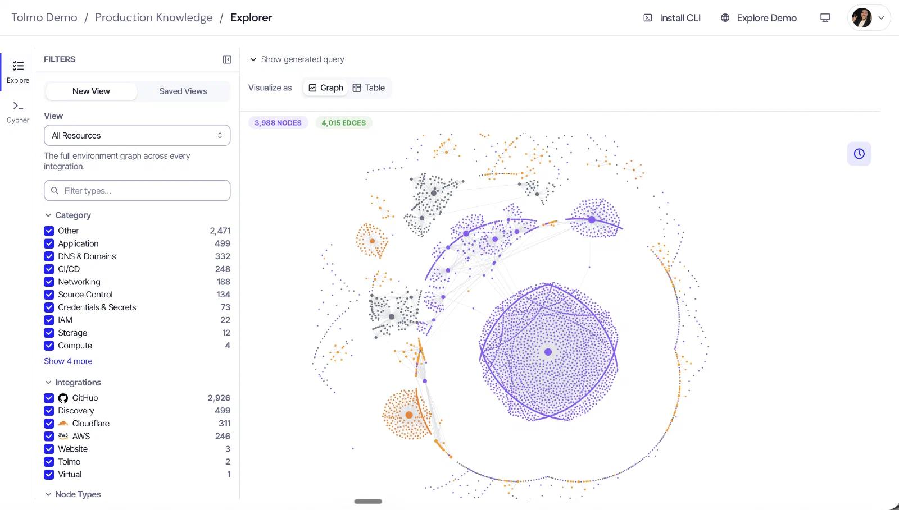
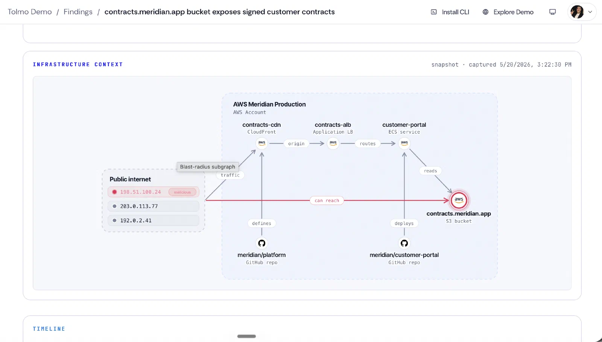
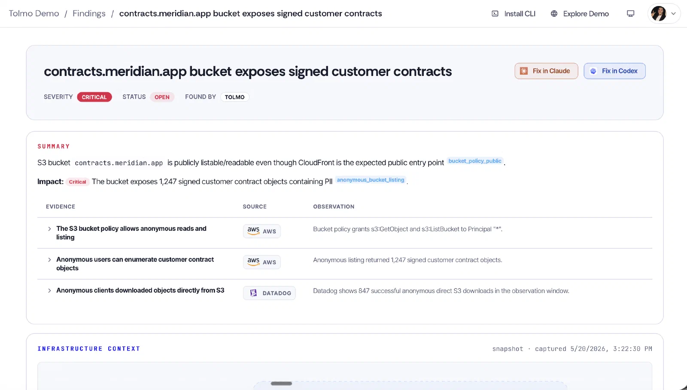
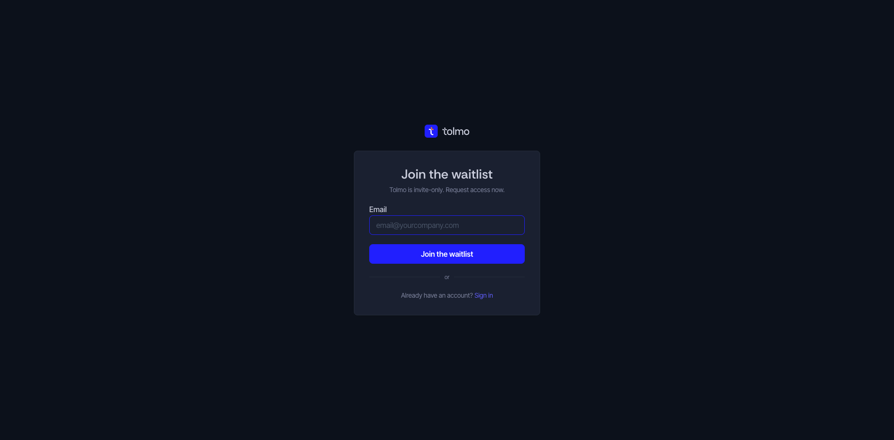
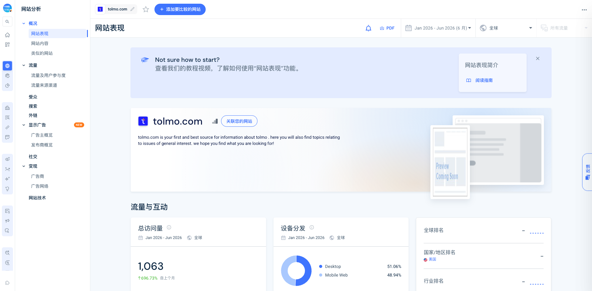

Tolmo 是一家以 **Production Knowledge Graph（生产知识图谱）** 为底座的自主安全 Agent 公司。它持续读取代码、云、CI/CD、身份、可观测性和安全工具中的事实，把资源与关系连接起来，再由 Agent 完成资产发现、攻击验证和修复交接。

## TL;DR

Tolmo 不是简单地把漏洞扫描器套上一层聊天界面。它实际在搭一套面向 Agent 的安全控制平面：连接器负责收集事实，时态图谱负责保存上下文，安全 Agent 在图上验证风险，finding/audit/proxy/skill 再把结果交给工程团队和 coding agent。

- **团队可信度很高**：四位联合创始人都来自 Sqreen/Datadog 安全体系，其中两位还在 Apple 做过安全；这是一个连续创业团队，不是临时拼出的 AI security 项目。
- **资本与设计伙伴先行**：2026 年 6 月 18 日出隐身并宣布 $22M，由 [[investor.accel]] 领投，[[investor.y-combinator]] 和 [[investor.sv-angel]] 参与；官方称已有 40+ 生产设计伙伴。创始人发布时写 45 家，两个口径按发布时间并存。
- **产品仍处早期**：官网 App 仍是 invite-only；官方融资稿明确只有 Pentesting Agent 已经在生产部署，Discovery 与 Remediation 正在陆续推出。没有公开收入、估值或具名客户。
- **真正的差异化不是“AI 会找漏洞”**：Tolmo 强调 inside-out 的生产上下文、时间维度、可利用性验证，以及把完整 blast radius 交给 coding agent 修复。
- **外部采用信号仍弱**：2026 年 1-6 月第三方估算总访问约 1,063，6 月约 311；域名历史还混有停放页，不能据此读取稳定渠道。X/HN/中文社区也尚未形成独立用户讨论。

当前最强的证据是团队履历、公开文档、集成面、CLI 发布节奏和融资；最弱的是独立客户验证、留存、收入和真实生产效果。

## 产品：图谱是底座，Agent 是应用

### 1. Gather：只读接入生产事实

Tolmo 连接 GitHub/GitLab、AWS/GCP/Azure、Cloudflare、Datadog/Sentry/New Relic、Terraform、Linear/Jira、Google Workspace，以及 Wiz、Snyk、Vanta 等安全工具。官网强调使用 read-only roles，不要求部署 agent 或修改代码。

这意味着它首先是一层数据与凭据基础设施。Wiz、Snyk、Vanta 在这里不只是竞品，也可以成为 Tolmo 的输入视角。安全市场更像多层组合，而不是赢家通吃。

### 2. Connect：把资源与关系变成可查询图谱

文档公开了 `GraphNode`、`GRAPH_EDGE`、SQL/Cypher 查询，以及 `firstSeenAt` / `lastSeenAt` 时间属性。关系可从环境变量、事件映射、secret 引用、IaC 与实际云资源中推断，因此它要回答的不是“这里有一个 S3 bucket”，而是“谁定义它、哪个服务读它、外部流量如何到达它、变化发生在什么时候”。

### 3. 三类安全 Agent

**Internal Discovery Agent** 持续发现资产、身份、数据存储与依赖；**Pentesting Agent** 从内部权限和信任边出发验证真实攻击路径；**Remediation Agent** 比较修复前后的图谱差异，解释 blast radius，并把上下文交给 coding agent。

Pentesting Agent 的定位与传统外部扫描不同：它从组织内部看到 IAM、CI、secrets 和服务关系，目标是证明 exploitability，而不是只生成理论告警。官方把“找到漏洞”和“证明能否利用”明确分开。

Remediation Agent 不只是生成补丁。产品页强调 before/after graph delta、blast radius 和安全后果，再由 Claude Code、Codex、Cursor 等 coding agent 执行修改。这是一种“安全 Agent 验证，编码 Agent 执行”的分工。

### 4. CLI、Skill 与安全控制面

公开 CLI 比官网更能暴露真实产品边界：它支持查询代码和基础设施、SQL/Cypher、finding 生命周期、threat model artifact、Datadog monitor、网站扫描与 secure proxy。代理请求可以访问 GitHub、AWS、Linear、Sentry、Datadog，而凭据由服务端解析，不暴露给调用 Agent。

`tolmo skill install` 会把 `SKILL.md` 写入 Claude Code 和通用 `~/.agents` 目录，让 coding agent 获得完整 Tolmo CLI 表面。可选的 Claude Code telemetry 还能采集 tool calls 和 assistant messages。

因此，Tolmo 的产品公式更接近：

> connectors + temporal graph + security agents + secure proxy + findings/audit + coding-agent skill

这与 Agent 治理直接相关：上下文、权限代理、可审计 finding、人工升级和工具调用界面共同构成执行边界，而不是再加一个聊天机器人。

## 产品体验与 Demo

公开 App 仍停在 waitlist，已有账户可以登录。本轮没有受邀账户，不能独立测试 Dashboard、接入耗时、finding 准确率或修复闭环。

[官方 132 秒产品 Demo](https://www.youtube.com/watch?v=nrOoCl0XRS8) 展示了一个新公开 S3 bucket：Agent 先确认 bucket 中有已签合同，再从 GitHub 判断没有服务要求它公开，从 CloudFront 确认已有安全分发路径，并用 Datadog 日志确认公网 IP 读取，最后把完整上下文交给 coding agent 修复。这个案例很好地解释了“跨系统证据”，但它仍是脚本化官方 Demo，不是客户实测。

## 团队：Sqreen 的第二次创业

Tolmo 由 [[person.pierre-betouin]]、[[person.jean-baptiste-aviat]]、[[person.vladimir-de-turckheim]] 和 [[person.arnaud-breton]] 联合创办。

- Pierre Betouin（CEO）与 Jean-Baptiste Aviat 曾共同创办 [[company.sqreen]]；两人早年都在 Apple 做安全。
- Sqreen 在 2021 年被 Datadog 收购，公开口径称当时有约 800 个生产客户。团队随后在 Datadog 继续建设安全产品。
- Vladimir 是 Sqreen 第 4 位员工、Datadog Staff Engineer，也是 Node.js core emeritus 和 AsyncLocalStorage 创建者。
- Arnaud 同样经历了 Sqreen 到 Datadog 的安全产品周期。

官方还列出 Matt Suiche、William Beuil、Jimmy Caputo、Mihail Kirov、Tyler Hayden 等早期成员，团队履历覆盖 Apple、Sqreen、Datadog 和 Snyk。LinkedIn 显示公司规模为 11-50、可见员工 7 人；YC 页面标注团队 12 人。YC 页面只展示 Pierre 与 Vladimir 两位 founder，而 Tolmo 官网与融资稿明确是四位，前者应视为资料未补全。

这支团队最值得关注的是闭环经验：他们不只是懂安全技术，也经历过从创业公司到大型可观测性平台内建设安全业务的过程。

## 融资与 Launch

| 时间 | 节点 | 证据边界 |
|---|---|---|
| 2026-04-07 | GitHub CLI 仓库创建 | 仓库主要分发二进制和 Skill，不是后端开源。 |
| 2026-06-18 | 出隐身并宣布 $22M | [[investor.accel]] 领投；YC 参与；无估值。 |
| 2026-06-18 | 官方称 40+ design partners | 融资稿写首批 40 家，创始人 X 写 45 家。 |
| 2026-06-22 | 产品 Demo 与研究内容发布 | Demo 约 99 views（采集时）；研究文章进入 HN。 |
| 2026-06-24 | YC Spring 2026 launch | 页面采集时显示 7 votes。 |
| 2026-07-13 | CLI v0.23.0 | 近两个月密集 nightly/release；公开仓库仅 4 stars。 |

官方称 Pentesting Agent 已在 40+ 设计伙伴的生产环境中运行并发现数百个 critical findings。这是值得记录的采用信号，但没有具名客户、案例细节和独立审计，不能等价为 PMF。

## 规模与流量

[[traffic.similarweb.tolmo-2026-01-2026-06]] 显示 2026 年 1-6 月约 1,063 visits，6 月约 311 visits / 311 unique visitors；1 page/visit、100% bounce。渠道估算为 Direct 61.35%、Organic Social 19.35%、GenAI 7.60%、Organic Search 3.91%、Referral 3.91%。

这些数字只能说明量级很小，不能说明精确渠道：

- 新官网 6 月 18 日才正式发布，半年区间包含发布前数据。
- 数据平台仍显示旧停放页描述，说明历史域名数据污染。
- SEO 工具只估算 5 次自然流量、28 个关键词、Authority Score 2；部分关键词与当前 Tolmo 无关。
- 访问量太低，任何百分比都会被少量访问放大。

合理判断是：Tolmo 目前依赖 founder、Accel、YC 和安全圈网络进入设计伙伴，公开网站尚未成为规模化获客渠道。不能从官网 traffic 推断其生产部署量，也不能把设计伙伴数字当成付费客户数。

## GTM、社区与内容传播

Tolmo 的 launch 由 Pierre、Accel、YC 和团队网络共同放大。公司 X 账号采集时只有约 96 followers、6 条内容；Pierre 的 launch thread 有 87 likes、13 reposts，明显强于公司号。当前分发资产是创始人信用与安全网络，而不是品牌账号。

它也在尝试通过高冲击技术内容进入开发者社区。文章“Fable 5 wrote a Windows kernel in 38 minutes”进入 HN 后得到 12 points / 8 comments，但评论集中质疑标题范围、源代码是否公开，以及 AI 口吻写作。这个案例说明内容能带来注意力，也会产生可信度成本；研究营销不能牺牲限定条件。

中文世界只找到一篇可引用的公众号综述，把 Tolmo 与 Superset、Linzumi、Superlog 放在“AI coding 加速后，下游控制与质量保障”这条线上。本轮没有找到 Reddit、V2EX、Linux.do、知乎、即刻或小红书的有效独立反馈。这里的结论只能是“本轮未命中”，不是“没有用户”。

## 竞品与相邻产品

| 层级 | 公司/产品 | 与 Tolmo 的关系 |
|---|---|---|
| 直接：自主渗透 | XBOW、Tenzai | 都强调自主攻击、持续 pentest 和可利用性验证；Tolmo 更强调内部生产图谱和修复交接。 |
| 直接/相邻：安全图谱 | Cyscale、Wiz、Snyk、Cycode | 已掌握 cloud/code/identity 风险数据；其中 Wiz、Snyk 也被 Tolmo 当作输入。 |
| 强相邻：headless CNAPP | Sysdig | 把 runtime CNAPP 信号通过 API、MCP、Skill 交给 Claude Code/Codex/Cursor，说明 incumbents 也在 agent-native 化。 |
| 相邻：Agent 本身安全 | [[company.general-analysis]] | 保护 AI Agent 和 tool graph；Tolmo 则用 Agent 保护生产软件与基础设施。 |

Tolmo 的 moat 假设不是某个模型，而是连接器覆盖、时态生产图谱、历史 finding、漏洞利用证据和工程修复闭环能否一起积累。直接竞品在自主攻击证明和客户 logo 上可能更强，incumbent 则拥有更成熟的数据面与客户关系。

## 关键判断

1. **Tolmo 的本体是生产上下文与安全控制平面，三类 Agent 是它之上的应用。** 如果只看“autonomous pentesting”，会低估它在图谱、凭据代理和 finding workflow 上的投入。
2. **这是一支用第二次创业压缩冷启动的团队。** Sqreen/Datadog 的信用、人才和客户认知解释了为什么一个刚公开的产品能先拿到 $22M 与 40+ 设计伙伴。
3. **Agent-native security 的入口正在从 Dashboard 转向 Skill/CLI/API。** 安全产品需要把可信上下文喂给 coding agent，并在执行前后保留验证与审计。
4. **“只读”不是完整权限描述。** 数据接入可以只读，但 secure proxy、finding 管理、Datadog monitor 和 coding-agent remediation 都可能产生动作；评估时必须逐能力看权限，而不是复述首页一句话。
5. **目前不能把强融资与强团队等同于强市场采用。** 独立客户、真实修复效果、误报率、部署摩擦和收入仍是核心空白。

## 风险与待验证

- App invite-only，本轮无法完成真实接入和任务测试。
- “40/45 design partners”“数百个 critical findings”均为官方口径，未见具名客户与独立证明。
- Pentesting Agent 明确已部署，其他 Agent 的实际可用范围和成熟度仍不清楚。
- 图谱与 secure proxy 集中连接生产凭据和上下文，若权限隔离、审计或租户边界出错，blast radius 也会变大。
- CLI 的 `about` 仍写“currently in stealth”，与 6 月公开 launch 冲突；说明产品和文档迭代很快，也存在状态漂移。
- GitHub 仓库是分发渠道，不是核心源码；4 stars 不能用来判断采用，也不能验证 Agent 逻辑。
- Trust Center 本轮只抓到空壳，不作为合规结论；需要人工登录或其他可读来源补证。
- 暂无 pricing、收入、估值、留存、误报率、平均部署周期和修复采纳率。

## 证据索引

### S1 官方/一手

- [Tolmo 官网](https://tolmo.com/) · [[source.website.tolmo-home-2026-07-14]]
- [平台与三类 Agent](https://tolmo.com/product/) · [[source.website.tolmo-platform-2026-07-14]]
- [Integrations](https://tolmo.com/integrations/) · [[source.website.tolmo-integrations-2026-07-14]]
- [发布与融资公告](https://tolmo.com/blog/introducing-tolmo/) · [[source.blog.tolmo-launch-2026-06-18]]
- [CLI docs index](https://docs.tolmo.com/llms.txt) · [[source.docs.tolmo-cli-2026-07-14]]
- [Agent Skill](https://docs.tolmo.com/guides/agent-skill.md) · [[source.docs.tolmo-agent-skill-2026-07-14]]
- [YC company profile](https://www.ycombinator.com/companies/tolmo) · [[source.yc.tolmo-company-2026-07-14]]
- [产品 Demo](https://www.youtube.com/watch?v=nrOoCl0XRS8) · [[source.youtube.tolmo-demo-2026-06-22]]
- [Pierre launch thread](https://x.com/pbetouin/status/2067679362057675151) · [[source.x.pierre-tolmo-launch-2026-06-18]]

### S2 平台与第三方强证据

- [[source.accel.tolmo-seed-2026-06-18]]
- [LinkedIn company](https://www.linkedin.com/company/tolmohq/) · [[source.linkedin.tolmo-company-2026-07-14]]
- [GitHub CLI repo](https://github.com/tolmohq/tolmo) · [[source.github.tolmo-cli-2026-07-14]]
- [网站流量快照](https://www.similarweb.com/website/tolmo.com/) · [[source.similarweb.tolmo-2026-01-2026-06]]

### S3/S4 社区与边界

- [HN 技术内容讨论](https://news.ycombinator.com/item?id=48824006) · [[source.hn.tolmo-kernel-2026-06-22]]
- [[source.weixin.yc-s26-tolmo-2026-07-11]]
- [[source.trust.tolmo-empty-shell-2026-07-14]]

研究判断见 [[note.tolmo-product-takeaway-2026-07-14]]，竞品分层见 [[note.tolmo-competitor-map-2026-07-14]]，本轮过程与反思见 [[note.tolmo-research-run-2026-07-14]]。
