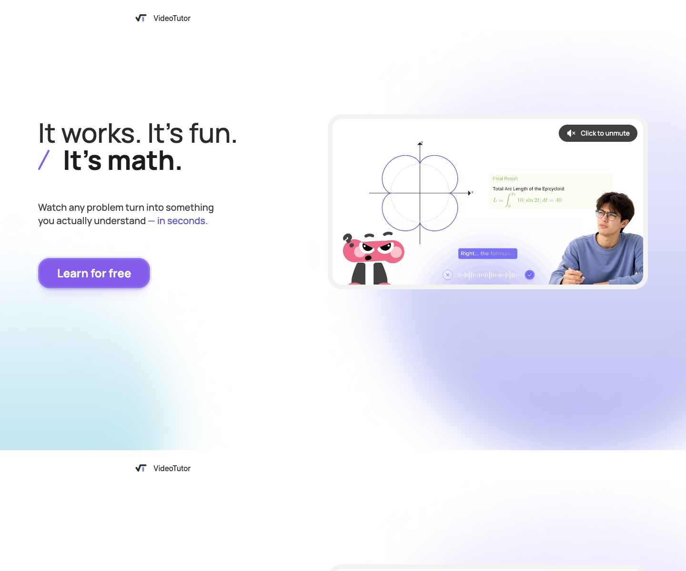

# VideoTutor

## TL;DR

[[company.videotutor]] 是一个 AI 教育 agent / AI video tutor：学生输入或拍下数学/STEM问题，它不是只返回文字答案，而是实时生成带动画、语音、步骤拆解和可打断追问的教学视频。

我的判断：VideoTutor 最值得看的地方，是它把 AI tutor 从“answer retrieval / homework helper”往“generated instruction / 教学过程生成”推进了一步。它不只是让 LLM 回答题目，而是把题目解析、教学结构、数学动画、旁白、交互追问和长期记忆串成一个实时学习体验。对 agent 产品来说，这是一个很好的例子：agent 的输出不一定是文本或动作，也可以是一个动态生成的、可交互的“过程”。

不过它也有明显待验证点：核心增长数字、客户意向、投资方细节多来自公司新闻稿或访谈口径；YZi Labs 官方文章目前 browser read 抓不到正文；Similarweb 没有直接公开命中；Product Hunt 未发现明确 launch。

## 产品是什么

官网把 VideoTutor 定义为 **AI Video Tutor for Math & STEM**。

它的关键能力：

- 把任何 math / STEM question 转成 personalized AI tutoring video。
- 用 animated visuals、voice、step-by-step explanation 讲解问题。
- 学生可以中途打断、追问、要求换一种解释。
- 官网技术区写了 Generate to Animation：Question -> Animated Scene + Interactive Explanation。
- 官网还强调 Long-term Memory：Adapt Teaching、Assemble Context、Update Memory、Extract Signals、Capture Session。

所以它和普通 AI homework helper 的差异在于：不是直接给答案，而是生成讲解过程。

## 具体场景

公开资料里它的早期聚焦比较清楚：K12 / SAT / AP / math / STEM，尤其是需要可视化的函数、几何、物理等题目。

36Kr 和 BlockBeats 访谈里提到：学生拍照或输入题目，系统生成类似老师在白板讲题的视频；早期主要做 SAT/AP 数学题，之后再扩展到更多 STEM 学科。

这和 Chegg / Gauth 这类 homework answer 产品不完全一样。VideoTutor 自己的叙事是 active learning / exam prep：用户不是为了尽快抄答案，而是为了理解题目、准备考试、提高分数。

## 技术线索

几个来源都提到 Manim 或数学动画渲染：

- GlobeNewswire / Pulse2：VideoTutor draws on Manim，并自动化从 question 到 teaching explanation、visual components、narrated video lesson 的生产流程。
- 36Kr：团队做了 geometry analyzer，把三角形、平面几何、线等转换成模型可理解的 machine language；并重写 animation rendering protocol，控制每帧元素位置。
- 36Kr：为减少大模型幻觉，复杂题会用 Claude / Gemini 双模型校准，两个模型一致才输出。
- 36Kr：用 SAT/AP 高分学生标注 AI-generated videos 的错误，再反馈训练。
- BlockBeats：LLM 生成文字和 animation instructions，自研 mathematical animation rendering engine 负责精准渲染；实时交互时用前面 scenes/context 规划下一段教学。

这些说法里，官网和新闻稿只给方向，36Kr/BlockBeats 给了更多细节。技术细节目前主要来自访谈，需要后续找 demo、论文、repo 或工程说明交叉验证。

## 增长和 GTM

VideoTutor 的增长线很有意思：它不是 HN/Product Hunt 型，而更像学生内容传播。

公开口径：

- GlobeNewswire / Pulse2：VideoTutor-related content surpassed 50M cumulative TikTok views，主要由 organic student sharing 驱动。
- 36Kr：上线 20 天注册用户超过 30,000，video views 超过 10M，生成超过 100,000 videos。
- BlockBeats：强调 B2C word-of-mouth，学生主要在 TikTok 分享，家长在 Facebook groups；团队还做 high school campus ambassadors。
- GlobeNewswire：公司称收到 Tencent Group、Xiaotiancai 等购买/部署咨询，以及 1000+ API integration requests。
- 36Kr：提到印度 60,000 学生 tutoring institution 合作，以及与美国校园社交平台 Fizz 达成合作。

这些增长数字很亮眼，但证据类型多数是公司新闻稿或媒体访谈，需要谨慎。当前可独立看到的社交账号规模并不大：X 官方约 2.3k followers，LinkedIn 525 followers、2-10 employees。合理解释是：传播主阵地可能不是公司账号，而是学生生成内容/TikTok 内容扩散。

## 团队与融资

团队：

- [[person.kai-zhao-videotutor]]：CEO / founder。X bio 直接写 CEO at VideoTutor；LinkedIn 搜索结果显示 Founder of VideoTutor。
- [[person.james-zhan-videotutor]]：BlockBeats/Founder Park 访谈中出现为 CTO James Zhan，并被描述为来自 Gemini/Google AI engineering；这条需要 LinkedIn 或官方团队页进一步验证。

融资：

- 多个来源称 VideoTutor 获得 $11M seed。
- 投资方包括 [[investor.yzi-labs]]、[[investor.baidu-ventures]]、[[investor.amino-capital]]。
- 中文/crypto 媒体还提到 Jinqiu Fund、BridgeOne Capital 等参与，当前标低置信。
- YZi Labs 官方文章在 Google 可搜到，但 browser read 只返回空壳，因此未把官方正文当证据。

口径冲突：一些搜索结果/中文媒体显示融资发生或宣布在 2025 年 10-11 月；GlobeNewswire / Pulse2 / SaaSNews 在 2026 年 5 月再次报道或转述。当前我把融资事实记为“已披露 $11M seed”，但公告精确日期需要补 YZi 官方正文或原始 PR。

## 和我们主线的关系

VideoTutor 不属于 AI employee，但属于 **domain agent / education agent**。

它对我们有三个启发：

1. **Agent 输出可以是动态过程。** 很多 agent 产品把输出限制在文字、表格、动作执行。VideoTutor 把输出变成实时生成的视频教学过程。

2. **垂类不是行业标签，而是媒介和任务闭环。** 它不是泛教育 chatbot，而是 SAT/AP/STEM 数学可视化讲解。题目输入、动画渲染、追问、记忆、练习/提分可以形成闭环。

3. **年轻用户产品的 GTM 可能不走常规 B2B 软件路径。** 它的分发更像 TikTok / 学生分享 / 家长群 / campus ambassador，而不是 HN/PH/SEO。

## 风险与待验证

- **正确性风险**：数学/STEM 讲解对精确性要求高，尤其是几何图形、公式、步骤推理；需要真实题库评测。
- **渲染延迟和成本**：实时生成动画视频比文本答案重很多，36Kr 也提到 zero latency 是挑战。
- **增长数字依赖公司口径**：50M TikTok views、1000+ API requests、Tencent/Xiaotiancai interest、印度机构合作等需要逐条验证。
- **融资公告时间不一致**：需补 YZi 官方正文。
- **商业模式未稳定**：访谈提到 $3.99 / 4 videos、$69/month、pay-per-performance / SAT Math outcome package，但官网当前未清晰展示 pricing。
- **竞争边界**：Chegg/Gauth 是 homework answer；Gatekeep/AnimG/Manim AI generator 是相邻技术形态；ChatGPT Study mode 是基础模型下沉风险。

## 后续建议

如果继续深挖，我建议顺序是：

1. 用实际题目体验产品：SAT/AP 数学、几何、物理各测几道，记录准确性、延迟、视频质量、追问体验。
2. 找 TikTok 真实账号/爆款视频，而不是只看新闻稿 50M views。
3. 找 Kai Zhao / James Zhan 的 LinkedIn 和团队履历。
4. 对比 Gatekeep、Gauth、Chegg、ChatGPT Study mode、AnimG。
5. 看是否有 API/enterprise offering 文档，验证“1000+ API requests”和 B2B 集成需求。

## 证据库

- [[source.website.videotutor-home-2026-07-10]] - 官网，S1。
- [[source.linkedin.videotutor-company-2026-07-10]] - LinkedIn 公司页，S2。
- [[source.x.videotutor-profile-2026-07-10]] - X 官方账号，S2。
- [[source.x.kai-zhao-profile-2026-07-10]] - Kai Zhao X 账号，S2。
- [[source.globenewswire.videotutor-tiktok-2026-05-01]] - 公司新闻稿/赞助内容，S2/S3。
- [[source.pulse2.videotutor-2026-05-01]] - Pulse2 报道，S2。
- [[source.saasnews.videotutor-seed-2026-05-05]] - The SaaS News，S2。
- [[source.36kr.videotutor-founder-2025]] - 36Kr 深访/背景，S2。
- [[source.blockbeats.videotutor-seed-2025]] - BlockBeats/Founder Park 访谈整理，S2。
- [[source.reddit.videotutor-apstudents-feedback]] - Reddit 早期弱反馈，S3/S4。
- [[source.yzilabs.videotutor-official-empty-2026-07-10]] - YZi 官方页抓取失败记录，S4。
