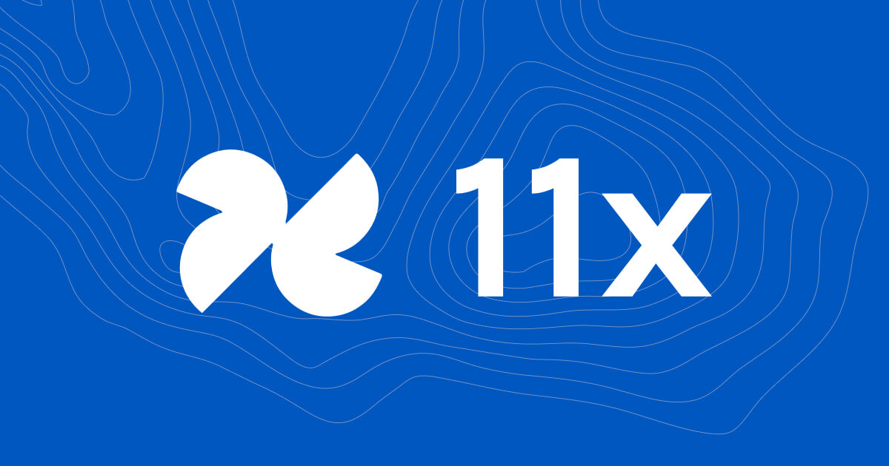
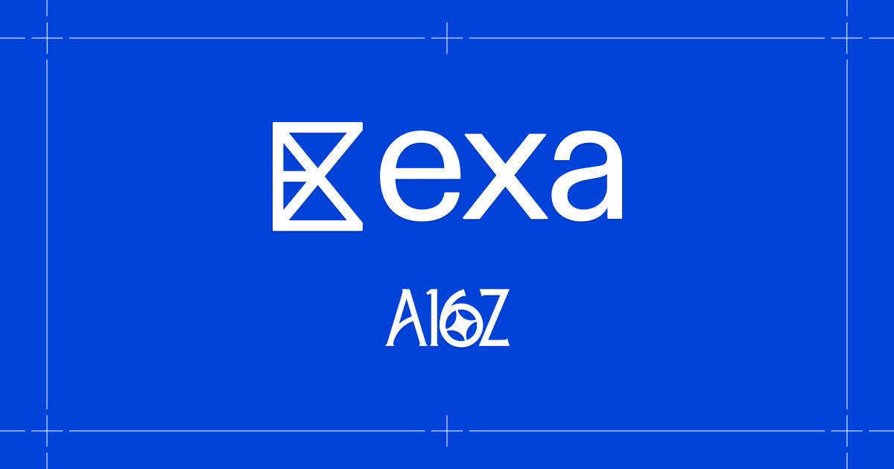
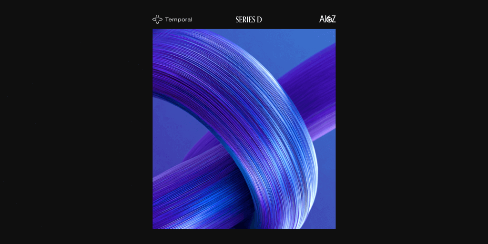
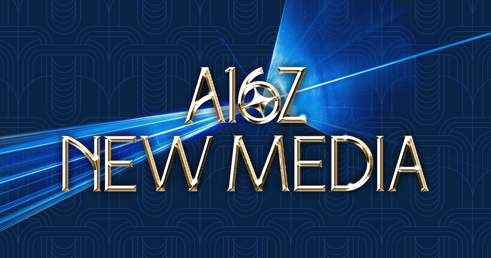

# Andreessen Horowitz（a16z）

> 研究更新：2026-07-21。证据等级沿用 S1 官方、S2 强第三方、S3 社区/二手、S4 待核验。

## TL;DR

a16z 不是“一支押注 AI 的基金”，而是一套覆盖 Seed、Venture、Growth、加速器和长期资本的多策略机构。AI 横跨 Apps、Infrastructure、Growth、Enterprise、Crypto、Consumer 等组织单元；官网单列 AI 作为内容、项目和 portfolio 聚合页，但当前团队结构里没有一个可独立识别的“AI 投资团队”。因此，研究 a16z 不能只问“它投了哪些 AI 公司”，必须继续追到 **哪一条策略、哪个阶段、哪些公开署名人、以及哪套投后分发能力**。

截至 2026-03-30，SEC Form ADV 报告 a16z Capital Management 约 **1064.76 亿美元监管资产（RAUM）**、119 个全权委托账户、738 名员工，其中 88 人从事投资顾问或研究。官网团队目录同时展示 97 名 Investment Team、462 名 Operations Team、7 名 Board Partners；这与监管口径和 LinkedIn 自报人数不是同一个统计范围，不能混用。

对我们当前已研究公司的交集，a16z 已形成五种不同入口：[[company.11x]] 属于 Enterprise/Apps 叙事，[[company.exa]] 与 [[company.temporal]] 属于 AI Infrastructure / Growth 交叉，[[company.harvey]] 是成长阶段法律 AI，[[company.skyfire]] 则来自 Crypto Startup Accelerator。共同品牌相同，但投资策略、人员和资本工具不同。

## 1. 机构身份与规模

- **成立：** 2009 年，由 [[person.marc-andreessen]] 与 [[person.ben-horowitz]] 创立。
- **阶段：** 官方口径为 Seed、Venture 到 Growth，另有 Speedrun accelerator、Crypto Startup Accelerator 和 Perennial 长期投资平台。
- **主题：** AI、Bio + Health、Consumer、Crypto、Enterprise、Fintech、Games、Infrastructure、American Dynamism 等。
- **规模：** 官网 About 页截至 2026-04-30 表述为 `$100B+ AUM`；2026-03-30 Form ADV 的精确监管口径为 `$106,476,153,956 RAUM`。二者方向一致，但含义仍以各自定义为准。
- **组织：** 官网结构化目录共 567 个展示成员，其中 97 人属于 Investment Team、462 人属于 Operations Team、7 人为 Board Partners。Form ADV 的 738 名员工是法律申报口径，覆盖范围更广。

LinkedIn 页面显示“1,004 associated members”但公司规模栏仍写 201–500；这是自报关联人数与静态公司档案的冲突，不能替代 Form ADV 或官网目录。

## 2. 资本架构：品牌下是多条资金与阶段路径

### 2026 年新募资

Ben Horowitz 在 2026-01-09 宣布募资超过 **150 亿美元**：

| 策略 | 官方金额 |
|---|---:|
| American Dynamism | $1.176B |
| Apps | $1.7B |
| Bio + Health | $700M |
| Infrastructure | $1.7B |
| Growth | $6.75B |
| 其他 venture strategies | $3B |

这是一组基金与策略的总和，不应写成“150 亿美元 AI 基金”。AI 是这些策略共同面对的技术变化，Apps、Infra、Growth 等才是公开披露的资金桶。

### 2024 年对照

2024 年公告的 72 亿美元包括 American Dynamism $600M、Apps $1B、Games $600M、Infrastructure $1.25B、Growth $3.75B。两轮公告显示 a16z 会随技术类别和阶段重新组织资金，而不是维持一支永远不变的旗舰基金。

### 不能混在一起的其他平台

- **Speedrun：** 独立加速器条款。SR007 官方称每家公司最高 $1M，其中 $500K 以 SAFE 换 10%，另 $500K 在后续轮次投资；不应和常规 Seed 条款混写。
- **Crypto Startup Accelerator / CSX：** [[company.skyfire]] 的证据指向 CSX，不代表主品牌通用 Seed 策略。
- **Perennial：** 面向企业家、领导者和机构的长期资本与跨代策略，包含 venture、real assets 与 philanthropy 规划；不应并入风险投资 portfolio 统计。

## 3. AI 是跨垂直层，不是独立团队

a16z 的 AI 页面组合了三类资产：

1. AI 主题内容、播客和 AI Canon；
2. a16z Infra / Consumer 的开源项目、产品实验和 grants；
3. 跨垂直的 AI portfolio 聚合。

团队目录的实际垂直标签包括 American Dynamism、Bio + Health、Consumer、Crypto、Enterprise、Fintech、Growth、Infra、Seed、Speedrun 等，但没有 AI。这个差异很重要：**AI 页面是市场与知识入口，投资责任仍落在具体垂直、阶段和人身上。**

[[concept.cross-vertical-ai-capital-stack]] 用来表达这套结构。它不是 a16z 官方术语，而是基于当前组织、基金公告和投资交集形成的研究抽象。

## 4. 与当前 AI Company Atlas 的交集

| 公司 | 轮次/关系 | 公开署名与组织线 | 可支持的判断 |
|---|---|---|---|
| [[company.11x]] | 2024 Series B，a16z 领投 | [[person.seema-amble]]、[[person.joe-schmidt-a16z]] 等；Enterprise | 下注“digital workers”与 enterprise workflow，不等于已验证劳动力替代结果 |
| [[company.exa]] | 2026 Series C，a16z 领投 | [[person.sarah-wang-a16z]]、[[person.stephenie-zhang]]、Jennifer Li、Jason Cui；Growth + Infra | 把 search for agents 视为独立基础设施层 |
| [[company.temporal]] | 2026 Series D，a16z 领投 | Sarah Wang、Stephenie Zhang、Raghu Raghuram；Growth + Infra | durable execution、state、retry、recovery 成为 Agent 生产基础设施 |
| [[company.harvey]] | 2025/2026 成长轮关系，当前 medium | 强第三方融资报道确认 a16z 参与/领投；公开署名人与具体 vehicle 尚未充分核实 | 保留投资关系，不把 Growth 团队猜测升级为事实 |
| [[company.skyfire]] | 2024 strategic seed / CSX participant | a16z Crypto Startup Accelerator | Agent payment 属于 crypto accelerator 路径，不代表企业软件团队 thesis |

### 从交集看到的三个 cluster

**Enterprise AI employees：** 11x 的公开投资文章由 Enterprise/Fintech 相关投资人共同署名，重点是把重复销售工作包装为 digital workers。这里的关键不是模型，而是 workflow、数据、交付和企业购买路径。

**Agent infrastructure：** Exa 与 Temporal 由 Growth 和 Infra 人员交叉署名。前者押注 agents 需要高频、长尾、低延迟的机器搜索；后者押注长任务需要 durable state、retries、recovery 与 replay。两笔投资共同说明 a16z 不只买应用增长，也在建立 Agent 运行栈。

**阶段与载体分化：** Harvey 是成熟垂直应用，Skyfire 是 accelerator/crypto 入口。若只看品牌，会把完全不同的 ownership、支持能力和风险偏好拼成一条“a16z AI thesis”。

## 5. 人物网络：公开归因，不等于决策权

- [[person.marc-andreessen]] 与 [[person.ben-horowitz]] 是联合创始人和 General Partners，决定机构文化、组织和长期叙事。
- [[person.martin-casado]] 负责 Infrastructure practice，是 AI infra 主题的重要公开解释者；但本轮没有把所有 Infra 投资自动归到他个人。
- [[person.sarah-wang-a16z]] 负责 AI、enterprise applications 和 infrastructure 的成长阶段投资，公开连接 Exa 与 Temporal。
- [[person.stephenie-zhang]] 位于 Growth team，公开连接 Exa 与 Temporal，形成 growth-stage enterprise infrastructure cluster。
- [[person.seema-amble]] 与 [[person.joe-schmidt-a16z]] 位于 Enterprise/Fintech 交叉，公开连接 11x。

2013 年 Ben 的旧文写过：机构运营由 Scott Kupor 负责，投资决定由 General Partners 决定。它只能作为历史机制证据。当前多策略、多地区、多阶段组织的 sponsor、投票、否决、IC 和 conflict allocation 细节没有在本轮公开材料中得到充分验证，所以正文不把 byline 当作最终决策权。

## 6. 投后 operating system：资本之外的分发能力

### 运营团队

官网目录展示 462 名 Operations Team，远多于 97 名 Investment Team。官方将其称为 VC 中规模最大的 operator team，能力覆盖人才、GTM、营销、政策、全球伙伴和公司建设。目录与服务说明证明组织存在，但不能直接证明每家公司获得相同资源或产生同样结果。

### Executive Briefing Center

当前 EBC 页面把它定义为连接 portfolio founders 与企业、政府领导者的 briefing network。2017 年官方历史文章曾称累计举办 12,000+ briefings/events、形成 $3.5B sales pipeline。这个数字是当时的机构自报 pipeline，不是 a16z 收入，也不是当前客户转化率。

### New Media

New Media 把内容制作、创始人定位、launch day 和 timeline distribution 做成 forward-deployed 服务。它说明 a16z 把媒体当作 portfolio distribution 基础设施，而不只是品牌部门。但官方也强调选择性支持，因此不能假定每家被投公司都获得同等级 launch。

### Global Partnerships

2026 年 a16z 将 Investor Relations 升级为 Global Partnerships，公开目标包括把 LP、主权/机构资本、市场准入、监管关系与创始人国际扩张连接起来。这里的价值不只是募资，而是把资本方变成客户、渠道和政策网络的一部分。

### 内容与开源

AI 页面同时运营 podcast、AI Canon、newsletter、GitHub starter projects、grants 和产品 demos。这形成了 [[concept.venture-platform-as-distribution-network]]：研究、内容、社区、人才、客户和投资相互供给。当前证据能证明网络和投入存在，不能独立量化其对 dealflow、营收或退出的增量贡献。

## 7. 中文世界如何理解 a16z

中文媒体当前更常把 a16z 当作“AI 趋势解释器”：围绕“三条 AI 投资路径”“AI 应用护城河”“Big Ideas 2026”等内容做编译和二次总结。这有传播价值，但容易产生三个偏差：

1. 把某位 partner 的文章写成全机构统一 IC 标准；
2. 把 AI 主题页写成独立 AI 基金或单一团队；
3. 重视观点与 portfolio 名单，忽略 Apps/Infra/Growth/CSX/Perennial 等资本载体差异。

因此中文材料适合用于认知审计和选题发现，基金金额、团队归属和投资关系仍反向核到官方公告、团队页和 SEC filing。

## 8. 关键判断与风险

### 判断 1：a16z 的核心产品不是“钱更多”，而是资本栈加分发栈

多阶段资金让它能在公司生命周期中重复下注；运营、EBC、New Media、Global Partnerships 和内容网络让它试图影响人才、客户、政策和叙事。这比“投后服务菜单”更接近一个机构级 distribution system。

### 判断 2：AI 投资的真实单元是 partner × vertical × stage

AI 只是共同技术变量。对创业者而言，更值得研究的是谁负责当前阶段、此人连续投了什么产品层、对应 fund/vehicle 有何 reserves 和支持能力。

### 判断 3：规模同时带来选择性与归因问题

97 名投资团队、462 名运营团队和 1000+ LinkedIn 关联成员，意味着品牌不再等同于单一 partner 体验。公开文章的强叙事也可能掩盖资源分配、跨策略冲突、竞争投资与实际服务覆盖率。

### 风险与未知

- 当前公开材料没有完整披露 sponsor、IC 投票、否决、allocation 和 conflict process；
- 官网 portfolio 明确排除未获披露许可和部分未宣布资产，且按月更新，所以不能当完整持仓表；
- “$15B”是多基金总募资，不是可随意跨策略调用的一池资金；
- EBC pipeline、New Media launch 和 Global Partnerships 都主要来自机构自报，缺统一 cohort 结果；
- Harvey 的具体 vehicle 与公开责任人仍待一手证据补齐；
- AI 主题内容由个人署名，a16z disclosure 明确其观点不必然代表机构或每支基金。

## 9. 后续监控

- 新 fund close、Form ADV 和 vehicle 调整；
- Apps、Infra、Growth 对 Agent application / runtime / identity / governance 的连续下注；
- Exa、Temporal、11x 的 follow-on、董事会和 operating partner 归因；
- New Media、EBC、Global Partnerships 是否公开可比较的 portfolio outcome；
- Speedrun/CSX 公司与主基金后续轮次之间的转换；
- Harvey 关系的官方投资公告或 partner 归因。

## 10. 证据库

### S1 官方与监管

- [About a16z](https://a16z.com/about/)
- [a16z Team](https://a16z.com/team/)
- [AI + a16z](https://a16z.com/ai/)
- [Portfolio](https://a16z.com/portfolio/)
- [Investment List](https://a16z.com/investment-list/)
- [Why Did We Raise $15B?](https://a16z.com/why-did-we-raise-15b/)
- [New Funds, New Era](https://a16z.com/new-funds-new-era/)
- [SEC Form ADV, CRD 160489](https://reports.adviserinfo.sec.gov/reports/ADV/160489/PDF/160489.pdf)
- [Executive Briefing Center](https://a16z.com/briefings/)
- [What is New Media?](https://a16z.com/what-is-new-media/)
- [Global Partnerships](https://a16z.com/a16z-investor-relations-is-now-global-partnerships/)
- [Perennial](https://a16z.com/perennial/)
- [Speedrun SR007](https://a16z.com/applications-for-a16z-speedrun-sr007-are-now-open/)
- [Investing in 11x](https://a16z.com/announcement/investing-in-11x/)
- [Investing in Exa](https://a16z.com/announcement/investing-in-exa/)
- [Investing in Temporal](https://a16z.com/announcement/investing-in-temporal/)

### S2/S3 第三方与中文认知

- [Andreessen Horowitz LinkedIn](https://www.linkedin.com/company/a16z/)
- [36氪：a16z AI 投资逻辑三条路](https://www.36kr.com/p/3647673193762439)
- [虎嗅：AI 应用护城河](https://www.huxiu.com/article/4828027.html)

## 研究关系

- 试点方法：[[method.investor-research-sop-v0]]
- 本轮过程：[[note.a16z-research-run-2026-07-21]]
- 核心判断：[[note.a16z-investment-system-takeaway-2026-07-21]]
