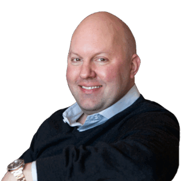

# Marc Andreessen

Andreessen Horowitz（[[investor.andreessen-horowitz]]）联合创始人兼 General Partner。早年共同创建 Mosaic 浏览器，随后联合创办 Netscape；又与 Ben Horowitz 联合创办 Loudcloud，后更名 Opsware 并于 2007 年出售给 HP。

官网当前将其列入 Investment Team，覆盖 American Dynamism、Consumer 与 Growth。Marc 是 a16z AI、技术乐观主义、政策和媒体叙事的关键公开人物，但他的公开观点不应自动视为每支 a16z 基金或每位 partner 的统一投资标准。

- 官方档案：https://a16z.com/author/marc-andreessen/
- X：https://x.com/pmarca
- Substack：https://pmarca.substack.com/

