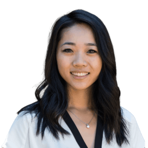

# Sarah Wang

Andreessen Horowitz（[[investor.andreessen-horowitz]]）General Partner，负责 AI、enterprise applications 与 infrastructure 的成长阶段投资。官网列出的代表项目包括 Cursor、Decagon、Thinking Machines Lab、Character.ai、Wiz、OpenAI、SSI 和 Databricks。

在当前 Atlas 交集中，她公开署名 a16z 领投 [[company.exa]] Series C 与 [[company.temporal]] Series D。这里能证明公开投资归因和 Growth/Infra 交叉，不能单独证明她拥有最终、排他的投资决定权。

- 官方档案：https://a16z.com/author/sarah-wang/
- X：https://x.com/SarahDingWang
- LinkedIn：https://www.linkedin.com/in/sarah-wang-59b96a7/

