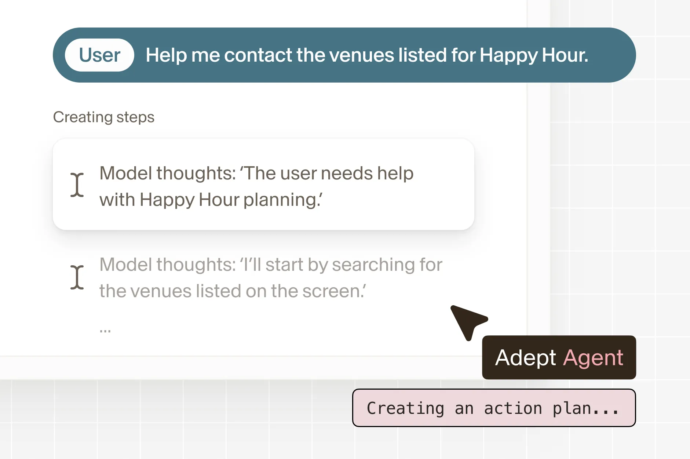

# Building Powerful Agents with Adept

Source: https://www.adept.ai/blog/adept-agents/
Published: 2024-08-23
Evidence: S1 official / quality full

Adept defines AI agents as “software that can translate user intent into actions.” The post introduces Adept Workflow Language (AWL), a proprietary custom language for composing multimodal web interactions on top of Adept’s models.

Key facts:

- Adept’s agent understands the screen, reasons about what is on page, and makes plans.
- Agent design goals: reliable/on-rails, robust to environment changes, easy to author.
- AWL is a syntactic subset of JavaScript ES6.
- Functions like click("Compose") invoke multimodal locate/action calls; act() invokes agent reasoning loops from natural language.
- Example workflow: extract event attendee info from PDF, create HubSpot lead; adapt same workflow to Salesforce with minimal changes.
- Other examples: EMR update from diagnosis PDF, Stripe customer/invoice from Google Sheets, Gmail to Salesforce lead management, mortgage contract info to government site search.

Research value: this marks Adept’s shift from broad ACT-1 vision to enterprise workflow automation with a programmable agent DSL and actuation layer.

