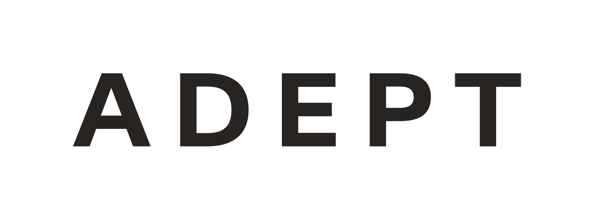

# Adept homepage

Source: https://www.adept.ai/
Collected: 2026-07-09
Evidence: S1 official / quality full

Adept current homepage positions the company as “Agentic AI for your tech stack” and says its advancements in agent development accelerate product roadmaps with proven results.

Key product claims:

- Adept is an enterprise AI tool for managing manual, repetitive workflows across daily tools.
- Building useful, reliable agents requires a full-stack approach.
- Stack components: proprietary agent training data, multimodal model suite, custom actuation software, feedback/data collection tools.
- The custom actuation layer is powered by a proprietary DSL and actuation layer that enables actions across websites and software applications.
- Capabilities shown: Locate, Web VQA, end-to-end workflows.
- Use cases shown: supply chain shipping availability checks, financial services PDF/contract extraction and internal system update, healthcare license applications with human-in-the-loop final submission.
- Differentiation language: accurate/reliable, future-proof, fast setup through natural language, enterprise-wide.

Assets captured: [[company.adept]] assets in `assets/adept/`.
