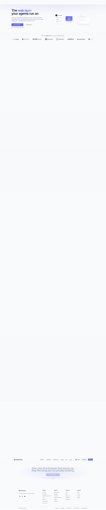
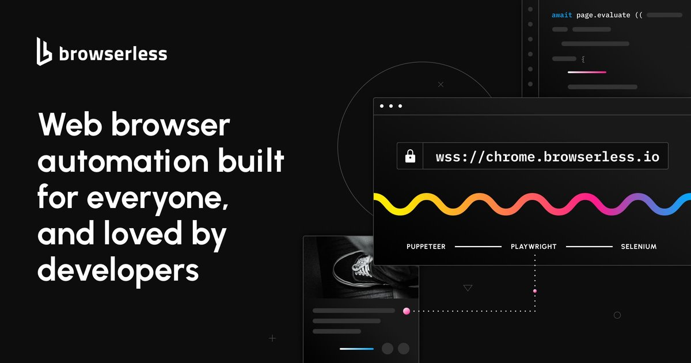

官网首页 browser read 失败（ERR_ABORTED 到 /home），但 curl 与浏览器截图可验证 meta/页面内容。核心口径：Headless Browser Automation & Scraping；描述为 real-time browser infrastructure behind 173M+ Docker pulls，支持 Puppeteer/Playwright、scraping、automation、AI agents；无需 DevOps，free plan 无信用卡。官网 FAQ 说明 Browserless 是 managed headless browser platform，替换 launch() 为 connect() 指向 Browserless endpoint；支持 cloud、managed cloud、self-hosted。

图片资产：

