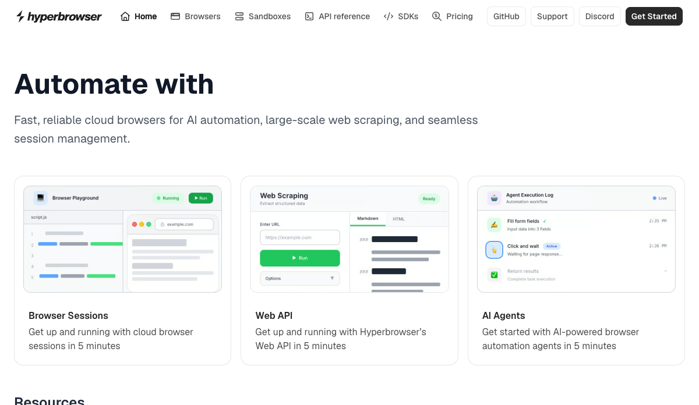

Docs index 显示 Hyperbrowser 产品面很宽：Browser Sessions、Web API、AI Agents、HyperAgent、MCP、Stagehand/LangChain/LlamaIndex integrations、Sandboxes、X402 等。

重要判断：Hyperbrowser 不只是 remote browser service，而是在搭 browser session + web data API + agent runner + sandbox 的 web-agent runtime。

截图：
