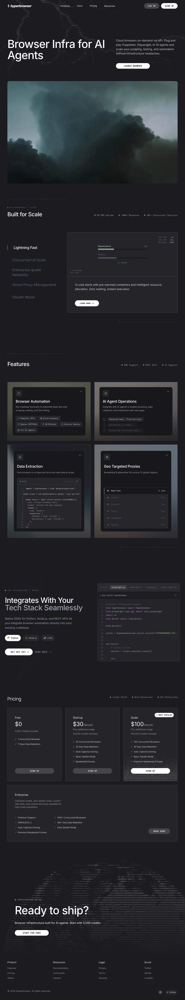

官网定位为 “Web Infra for AI Agents”，核心文案是 cloud browsers on-demand via API，Plug and play Puppeteer, Playwright, or AI agents。官网强调 scale、99.99% uptime、<50ms response、10k+ concurrent sessions、SDK/REST/12 regions。

首页价格露出：1 credit = $0.001；$0.10/browser hour；$10/GB proxy data。Enterprise 层出现 unlimited credits、ultra stealth、custom rate limits、1000+ concurrent browsers、HIPAA/SOC 2、180+ day data retention、auto captcha solving、premium residential proxies。

截图：
