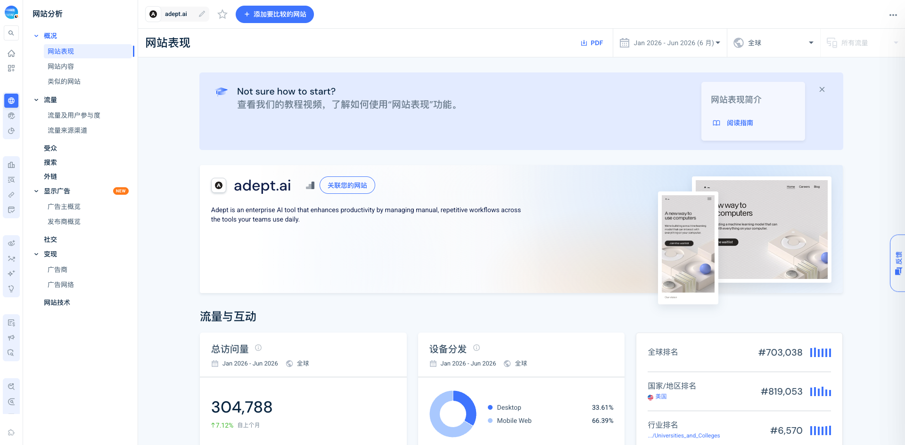
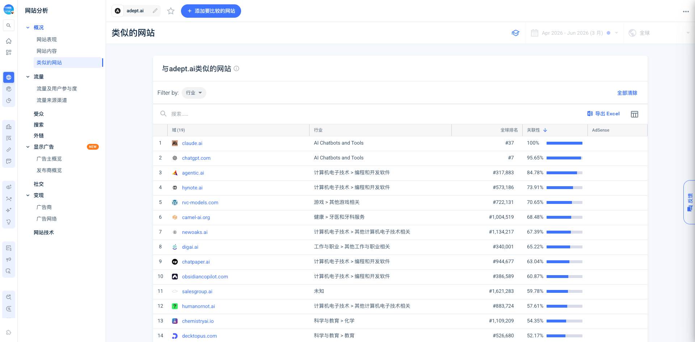

# Similarweb overview for adept.ai

Source: Similarweb overview
Collected: 2026-07-09
Range shown: Jan 2026 - Jun 2026, Global, All traffic
Evidence: S2 third-party traffic estimate / quality full enough for overview

## Overview metrics shown

- Total visits, Jan-Jun 2026: 304,788.
- Monthly visits shown: 15,372.
- Month-over-month: +7.12%.
- Device distribution: Desktop 33.61%, Mobile Web 66.39%.
- Global rank: #703,038.
- Country rank: United States #819,053.
- Category shown: Universities and Colleges, #6,570. This category looks odd for Adept and should not be over-interpreted.
- Monthly unique visitors: 8,725.
- Deduplicated audience: 7,958.
- Visit duration: 00:00:27.
- Pages per visit: 1.75.
- Bounce rate: 66.20%.

## Geography shown

- United States: 38.36%.
- India: 35.53%.
- Japan: 8.69%.
- United Kingdom: 3.87%.
- Germany: 2.50%.

## Channels shown

- Direct: 30.25%.
- Organic Search: 56.99%.
- Paid Search: N/A / effectively below 1% in search module.
- Referrals: 6.75%.
- Organic Social: 2.01%.
- Paid Social: N/A.
- Generative AI: 4.00%.

Search module:

- Organic search is 56.99% of traffic.
- Brand vs non-brand in Jun 2026: brand 96%, non-brand 4%.
- Non-brand keyword rows included noisy/low-volume terms such as “adept.ai cn”, “ampet ai”, “act-1, robot foundation model”, “what is fyuu net”, “flashattention”.

Referral module:

- Top referral sources shown: augustusodena.com 19.40%, amplitude.lightning.force.com 13.58%, app.mymemo.ai 13.58%, cbinsights.com 11.35%, foundernest.com 10.82%.
- Outbound destinations shown: techcrunch.com 49.99%, huggingface.co 25.40%, fortune.com 24.61%.

## Similar Sites module

Similarweb's Similar Sites page returned 19 domains for adept.ai for Apr-Jun 2026.

Ranked by Similarweb relevance:

1. claude.ai — AI Chatbots and Tools — global rank #37 — relevance 100%.
2. chatgpt.com — AI Chatbots and Tools — global rank #7 — relevance 95.65%.
3. agentic.ai — Programming and Developer Software — global rank #317,883 — relevance 84.78%.
4. hynote.ai — Programming and Developer Software — global rank #573,186 — relevance 73.91%.
5. rvc-models.com — Games / Other Games Related — global rank #722,131 — relevance 70.65%.
6. camel-ai.org — Similarweb category shown as Health / Dentists and Dental Services, likely noisy categorization — global rank #1,004,519 — relevance 68.48%.
7. newoaks.ai — Computers Electronics and Technology / Other — global rank #1,134,217 — relevance 67.39%.
8. digai.ai — Jobs and Career / Other — global rank #340,001 — relevance 65.22%.
9. chatpaper.ai — Programming and Developer Software — global rank #944,677 — relevance 63.04%.
10. obsidiancopilot.com — Programming and Developer Software — global rank #386,589 — relevance 60.87%.
11. salesgroup.ai — Unknown — global rank #1,621,283 — relevance 59.78%.
12. humanornot.ai — Computers Electronics and Technology / Other — global rank #883,724 — relevance 57.61%.
13. chemistryai.io — Science and Education / Chemistry — global rank #1,109,209 — relevance 54.35%.
14. decktopus.com — Science and Education / Education — global rank #526,680 — relevance 52.17%.
15. eu.plaud.ai — Computers Electronics and Technology / Other — global rank not shown — relevance 50.00%.
16. tolans.com — Multimedia Graphics and Web Design — global rank #661,917 — relevance 48.91%.
17. irusiru.jp — Business and Consumer Services / Business Services — global rank #667,099 — relevance 46.74%.
18. acquainte.xyz — Games / Video Game Consoles and Accessories — global rank #269,671 — relevance 45.65%.
19. ibnsireen.com — Unknown — global rank #306,806 — relevance 44.57%.

## Google 快速识别

这一节是基于 Google 搜索摘要和必要的官网首页读取做的粗分流，不是完整产品调研。目的只是先把 Similarweb 里的真实竞品/相邻种子和噪声分开，避免后续在错误对象上消耗时间。

| 域名 | 大概是什么 | 对 Adept / Viktor 这类企业 agent 的相关性 |
| --- | --- | --- |
| claude.ai | 通用 AI assistant。 | 可作为通用 AI assistant 基准，不是聚焦 enterprise action-agent 的直接竞品。 |
| chatgpt.com | 通用 AI assistant。 | 可作为通用 AI assistant 基准，不是聚焦 enterprise action-agent 的直接竞品。 |
| agentic.ai | Agentic AI 工具目录和评分站，会按 browser/computer use、enterprise agent platforms、workflow automation、agent infrastructure 等类别组织工具。 | 很适合作为发现新 agent 公司的入口；它本身不是单一竞品产品。 |
| hynote.ai | AI 笔记、会议、音频、PDF、视频和链接总结产品。 | 知识工作 AI 相邻，直接竞品关系弱。 |
| rvc-models.com | RVC voice conversion / AI 声音模型库。 | 对企业 action-agent 分析基本是噪声。 |
| camel-ai.org | 开源 agent framework/community，涉及 multi-agent、world simulation、GUI/computer-use 等方向。 | 技术生态相关性强；适合看 agent framework 信号，不是 SaaS GTM 竞品。 |
| newoaks.ai | 面向 web chat、SMS、missed call reply、AI phone calls 的 chatbot/agent builder。 | customer engagement / customer service agent 相邻产品。 |
| digai.ai | Talent intelligence / recruiting AI 平台。 | 垂直 AI 产品；除非研究 HR agent，否则直接相关性弱。 |
| chatpaper.ai | AI 论文阅读、文献总结、文件问答产品。 | research/document assistant 相邻，直接竞品关系弱。 |
| obsidiancopilot.com | Obsidian vault 的 AI assistant，可和笔记聊天、总结、做 vault search，也支持 web/YouTube。 | 个人知识/PKM agent 相邻，不是企业 action automation。 |
| salesgroup.ai | 面向客服、评论、访客转化、客户问答的 AI employee。 | vertical AI employee / customer-facing automation 种子，值得轻量看。 |
| humanornot.ai | AI21 Labs 做的 social Turing game，判断聊天对象是人还是 AI。 | 对企业 agent 是噪声。 |
| chemistryai.io | AI chemistry solver / homework helper。 | 除非研究教育 AI，否则是噪声。 |
| decktopus.com | AI presentation maker / AI PPT 生成产品。 | 内容/生产力 AI 相邻，直接竞品关系弱。 |
| eu.plaud.ai | PLAUD AI note-taking 硬件/平台，覆盖会议、通话、线下记录。 | meeting-note workflow AI 相邻，直接竞品关系弱。 |
| tolans.com | consumer AI companion。 | 对企业 agent 是噪声。 |
| irusiru.jp | 日本 AI slide generation 服务。 | presentation/content AI 相邻，直接竞品关系弱。 |
| acquainte.xyz | Google 没有清晰识别出这个精确域名是 AI agent 产品；搜索结果指向相近域名上的 ERP/软件服务。 | 暂按未验证/噪声处理，除非后续有直接来源证明。 |
| ibnsireen.com | AI dream interpretation 产品。 | 对企业 agent 是噪声。 |

判断：这份表更适合作为 Similarweb 的 audience/search adjacency map，而不是竞品表。最值得后续处理的不是 Claude/ChatGPT 这种大助手，而是能帮助我们扩图谱的几类：

- `agentic.ai`：作为 agent 公司和分类发现入口。
- `camel-ai.org`：作为 agent framework / computer-use 技术生态信号。
- `salesgroup.ai`、`newoaks.ai`：作为 customer-facing AI employee / customer-service agent 相邻产品。
- `hynote.ai`、`obsidiancopilot.com`、`chatpaper.ai`、`eu.plaud.ai`、`decktopus.com`、`irusiru.jp`：作为 productivity/content/knowledge-work 相邻产品。
- `rvc-models.com`、`humanornot.ai`、`chemistryai.io`、`tolans.com`、`acquainte.xyz`、`ibnsireen.com`：对当前企业 action-agent 问题大概率是噪声。

Interpretation: Adept still has meaningful traffic for a legacy/research-heavy AI company, but traffic is short-session, search-led, and overwhelmingly branded. This looks more like brand/research/history interest than strong current product-led growth.
