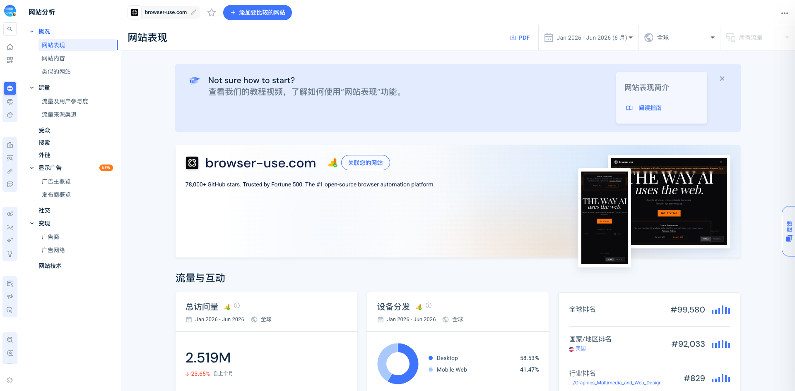
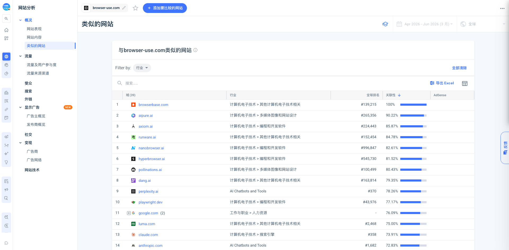

# Similarweb: browser-use.com traffic Jan-Jun 2026

范围 Jan 2026 - Jun 2026，全球，所有流量。

## 规模与参与度

- 6 个月总访问量：2.519M。
- 每月访问量：190,824。
- 月独立访客数：108,827。
- 已消除重叠受众：97,126。
- 访问持续时间：00:01:55。
- 页面数/访问：1.95。
- 跳出率：56.97%。
- Desktop 58.53%，Mobile Web 41.47%。
- 全球排名 #99,580；美国排名 #92,033；Graphics Multimedia and Web Design 行业排名 #829。

## 地理

Top countries：美国 21.65%、印度 13.03%、中国 6.49%、加拿大 4.64%、德国 3.62%。

## 渠道

渠道占比：Direct 34.66%、Organic Search 50.11%、Paid Search N/A、Referrals 6.83%、Display 0.07%、Organic Social 5.65%、Paid Social 0.08%、Gen AI 2.32%、Email 0.29%。

Search：自然搜索占 50.11%，Jun 2026 品牌 90%、非品牌 10%。这说明搜索主要来自 Browser Use 品牌/开源心智，不是宽泛 SEO 内容矩阵。

Referrals：ycombinator.com 27.97%、github.com 23.02%、aixploria.com 7.08%、saaspo.com 4.38%。

Social：YouTube 48.44%、X-twitter 42.64%、LinkedIn 4.47%、Reddit 2.41%、Facebook 1.18%。

## Similar sites

Similarweb similar sites Apr-Jun 2026 前列包括 browserbase.com、aipure.ai、axiom.ai、runware.ai、nanobrowser.ai、hyperbrowser.ai、pollinations.ai、dang.ai、perplexity.ai、playwright.dev、claude.com、anthropic.com、browse.ai 等。

有用相邻/竞品：Browserbase、Hyperbrowser、Playwright、Browse.ai、Axiom、Nanobrowser。AIPure/Dang/Perplexity/Claude/Anthropic 等更多是 AI 工具目录或大平台，不直接当竞品。

截图：

