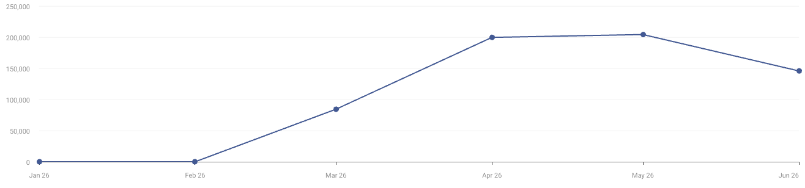

# Moxt Similarweb 2026 H1
采集时间：2026-07-15。统计窗口：2026-01 至 2026-06，Global / All Traffic / 主域。

- 主域累计访问估算：634,416
- 6 月主域访问估算：约 145,912
- 活跃月份平均访问：158,604
- Desktop 95.26%，Mobile Web 4.74%
- 平均停留 15:05；10.62 页 / 次；跳出率 28.81%
- 地域：美国 48.17%、中国 45.75%、香港 2.09%、巴西 1.80%、新加坡 0.79%
- 渠道：Direct 85.74%、Organic Search 4.71%、Paid Search 3.29%、Referral 2.31%、Organic Social 1.04%、Gen AI 2.24%
- 6 月自然搜索：品牌 86%、非品牌 14%

Similarweb 估算适合判断发布后的增长方向、地域与渠道结构，不应替代 GA、活跃 workspace、付费或留存数据。[[source.moxt.similarweb-2026-h1]]
